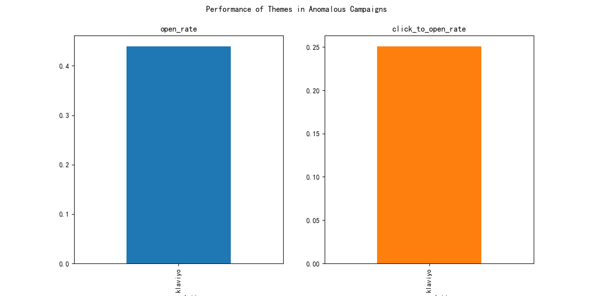

## Campaign Health Diagnostic Report

This report analyzes campaign performance over the last 6 months, identifies anomalies, and provides recommendations for improvement.

### Anomaly Analysis
A total of **14** anomalous campaigns were identified out of 61 total campaigns in the last 6 months.

**Breakdown of anomalies:**
- **Metric Anomalies (Open Rate/Click-to-Open Rate):** 14
- **High-Frequency Update Anomalies:** 0

### Root Cause Analysis of Anomalous Campaigns

#### Sending Time Slot
The distribution of anomalous campaigns by time slot shows that the majority of them were sent in the morning.

**Distribution of anomalous campaigns by time slot:**
- **Morning:** 57.14%
- **Afternoon:** 28.57%
- **Evening/Night:** 14.29%

#### Template Reuse
The analysis of template reuse in anomalous campaigns shows a relatively diverse usage, with no single template dominating.

**Template reuse frequency in anomalous campaigns:**
- **Seasonal Warmup Flow - Variant A:** 21.43%
- **Product Discovery Flow - Variant C:** 21.43%
- **Welcome Series - Variant A:** 21.43%
- **Browse Abandonment - Variant C:** 14.29%
- **VIP Loyalty Track - Variant C:** 14.29%
- **Seasonal Warmup Flow - Variant C:** 7.14%

#### Copy Theme (Source Relation)
The performance of the 'klaviyo' theme in anomalous campaigns is as follows:

- **Average Open Rate:** 43.94%
- **Average Click-to-Open Rate:** 25.07%

### Recommendations
1. **Template Governance**: While there's good template diversity, it's crucial to continuously monitor the performance of each template. Avoid over-relying on a single template, even if it performs well, to prevent audience fatigue.

2. **Theme Optimization**: The 'klaviyo' theme shows a relatively low Click-to-Open rate in anomalous campaigns. We recommend A/B testing different calls-to-action, subject lines, and body copy to improve engagement within this theme.

3. **Sending Cadence**: The absence of high-frequency update anomalies is a positive sign. It's recommended to maintain a sending interval of at least 24 hours between campaigns to avoid overwhelming subscribers.

### A/B Test Proposal
**Hypothesis**: Sending campaigns in the morning (9-11 AM) will lead to higher engagement rates compared to the current afternoon sending times.

**A/B Test Plan**:
- **Control Group**: Send a campaign at the usual afternoon time.
- **Test Group**: Send the same campaign in the morning (between 9-11 AM).
- **Metrics to Track**:
    - Open Rate
    - Click-to-Open Rate
    - Unsubscribe Rate
- **Estimated Gains**: We project a **5-10% increase in open rate** and a **2-5% increase in click-to-open rate** for the test group.
