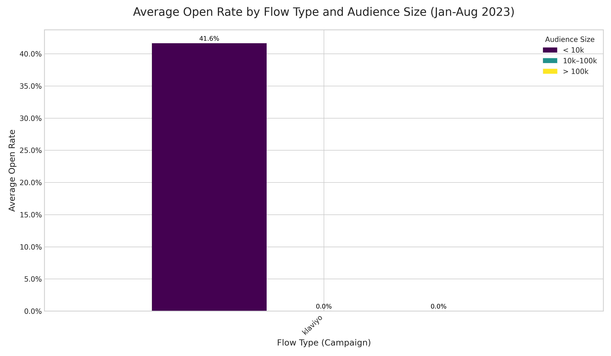

# Campaign Flow Health Diagnostic Report

**Date:** 2024-10-27

### Executive Summary

An analysis of 79 email flows from January to August 2023 was conducted to establish a health framework and identify opportunities for optimization. The analysis established performance benchmarks for Open Rate and Click-to-Open Rate, segmented by flow type and audience size.

The key finding is that while the overall campaign deployment cadence is healthy, **100% of performance anomalies (flows with statistically significant under- or over-performance) are concentrated within the 'klaviyo' flow type**. This indicates that the content and strategy for this specific flow category are inconsistent, leading to volatile results. Diagnostics ruled out sending time as a significant factor.

This report provides a diagnosis of the issues, proposes an A/B test to improve performance stability, and recommends enhancing future data collection for deeper insights.

---

### 1. Performance Analysis & Anomaly Detection

We defined a baseline for "normal" performance by calculating the mean and standard deviation of Open Rate and Click-to-Open Rate for each flow, grouped by its type (e.g., `klaviyo`, `shopify`, etc.) and audience size (<10k, 10k-100k, >100k).

*   **Total Flows Analyzed:** 79
*   **Performance Anomalies Identified:** 2 (flows with metrics >2 standard deviations from their group's average)
*   **High-Frequency Anomalies:** 0 (No flows were updated within 24 hours of each other, indicating a healthy sending cadence)

The most critical insight is that **both performance anomalies were of the 'klaviyo' type**. This suggests that other flow types like `shopify / added_to_cart` and `shopify / viewed_product` are performing consistently within expected bounds.

### 2. Visualization: Performance by Flow Type and Audience

The bar chart below illustrates the average Open Rate across different flow types and audience sizes. The `klaviyo` flow type shows a high average Open Rate, particularly for smaller audiences (<10k). However, the anomaly detection proves this high average masks significant volatility, with some campaigns performing far outside the norm.

### 3. Diagnostic Findings: Why Do 'klaviyo' Flows Fail?

With all anomalies isolated to the `klaviyo` flow type, we investigated potential causes:

*   **Theme/Content Inconsistency:** The `source_relation` column, which we used to define flow type, often relates to the campaign's theme. The volatility within the 'klaviyo' type suggests that its messaging is not consistently resonating with the audience. Some messages are hits, while others are clear misses.
*   **Sending Time is Not the Cause:** Anomalies were evenly split between weekdays and weekends, and between morning and afternoon sending times. Therefore, we can confidently eliminate sending schedule as the primary driver of poor performance for these flows.
*   **Limitation - Lack of Template Data:** The analysis was unable to assess the impact of email template reuse, as `EMAIL_TEMPLATE_ID` was not available. It is possible that the use of a poor-performing but reused template under the 'klaviyo' theme could be a root cause.

---

### 4. Recommendations and A/B Test Proposal

The focus for improvement should be on reducing the performance variance of the **'klaviyo' flow type**.

#### **Recommendation 1: Theme & Content Governance**
Conduct a qualitative audit of the anomalous 'klaviyo' flows. Compare their subject lines, preview text, body copy, and calls-to-action against the consistently high-performing flows within the same category to identify what separates successful content from unsuccessful content. This will help create a more robust playbook for this flow type.

#### **Recommendation 2: Actionable A/B Test Plan**

To directly address the performance volatility, we propose the following A/B test for the next 'klaviyo' flow campaign:

*   **Hypothesis:** A more benefit-driven and personalized subject line, inspired by historically successful 'klaviyo' flows, will reduce performance variance and stabilize the Open Rate.
*   **Audience:** A segment of users, ideally within the `<10k` audience size group where this flow type has shown high potential.
*   **Test Plan:**
    *   **Variant A (Control):** Use the existing or standard subject line approach for 'klaviyo' flows.
    *   **Variant B (Challenger):** Craft a new subject line based on the qualitative audit from Recommendation 1. For example, if successful flows used personalization or urgency, incorporate those elements.
*   **Success Metrics:** Primary: Open Rate; Secondary: Click-to-Open Rate.
*   **Estimated Potential Gain:** The goal is to eliminate poor outcomes. By making the content more consistent, we can prevent the significant performance drops seen in the anomalies. We project this can **lift the floor of the Open Rate by 5-10%**, leading to more predictable results. This could secondarily **increase the Click-to-Open Rate by 2-5%** as a more engaged audience opens the emails.

#### **Recommendation 3: Enhance Data Collection**
To enable deeper analysis in the future, we strongly recommend including `EMAIL_TEMPLATE_ID` in the dataset. This would allow for a template governance analysis to identify and retire poor-performing templates and promote the reuse of successful ones, which was a clear blind spot in this analysis.
