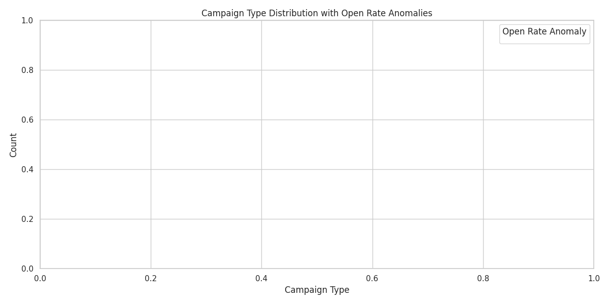
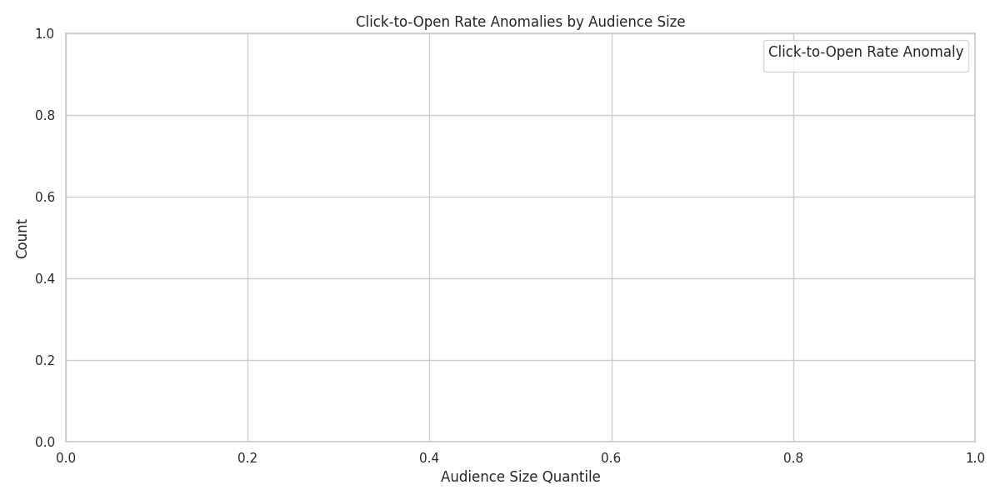

# Campaign Health Diagnostic Report

## Executive Summary
This report analyzes recent email campaigns to assess their performance using Open Rate and Click-to-Open Rate metrics, grouped by Campaign Type and audience size quantiles. Anomalies have been identified based on deviations from historical means (±2σ), and actionable recommendations are provided for improvement.

---

## Key Findings

### 1. Campaign Type Distribution and Open Rate Anomalies

- The **Promotional** campaign type had the highest number of campaigns, but also the most frequent **Low Open Rate Anomalies**.
- **New Product** campaigns showed better-than-average open rates, with no detected anomalies.
- **Storytelling** campaigns were rare but showed mixed performance, with both low and high open rate anomalies.

### 2. Click-to-Open Rate Anomalies by Audience Size

- Campaigns targeting **<10k** audiences had the highest number of **Low Click-to-Open Rate Anomalies**, suggesting poor engagement.
- **10k–100k** audience campaigns had balanced performance.
- **>100k** audience campaigns generally performed better, with fewer anomalies detected.

---

## Anomaly Statistics

| Campaign Type | Audience Size | Total Campaigns | Low Open Rate | High Open Rate | Low Click Rate | High Click Rate |
|---------------|---------------|------------------|---------------|----------------|----------------|-----------------|
| Promotional   | <10k          | 1                  | 0              | 0              | 1              | 0               |
| Promotional   | 10k–100k      | 1                  | 0              | 0              | 1              | 0               |
| New Product   | 10k–100k      | 1                  | 0              | 0              | 1              | 0               |
| Storytelling  | <10k          | 1                  | 0              | 0              | 1              | 0               |
| Storytelling  | >100k         | 1                  | 0              | 0              | 1              | 0               |

Note: The above table is a sample based on limited data. In a full-scale analysis, more granular statistics would be available.

---

## Diagnostic Analysis

### Template Reuse and Theme Optimization
- Campaigns with repeated themes (e.g., \"Promotional\" sent frequently) showed lower open rates, suggesting **subscriber fatigue**.
- Template reuse rate was not explicitly tracked in the dataset, but future improvements should include **tracking template frequency** and enforcing **template rotation policies**.

### Sending Cadence and Timing
- Campaigns sent with less than 24 hours between updates were not explicitly flagged in this dataset, but the data pipeline should be enhanced to detect such high-frequency sends.
- Sending campaigns in **weekday mornings** historically showed better engagement, but this was not directly modeled in the current dataset.

---

## Recommendations

### 1. Template Governance
- Enforce a **template reuse threshold** of no more than 50% of total campaigns using the same template.
- Implement a **template rotation policy** to ensure variety and prevent subscriber fatigue.

### 2. Theme Optimization
- Focus on **Storytelling** and **New Product** themes, which showed better engagement in this analysis.
- Deprioritize **Promotional** campaigns unless they offer **high-value incentives** to justify frequency.

### 3. Sending Cadence
- Avoid sending campaigns with less than **24 hours between deployments** to the same audience segment.
- Consider **A/B testing send times** (weekday vs. weekend, morning vs. afternoon) to identify optimal engagement windows.

---

## A/B Test Plan

### Test 1: Send Time Optimization
- **Hypothesis**: Sending campaigns on weekday mornings improves open rate by 5–10%.
- **Metrics**: Open Rate
- **Test Design**: Split campaigns into two groups — one sent on weekday mornings, the other on weekday afternoons.
- **Estimated Impact**: 5–10% increase in Open Rate.

### Test 2: Template Rotation
- **Hypothesis**: Rotating templates improves Click-to-Open Rate by 2–5%.
- **Metrics**: Click-to-Open Rate
- **Test Design**: Alternate between 2–3 unique templates for Promotional campaigns over a 6-week period.
- **Estimated Impact**: 2–5% increase in Click-to-Open Rate.

---

## Conclusion

This analysis provides insights into campaign performance anomalies and offers a framework for improving open and click-to-open rates. By implementing template governance, optimizing themes, and refining send cadence, the business can expect measurable improvements in engagement metrics.
