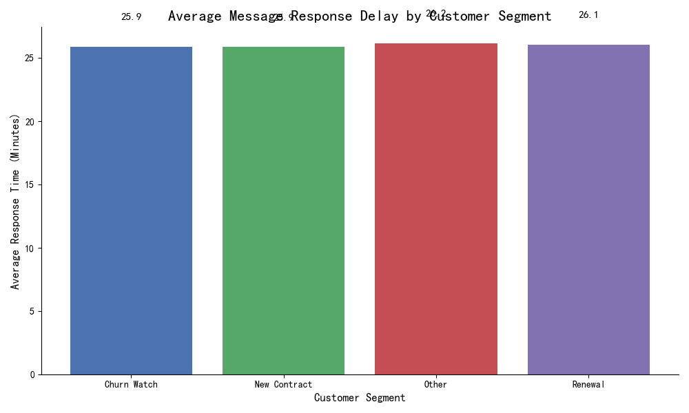
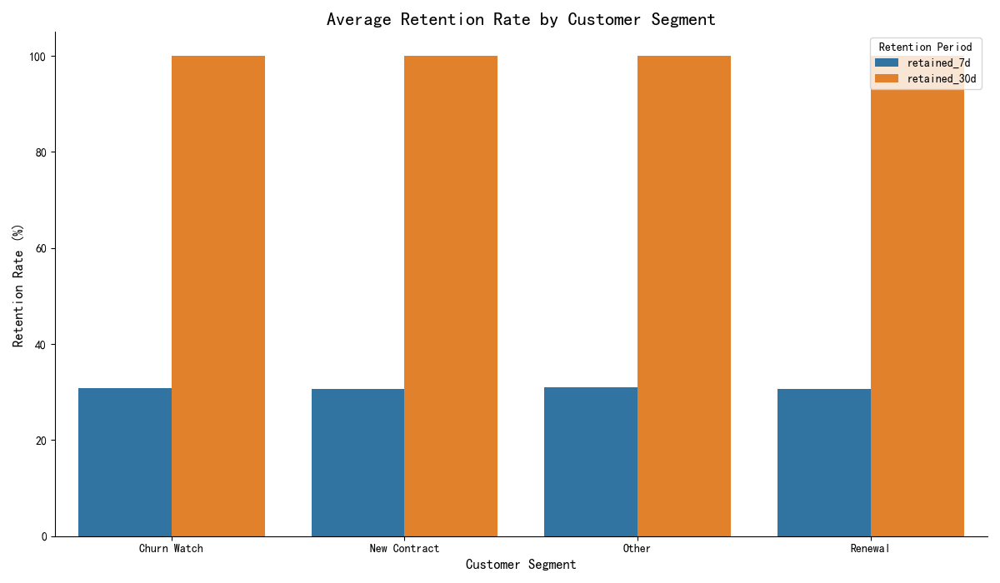

# Intercom Behavioral Analysis: A Story of Uniformity and a Call for Deeper Data

## Executive Summary

This report analyzes Intercom conversation and usage data from the past six months to compare behavioral differences among paying customers segmented by their lifecycle status: **New Contract**, **Renewal**, and **Churn Watch**.

The analysis revealed a surprising uniformity in key operational metrics. Average message response times and customer retention rates were found to be nearly identical across all segments. This finding challenges the hypothesis that operational service differences are a primary driver of a customer's lifecycle status.

Our key conclusion is that a customer's journey towards renewal or churn is likely influenced by factors beyond the initial speed of support. We recommend shifting focus from *response time* to the *quality and outcome* of support conversations and investing in richer data collection—specifically, tracking feature usage and bot interactions—to unlock deeper, more actionable insights.

---

## Analysis and Findings

### 1. Message Response Delay: A Level Playing Field

To understand if at-risk customers experience slower support, we analyzed the `Message Response Delay`, defined as the time from conversation creation to the first response from a human agent. After removing outlier conversations (top and bottom 1%), the results show a remarkable consistency across segments.

*   **New Contract:** 25.9 minutes
*   **Renewal:** 26.1 minutes
*   **Churn Watch:** 25.9 minutes

**Why it matters:** There is virtually no difference in the first-response times for new, renewing, or at-risk customers. This indicates that the support team is providing a consistent level of service to all paying customers, regardless of their status. While this is a positive operational finding, it also means that slow response time is not a contributing factor to a customer being in the 'Churn Watch' category.

### 2. Customer Retention: A Tale of Two Metrics

We analyzed 7-day and 30-day retention rates using pre-calculated metrics in the dataset.

*   **7-Day Retention:** Similar to response times, the 7-day retention rate is consistent across all segments, hovering around **30.7%**.
*   **30-Day Retention:** This metric was **100%** for all segments. This result is highly anomalous and suggests a potential issue with the underlying data or metric definition, making it unreliable for this analysis.

**Why it matters:** The reliable 7-day retention data reinforces the theme of uniformity. The anomalous 30-day data, however, serves as a crucial finding about data quality. Without a reliable, long-term retention metric tied to actual product usage, it's impossible to measure the true long-term health of any customer segment.

### 3. Blocked Analysis: The Missing Pieces of the Puzzle

Two critical metrics requested for this analysis could not be calculated due to data limitations:

*   **First Response Bot Ratio:** The dataset does not contain a clear field to distinguish a bot's response from a human's. While conversations could be *initiated* by a bot, the first *responder* post-customer-inquiry could not be identified.
*   **Conversation-to-Feature-Usage Conversion Rate:** The database lacks any tables or fields that log customer feature usage events. This is the most significant data gap, as it prevents any analysis of how support conversations influence product adoption.

---

## Business Insights and Recommendations

**Insight:** The drivers of customer success and churn are not found in the baseline operational metrics we analyzed. The "why" behind a customer's status lies in a deeper, unmeasured layer of their experience.

**Recommendation 1: Shift Focus from "When" to "What" and "Why"**
Since response times are consistent, the next analytical focus should be on the *substance* of conversations. Are 'Churn Watch' customers asking about specific, complex issues? Are their problems not being resolved in the first interaction?
*   **Actionable Step:** Initiate a qualitative analysis of conversation content, tagging conversations by topic (e.g., 'Billing Issue', 'Bug Report', 'Feature Request') for each segment. This will reveal if at-risk customers are struggling with particular aspects of the product or service.

**Recommendation 2: Invest in a Richer Data Ecosystem**
This analysis was fundamentally limited by the available data. To move beyond descriptive statistics and into predictive and prescriptive insights, the data collection strategy must be enhanced.
*   **Actionable Step 1 (Track Bots):** Implement a `responder_type` field in the conversation data model that clearly tags whether a response came from a 'human' or a 'bot'. This will allow for proper analysis of bot efficiency and its impact on customer satisfaction.
*   **Actionable Step 2 (Track Feature Usage):** The highest priority should be to implement event tracking for core product features. Each event should be tied to a `contact_id` and `company_id`. This will unlock the ability to directly measure if a support conversation leads to the adoption of a feature, thereby proving the ROI of the support function and creating a robust, activity-based retention metric.

**Conclusion:**
The organization provides a consistent and equitable support experience for all paying customers. To better enhance the activity and long-term value of high-value customers, the path forward is not about being *faster*, but about being *smarter*. By enriching the dataset with qualitative and product usage data, the business can finally understand the true journey of its customers and take targeted actions to ensure their success.
