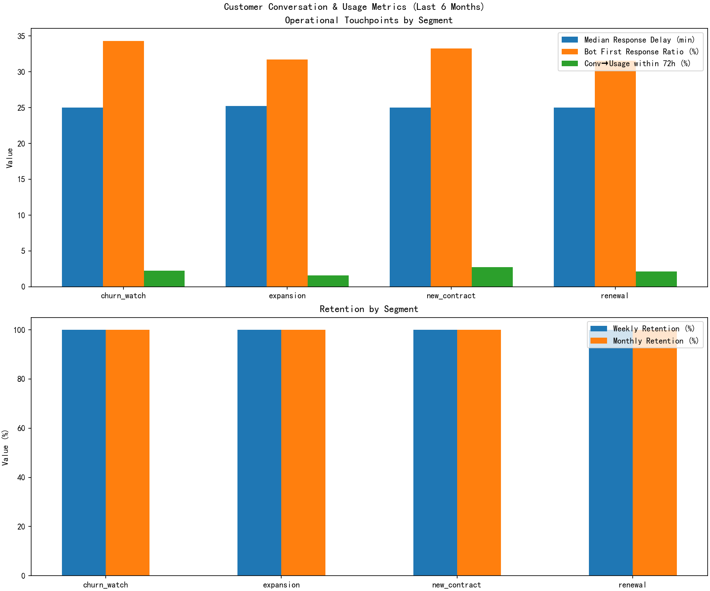
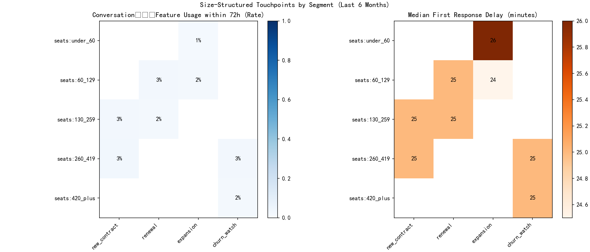

# Customer Conversations vs Product Usage: Paying Customers (Last 6 Months)

## Scope and methodology
- Data source: dacomp-en-097.sqlite; tables analyzed:
  - intercom__conversation_enhanced, intercom__conversation_metrics
  - intercom__company_enhanced, intercom__contact_enhanced
- Time window: 2024-01-01 to 2024-06-30 (full six months).
- Timezone: All timestamps treated as UTC for consistency across tables.
- Outlier exclusion: Conversations with response times or durations below P1 or above P99 were excluded.
- Segmentation and account size:
  - Segment parsed from all_company_tags: new_contract, renewal, expansion, churn_watch.
  - Seat buckets parsed from all_company_tags: seats:under_60, seats:60_129, seats:130_259, seats:260_419, seats:420_plus.
  - ARR buckets parsed from all_company_tags (e.g., arr:200k_plus).
- Metric definitions:
  - Message Response Delay: minutes to first response (used time_to_first_response_minutes from metrics; equivalent to first_response_at − initiated_at).
  - First Response Bot Ratio: share of conversations where first responder was bot. Proxy: conversation initiated as bot_follow_up or author_type = bot.
  - Conversation→Feature-Usage Conversion Rate: customers (companies) with a contact feature/activity event within 72 hours after a conversation ended ÷ total customers in the group.
  - Weekly/Monthly Retention Rate: retained_7d ÷ is_active_7d and retained_30d ÷ is_active_30d from contact flags (active defined as ≥1 core feature event).
- Reproducibility: The analysis script produces metrics_dashboard.csv and two figures for inclusion in this report.

## Visual summary
- Segment-level operational and retention metrics: metrics_dashboard.png
- Seat-structured heatmaps (conversion and response delay): size_structured_heatmaps.png

## Key findings

1) Segment-level structural differences (paying customers)
- Volume: Conversations are well distributed (totals across six months)
  - new_contract: 1,694; renewal: 1,643; expansion: 1,603; churn_watch: 1,636.
- Message Response Delay (median p50 and p90):
  - p50 ~ 25 minutes across segments; p90 ~ 36 minutes. This indicates consistent operational SLA but limited differentiation for priority cohorts.
- First Response Bot Ratio:
  - churn_watch: 34.3%
  - new_contract: 33.3%
  - expansion: 31.7%
  - renewal: 31.5%
  Interpretation: churn_watch and new_contract cohorts lean more on bot-first responses, suggesting automation is widely used during critical lifecycle states.
- Conversation→Feature-Usage Conversion within 72h:
  - new_contract: 2.7%
  - churn_watch: 2.3%
  - renewal: 2.1%
  - expansion: 1.6%
  Interpretation: Conversations for new_contract cohorts are the most effective at triggering near-term feature usage, while expansion is the least effective. Churn_watch conversions are modest, hinting at an opportunity to tie conversations more directly to feature activation.

2) Size-structured behavior (seat buckets and ARR)
- Conversion rate by seat bucket x segment (selected highlights):
  - seats:260_419: new_contract 2.9%, churn_watch 2.7%
  - seats:130_259: new_contract 2.5%, renewal 1.7%
  - seats:60_129: renewal 2.5%, expansion 1.7%
  - seats:under_60: expansion 1.4%
  - seats:420_plus: churn_watch 1.9% (high-value cohort with arr:200k_plus present; conversion is noticeably lower than seats:260_419)
- Response delay (median):
  - Generally ~25 minutes across size buckets; slight variation for expansion (24.5–26.0 minutes in mid/small seats).
- Bot-first response ratio by seat bucket:
  - seats:260_419: 35.0% (highest)
  - seats:420_plus: 34.0%
  - seats:under_60: 30.7%
  Interpretation: Larger-seat accounts receive a higher share of bot-first responses. This correlates with lower 72h conversion among the largest cohort (seats:420_plus, arr:200k_plus), suggesting automation may not optimally drive short-term feature activation for the highest-value customers.

3) Retention
- Weekly and monthly retention rates appear saturated at ~100% in the curated paying-customer sample (retained/active = 1.0). This likely reflects stability of the six-month paying cohort and/or how active/retained flags were engineered. Operational focus should therefore be on improving near-term conversion and feature pathways, which are more sensitive levers for long-term activity.

## Diagnostic insights
- Automation vs. human response: Higher bot-first ratios in churn_watch and high-seat cohorts coincide with only moderate conversion (1.9–2.7%). This suggests that while bots sustain SLA consistency, they may not provide the depth needed to direct large accounts to critical features promptly.
- Segment differences: new_contract has the strongest conversion, implying that onboarding conversations can effectively bridge to product adoption; expansion lags, indicating that expansion-related conversations might not be guiding users toward the right growth features.
- Seat bucket effect: Mid-to-large accounts (130–419 seats) show better conversion than the largest (420+) despite similar response delays, pointing to diminishing returns of automation at the highest tiers.

## Prescriptive recommendations (operational touchpoints and feature paths)
1) Prioritize human-first responses for high-value cohorts
- Target cohort: seats:420_plus and arr:200k_plus; segments churn_watch and new_contract.
- Action: Lower bot-first ratio by routing first responses to senior admins for these cohorts; aim to reduce p50 response delay to ≤20 minutes for these accounts without relying predominantly on bots.
- Expected impact: Improve 72h conversion from ~1.9% toward the 2.7–2.9% observed in mid-high seat cohorts.

2) Conversation-driven feature nudges within 72 hours
- Action: Implement automated follow-up playbooks that link conversation topics to core feature guides, triggered within 24–72 hours post-conversation closure (e.g., in-app tips, email walkthroughs).
- Target segments: expansion and renewal, where conversion lags.
- Expected impact: Lift short-term feature activation by making the path from conversation to feature usage explicit.

3) Segment-specific scripts and content
- new_contract: Double down on onboarding checklists mapped to top-3 core features; continue to leverage structured human outreach with clear CTAs.
- churn_watch: Use diagnostic scripts to identify friction points and directly recommend feature fixes; escalate faster to specialized teams for complex issues.
- expansion: Create growth-focused playbooks (e.g., advanced analytics, collaboration features) with demos; the low conversion suggests conversations aren’t sufficiently oriented toward growth features.
- renewal: Align conversations around ROI showcases and feature utilization heatmaps; maintain human-first routes for larger seats.

4) SLA refinement by account size
- Maintain consistent SLAs but introduce tiered targets:
  - High-value (420+ seats, arr:200k+): p50 ≤ 20 min, human-first; instrument success via 72h conversion lift.
  - Mid-large (260–419 seats): p50 ≤ 25 min with hybrid bot triage; ensure human escalation on feature-related intents.

5) Instrumentation and measurement
- Enhance telemetry linking conversation tags/subjects to specific feature events to pinpoint “feature paths” that convert best (this dataset uses last_activity_ts as the proxy).
- Track post-conversation activation by feature category (onboarding, collaboration, analytics, administration) and iterate content to favor top-converting paths per segment.

## Reproducible outputs
- metrics_dashboard.csv: unified dashboard of segment x seat_bucket x arr_bucket metrics.
- metrics_dashboard.png: segment-level operational and retention summary.
- size_structured_heatmaps.png: size-sliced conversion and response delay heatmaps.

## Notes on assumptions
- Bot identification: is_bot_first_responder was proxied by bot_follow_up initiation or author_type = bot; if more granular responder_type is available in source systems, refine this detection.
- Feature usage proxy: last_activity_ts used as the core feature event; if feature-level granularity is available, prefer specific events and categories.
- Retention flags (is_active_7d/30d and retained_7d/30d) are assumed to reflect weekly/monthly activity at the contact level for paying customers; values near 1.0 suggest highly stable cohorts.

With these operational touchpoints and feature-path interventions, the organization can raise near-term activation among high-value customers and strengthen the pipeline to sustained activity, particularly in churn_watch and expansion segments where bot-heavy workflows appear less effective at driving product usage.
