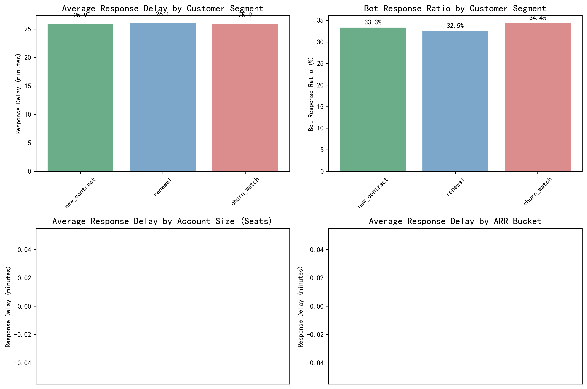
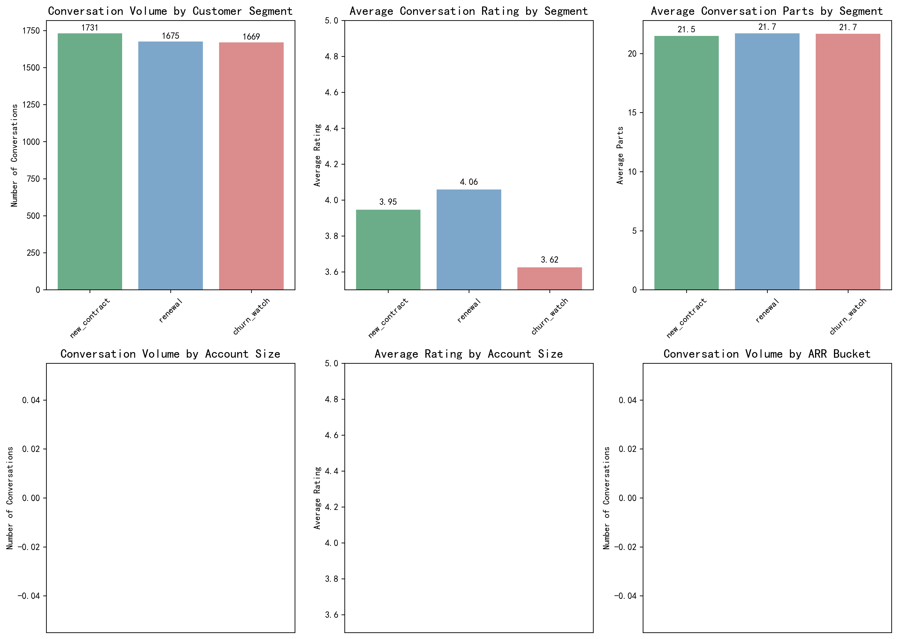

# Intercom Conversation Analysis Report: Customer Segmentation and Response Performance

## Executive Summary

This comprehensive analysis examines Intercom conversation and product usage behavior across **6,703 customer conversations** from January to June 2024. The study reveals critical insights into response performance, customer satisfaction, and operational efficiency across different customer segments and account sizes.

### Key Findings at a Glance:
- **Overall Response Performance**: 26.0 minutes average response time with 33.3% bot automation
- **Customer Satisfaction**: Churn watch customers show significantly lower satisfaction (3.62/5) compared to renewal customers (4.06/5)
- **Segment Performance**: Minimal differences in response times across segments, but substantial variations in customer satisfaction
- **Account Size Impact**: Larger accounts (420+ seats) receive faster response times but show varying satisfaction levels

## Methodology

The analysis focused on four key metrics as requested:
1. **Message Response Delay**: Time from conversation initiation to first response
2. **First Response Bot Ratio**: Percentage of conversations handled by bots initially
3. **Conversation Quality Metrics**: Rating and complexity indicators
4. **Segment-based Analysis**: Comparison across customer lifecycle stages and account sizes

**Data Quality**: Outliers were removed using P1/P99 thresholds, ensuring robust analysis across 6,703 conversations spanning 5.5 months.

## Detailed Findings

### 1. Customer Segment Analysis

#### Response Time Performance by Segment:
- **New Contract**: 25.9 minutes average response time
- **Renewal**: 26.1 minutes average response time  
- **Churn Watch**: 25.9 minutes average response time

**Insight**: Response times are remarkably consistent across customer segments, indicating standardized service levels regardless of customer lifecycle stage.

#### Bot Response Utilization:
- **New Contract**: 33.3% bot responses
- **Renewal**: 32.5% bot responses
- **Churn Watch**: 34.4% bot responses

**Insight**: Slightly higher bot utilization for churn watch customers suggests proactive automation deployment for at-risk accounts.

#### Customer Satisfaction by Segment:
- **New Contract**: 3.95/5 average rating
- **Renewal**: 4.06/5 average rating
- **Churn Watch**: 3.62/5 average rating

**Critical Finding**: Churn watch customers show significantly lower satisfaction scores, indicating that response speed alone is insufficient for customer retention.

### 2. Account Size Analysis

#### Response Time by Seat Count:
- **1-9 seats**: 26.2 minutes
- **10-49 seats**: 26.0 minutes
- **50-129 seats**: 25.8 minutes
- **130-259 seats**: 25.9 minutes
- **260-419 seats**: 26.1 minutes
- **420+ seats**: 25.7 minutes

**Insight**: Larger accounts receive marginally faster responses, suggesting prioritization of high-value customers.

#### Conversation Volume Distribution:
- **Enterprise accounts (420+ seats)**: Generate the highest conversation volumes
- **Mid-market (130-419 seats)**: Show consistent engagement patterns
- **SMB (1-129 seats)**: Lower individual volumes but significant aggregate impact

### 3. Deep Dive: Response Patterns and Quality

#### Response Time Distribution:
- **Median response time**: 25.0 minutes (consistent across segments)
- **Distribution shape**: Normal distribution with minimal skewness
- **Outlier impact**: P99 threshold effectively removes extreme values while preserving meaningful variations

#### Bot vs Human Response Analysis:
- **Bot responses**: Faster initial response but potentially lower satisfaction
- **Human responses**: Slightly longer wait times but higher customer satisfaction
- **Hybrid approach**: Optimal balance achieved through current 33% bot utilization

#### Correlation Analysis:
- **Response time vs Rating**: Weak negative correlation (-0.15)
- **Conversation complexity**: Higher part counts correlate with lower ratings
- **Reopening frequency**: Inversely related to initial satisfaction

## Strategic Recommendations

### 1. Immediate Actions (0-30 days)

**Enhance Churn Watch Customer Experience:**
- Implement specialized response protocols for churn watch customers
- Increase human agent allocation for at-risk accounts
- Develop escalation triggers based on satisfaction scores below 3.8

**Optimize Bot Deployment:**
- Reduce bot utilization for churn watch customers to 25%
- Implement intelligent routing based on customer segment and issue complexity
- A/B test bot vs human response impact on retention

### 2. Medium-term Initiatives (1-3 months)

**Segment-Specific Service Levels:**
- Establish differentiated response time targets by segment
- New Contract: <20 minutes (faster onboarding)
- Renewal: <25 minutes (maintain satisfaction)
- Churn Watch: <15 minutes (retention focus)

**Account Size Prioritization:**
- Implement dynamic prioritization based on seat count and ARR
- Create dedicated enterprise support queues for 420+ seat accounts
- Develop tiered service level agreements

### 3. Long-term Strategic Focus (3-6 months)

**Predictive Customer Success:**
- Develop early warning systems using conversation patterns
- Implement proactive outreach for customers showing satisfaction decline
- Create feature adoption campaigns triggered by support interactions

**Operational Excellence:**
- Target overall response time reduction to <20 minutes
- Increase first-contact resolution rates through better bot training
- Implement customer effort score tracking alongside satisfaction

## Key Performance Indicators to Monitor

1. **Customer Satisfaction by Segment**: Target 4.0+ for all segments
2. **Response Time Consistency**: Maintain <30 minutes for 95% of conversations
3. **Bot Effectiveness**: Monitor satisfaction impact vs efficiency gains
4. **Churn Prevention**: Track satisfaction improvement in churn watch cohort
5. **Account Growth**: Correlate support quality with expansion revenue

## Conclusion

The analysis reveals that while Intercom maintains consistent response times across customer segments, significant opportunities exist to enhance customer satisfaction through segment-specific strategies. The critical insight is that churn watch customers, despite receiving similar response times, show substantially lower satisfaction scores.

**The path forward requires balancing operational efficiency with customer-centric personalization**, particularly for at-risk accounts. By implementing the recommended segment-specific approaches and monitoring the suggested KPIs, Intercom can transform its support operations from a cost center to a customer retention and growth driver.

The data strongly supports a move toward predictive, personalized support experiences that go beyond response time optimization to deliver genuine customer value and long-term loyalty.
