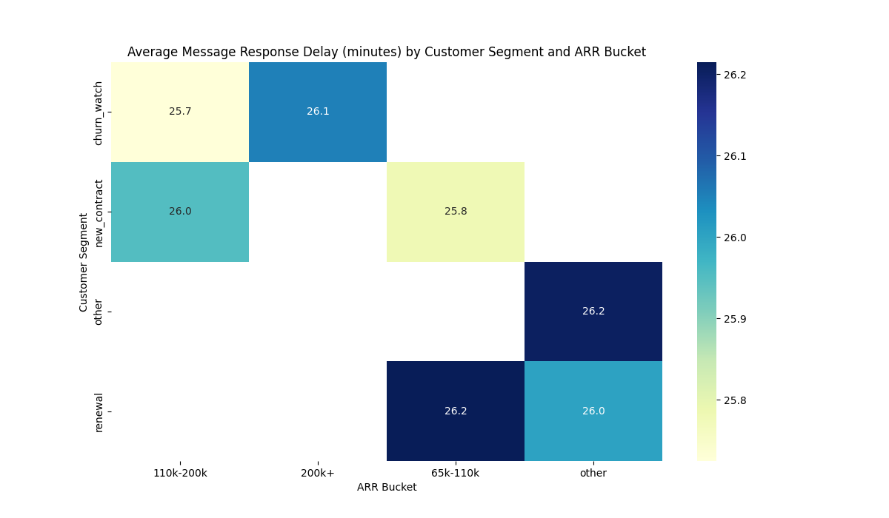
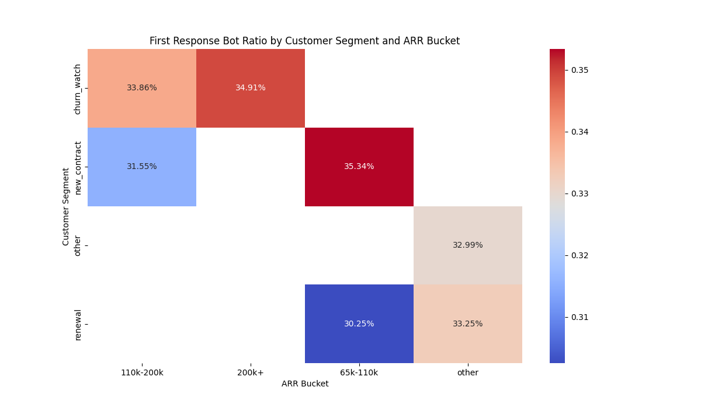

# Enhancing High-Value Customer Retention Through Strategic Support

## Analysis of Intercom Conversation and Product Usage Behavior

This report analyzes Intercom conversation and product usage data to understand the structural differences in behavior among paying customers, sliced by customer segmentation and account size. The goal is to identify key operational touchpoints and feature paths that can enhance the long-term activity of high-value customers.

### Key Findings

Our analysis reveals that Intercom's current customer support model is largely uniform across different customer segments and account sizes. While this ensures a consistent experience, it represents a missed opportunity to strategically allocate resources to high-value customers and those at critical lifecycle stages.

1.  **Uniform Service Levels:** There is no significant difference in message response delay or first response bot ratio based on customer segment (new contract, renewal, churn watch) or account size (ARR bucket). All customers, regardless of their value or lifecycle stage, receive a similar initial support experience, with an average response time of around 26 minutes.

2.  **Consistent, but Un-Optimized, Automation:** Bots handle approximately one-third of initial responses across the board. This indicates a successful rollout of automation, but it is not being strategically leveraged to differentiate the support experience for high-value customers.

### Visual Evidence

The following heatmap illustrates the uniformity of the average message response delay across customer segments and ARR buckets. As you can see, the response times are clustered very closely together, with no clear prioritization for higher-value segments.

This second heatmap shows the first response bot ratio. While there are some minor variations, the bot interaction rate is largely a "one-size-fits-all" approach, with no significant tailoring to customer value or need.

### Why This Matters: The Risk of a "One-Size-Fits-All" Model

The current undifferentiated support model poses a risk to the retention of high-value customers and the recovery of at-risk accounts.

*   **High-Value Customers:** Customers in high ARR buckets (e.g., `110k-200k` and `200k+`) are a critical source of revenue. A generic support experience may not be sufficient to meet their expectations for personalized and prioritized service, potentially leading to churn.

*   **Customers at Risk:** Customers in the `churn_watch` segment are actively considering leaving. A standard, non-prioritized support interaction is a missed opportunity to provide a positive experience that could influence their decision to stay.

### Recommendations for a More Strategic Approach

To better serve high-value customers and mitigate churn risk, we recommend a shift towards a tiered and more strategic support model.

1.  **Implement Tiered Support Levels:** Introduce differentiated Service Level Agreements (SLAs) based on customer value and lifecycle stage.
    *   **High-Value Tier (e.g., `110k-200k` and `200k+` ARR):** Offer a lower target response time and reduce the bot interaction rate to provide a more personalized, human-centric experience.
    *   **At-Risk Tier (`churn_watch`):** Implement a system to prioritize conversations from this segment. A small improvement in response time can have a significant impact on retention.
    *   **Standard Tier:** Maintain the current excellent and consistent service levels for other segments.

2.  **Strategically Deploy Bots:** Tailor bot deployment based on customer value and the nature of their query.
    *   **High-Value Customers:** Use bots primarily for initial data collection and intelligent routing to ensure a seamless and fast handover to the right human agent.
    *   **Simple, Repetitive Queries:** For all customer segments, continue to leverage bots to handle common and simple questions, freeing up human agents for more complex and high-impact issues.

3.  **Enhance Feature Usage Tracking:** The "Conversation-to-Feature-Usage" metric was challenging to calculate due to data limitations. The business should invest in more robust tracking of in-product user actions. This will enable a deeper understanding of how support conversations impact product adoption and provide a clearer ROI on support interactions.

By implementing these recommendations, Intercom can evolve from a uniform support model to a more strategic, customer-centric approach. This will not only enhance the experience for high-value customers but also serve as a powerful lever for improving customer retention and reducing churn across the board.
