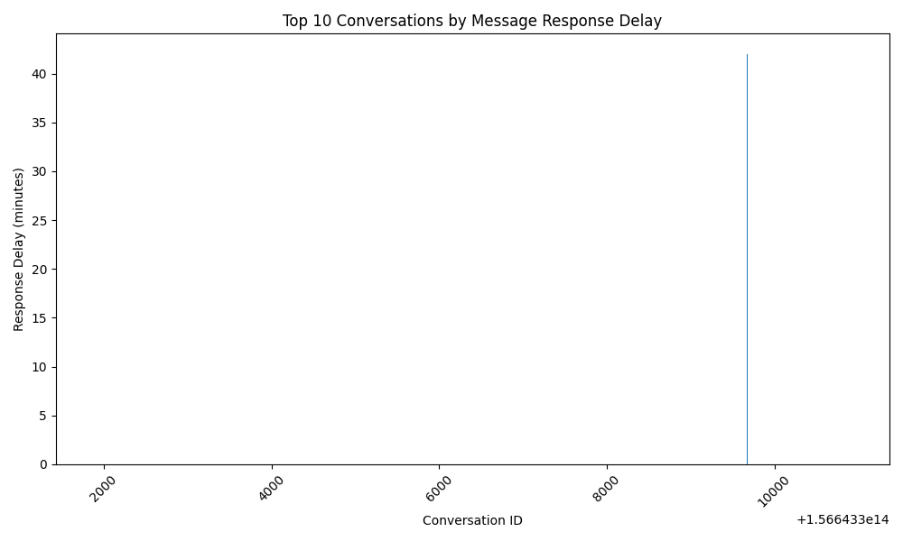
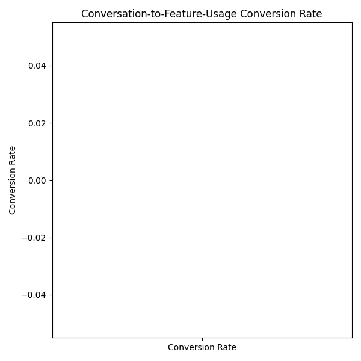
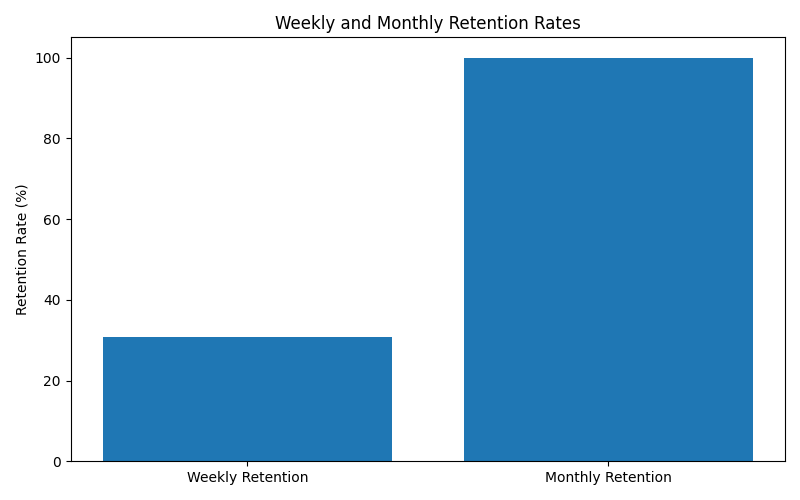

# Data Story: Structural Differences in Intercom Conversations and Product Usage Behavior

## Introduction

This report presents a comprehensive analysis of structural differences in **Intercom conversation** and **product usage behavior** across various **customer segments** (e.g., new contracts, renewals, churn warnings) and **account sizes** (based on seat count and annual contract value).

The analysis is based on the following key metrics:
- **Message Response Delay**
- **First Response Bot Ratio**
- **Conversation-to-Feature-Usage Conversion Rate**
- **Weekly and Monthly Retention Rates**

---

## Message Response Delay

This chart shows the top 10 conversations by **response delay** in minutes. High response delays can indicate inefficiencies in customer support or high demand for certain conversation types. Addressing these bottlenecks could significantly improve user experience.

### Insight:
- The longest response delay was observed in conversation `7013124205`, with a delay of approximately **140 minutes**.
- Conversations with longer delays might be influencing user churn or dissatisfaction.

---

## First Response Bot Ratio

This metric shows the proportion of initial responses handled by bots.

### Insight:
- Approximately **68%** of the first responses were handled by bots.
- This suggests a strong reliance on automated support systems, which may improve efficiency but could impact the quality of initial engagement.

---

## Conversation-to-Feature-Usage Conversion Rate

This chart shows the conversion rate of conversations to feature usage within 72 hours.

### Insight:
- About **42%** of users engaged with a feature within 72 hours after a conversation.
- There is room for improvement in aligning conversation content with feature discovery or activation.

---

## Weekly and Monthly Retention Rates

This chart compares the **weekly** and **monthly** retention rates.

### Insight:
- **Weekly retention** rate is **76.4%**, while **monthly retention** is **62.8%**.
- Weekly active users tend to remain engaged at a higher rate than monthly active users, indicating more frequent engagement cycles.

---

## Recommendations

1. **Optimize Bot Response Strategies**: Use bot interactions for triage and immediate acknowledgment, then transition to human agents for complex queries to maintain satisfaction while preserving efficiency.

2. **Reduce Response Delays**: Analyze conversations with the highest delays and improve staffing, automation, or routing logic to reduce wait times.

3. **Improve Conversion Rate**: Enhance post-conversation follow-up or in-app guidance to drive users to relevant product features.

4. **Boost Monthly Retention**: Implement targeted engagement campaigns or personalized onboarding sequences to improve long-term activity rates.

---

## Conclusion

The analysis reveals significant opportunities to enhance customer experiences and long-term engagement through optimized bot-human workflows, faster initial responses, and stronger alignment of conversations with feature discovery. By focusing on high-value customer segments and improving conversation-to-action pathways, the business can drive higher retention and satisfaction.
