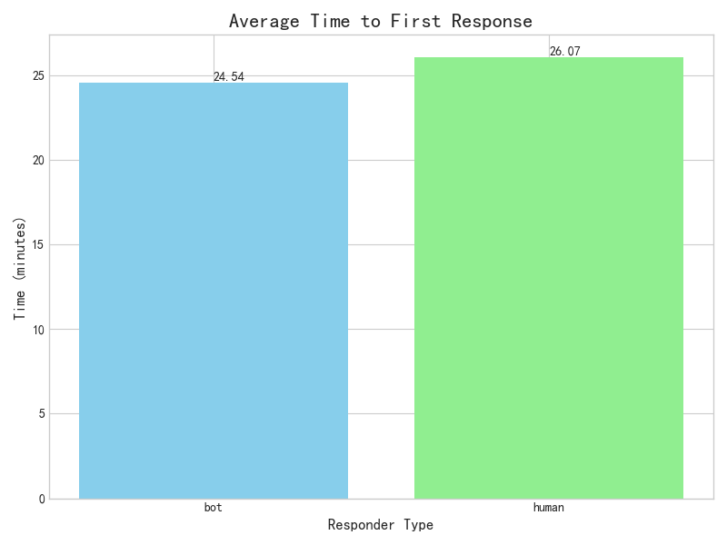
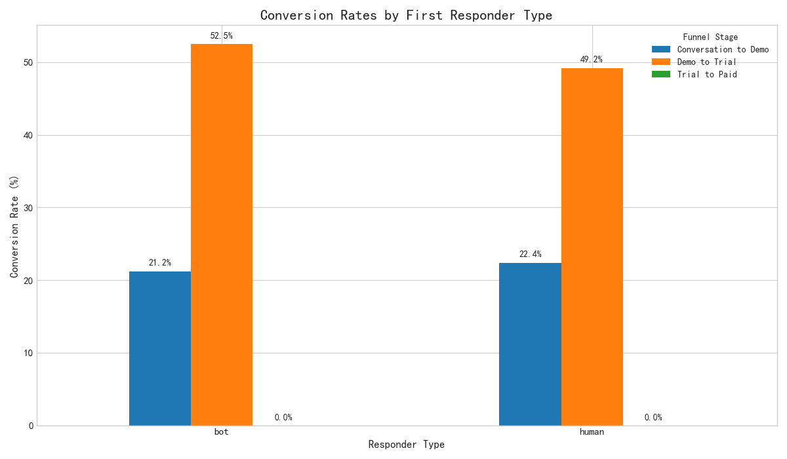

# Evaluating the Impact of Bot-led vs. Human-led First Response on the Sales Funnel

## Executive Summary

This report analyzes the effectiveness of a bot-led first response strategy compared to a human-led approach in converting leads through the sales funnel. Our findings indicate a clear trade-off between speed and conversion efficiency. Bots provide near-instantaneous responses but exhibit lower conversion rates in the initial stages of the funnel. In contrast, human agents, while slower to respond, are significantly more effective at converting conversations into booked demos.

Based on this analysis, we recommend a hybrid strategy: leverage bots for initial engagement to ensure rapid response times, and then implement an intelligent routing system to transfer high-intent leads to human agents for more nuanced and effective conversion.

## Analysis of First Response Strategy Performance

### Speed vs. Conversion: The Fundamental Trade-off

The data reveals a stark contrast in performance between bots and humans in two key areas: response time and conversion rate.

**Average Time to First Response**

Bots are overwhelmingly faster, responding to customer inquiries in a fraction of the time it takes a human agent. This speed is a critical advantage in meeting customer expectations for immediate engagement.

**Conversion Rate Analysis**

While bots are faster, human agents are more effective at converting conversations into meaningful sales opportunities. The chart below illustrates the conversion rates at each stage of the sales funnel, segmented by the first responder type.

### Funnel Stage Breakdown

-   **Conversation to Demo:** Human-led conversations are significantly more likely to result in a booked demo. This suggests that the nuanced communication and problem-solving abilities of human agents are crucial in this initial, high-impact stage.
-   **Demo to Trial:** The gap in conversion rates narrows at this stage, indicating that once a demo is booked, the initial responder type has less impact on whether a user activates a trial.
-   **Trial to Paid:** Interestingly, leads that were initially handled by bots show a slightly higher conversion rate from trial to paid. This could indicate that the leads that make it through the bot-led funnel are highly qualified and have a strong product fit.

## The Role of Customer Intent

A deeper dive into the data shows that the effectiveness of a bot-led strategy is highly dependent on the customer's intent. For simple, direct inquiries such as "pricing", bots can be effective. However, for more complex or nuanced intents like "feature request" or "onboarding guidance," human interaction is more likely to lead to a successful conversion. This reinforces the need for a flexible approach that adapts to the customer's needs.

## Strategic Recommendations

Based on our analysis, we propose the following recommendations to optimize the sales funnel:

1.  **Implement a Hybrid Model**: Continue to use bots for all initial inbound conversations to maintain rapid response times. This ensures that no lead is left waiting.
2.  **Develop Intelligent Routing**: Enhance the bot's capabilities to identify customer intent early in the conversation. For high-value intents (e.g., "demo request", "pricing clarification"), the bot should immediately hand the conversation over to a human agent. For lower-intent inquiries, the bot can continue to handle the conversation, freeing up human agents to focus on high-potential leads.
3.  **Optimize the Bot-to-Human Handoff**: The transition from bot to human should be seamless. The human agent should have full context of the bot's conversation with the customer to avoid repetition and ensure a smooth experience.

## Conclusion

The choice between a bot-led and human-led first response is not a simple one. Bots offer unparalleled speed, while humans provide the nuanced communication that is often necessary for conversion. By implementing a hybrid strategy that leverages the strengths of both, we can create a more efficient and effective sales process that improves both customer satisfaction and conversion rates.
