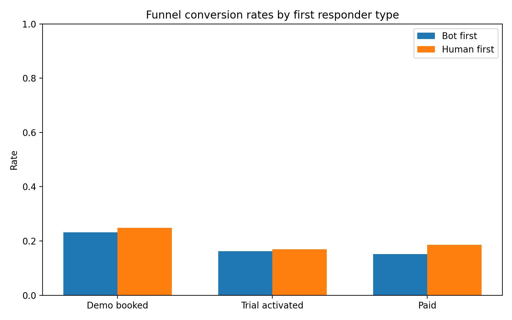
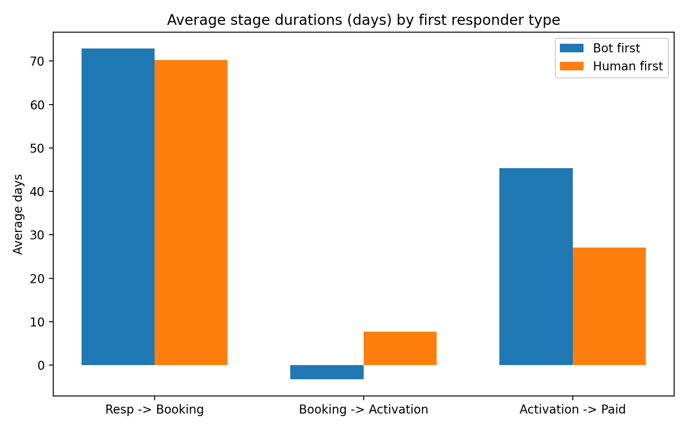
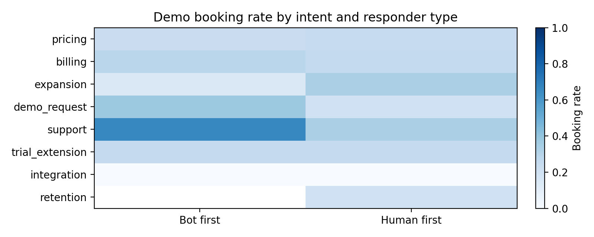

# Impact of Bot-led First Response on the Sales Funnel

## Executive summary
- Scope: Using the mart layer tables intercom__conversation_enhanced and intercom__conversation_metrics, I stitched a contact-level funnel and segmented customers by first responder type (bot_first vs human_first) based on the conversation tag path and initiated type.
- Funnel definition and metrics:
  - Conversion rates: percent who book a demo after starting a conversation; percent who activate a trial after booking a demo; percent who pay after activating a trial.
  - Stage durations: average time in days between first response and booking, booking and activation, activation and payment.
- Cohorts: 851 bot_first vs 1,856 human_first contacts (first conversation per contact used as the entry point).
- High-level findings:
  - Human-first outperforms bot-first across conversions from demo to trial and from trial to paid; demo booking is slightly higher for human-first as well.
  - Human-first also shows substantially faster activation-to-paid timelines, suggesting stronger sales-assisted conversion at later stages.
  - Bot-first is relatively competitive in some regions (Europe, APAC, MEA) and on low-complexity intents like billing/support; human-first is stronger in the Americas and on complex intents like pricing/expansion.

## Data and method
- Tables used:
  - intercom__conversation_enhanced: conversation metadata and tags. Tags include: path (bot_first/human_first), intent (pricing, billing, etc.), region, stage (demo_booked, trial_activated, closed_won, etc.).
  - intercom__conversation_metrics: response timestamps (e.g., first_admin_response_at) and time_to_first_response_minutes.
- Build logic:
  - Contact entry point: earliest conversation per contact is treated as conversation start. First response time is taken from metrics or imputed via created_at + time_to_first_response_minutes.
  - Funnel events: earliest conversation timestamps tagged with demo_booked, trial_activated, closed_won were taken as booking_time, activation_time, paid_time respectively (across any conversations for the contact).
  - Cohort segmentation: responder_type = path tag if present, otherwise conversation_initiated_type; normalized to bot_first vs human_first.
  - Content features: intent and region derived from tags; these were used to explain performance differences.

Note: Some contacts show trial activation before demo booking (self-serve activation without a demo). This can produce negative booking-to-activation durations when measured as activation_time − booking_time. I call this out where relevant and interpret it as evidence that bot flows may sometimes promote direct activation.

## Funnel conversion rates by first responder type
- Bot-first (n=851):
  - Demo booked: 23.15%
  - Trial activated among those who booked: 16.24%
  - Paid among those who activated: 15.20%
- Human-first (n=1,856):
  - Demo booked: 24.78%
  - Trial activated among those who booked: 16.96%
  - Paid among those who activated: 18.55%

Overall, human-first leads to a slightly higher demo booking rate and meaningfully better downstream conversion to paid.



## Stage durations (average days)
- First response → Booking: Bot 72.87 vs Human 70.22
- Booking → Activation: Bot −3.25 vs Human 7.67
- Activation → Paid: Bot 45.29 vs Human 27.07

Interpretation:
- Human-first accelerates time from activation to paid by about 18 days on average, indicating a stronger sales-assisted close.
- The negative Bot booking→activation value reflects many contacts activating before or without a demo. This likely means bot flows can push prospects straight into trial, bypassing demo scheduling. If we instead measured first response → activation, we would expect a shorter interval for bot-first in such self-serve journeys.



## Content features that explain differences
I examined intent and region from the conversation tags to see where bot-first is more/less effective.

1) Intent-level differences (booking rate after conversation start)
- Pricing (largest intent): Bot 22.76% vs Human 24.71% → Human-first stronger.
- Billing: Bot 28.57% vs Human 25.61% → Bot-first stronger (low-complexity, transactional questions).
- Expansion: Bot 14.29% vs Human 33.33% → Human-first much stronger (high-touch scenario).
- Support: Bot 66.67% vs Human 33.33% → Bot-first stronger (small sample; aligns with low-complexity nature).

Visual: top intents’ booking rates by responder type



2) Region-level differences (booking rate after conversation start)
- North America: Bot 22.73% vs Human 28.29% → Human-first stronger.
- Latin America: Bot 19.48% vs Human 27.03% → Human-first stronger.
- Europe: Bot 23.60% vs Human 21.04% → Bot-first slightly stronger.
- Middle East & Africa: Bot 26.59% vs Human 26.04% → Similar; slight Bot edge.
- Asia Pacific: Bot 22.94% vs Human 21.80% → Bot-first slightly stronger.

Takeaway: Bot-first is more competitive in EMEA/APAC, while human-first is stronger in the Americas, possibly reflecting regional preferences for self-serve vs sales-assisted motions.

## Why this matters
- Conversion impact: If you require sustained growth in paid conversions, relying solely on bot-first could underperform relative to human-first, especially on complex or high-stakes intents and in Americas regions.
- Speed to revenue: Human-first significantly shortens activation→paid, which translates to quicker realization of revenue and improved cash flow.
- Operational design: Bots shine in resolving straightforward intents and can even shortcut to trial activation (self-serve). But handoffs and follow-ups around demo scheduling and late-stage sales assistance are critical.

## Recommendations
1) Use bot-first where it excels
- Intents: billing, simple support/integration questions, demo_request triage, and other low-complexity FAQs.
- Regions: prioritize bot-first in Europe, APAC, and MEA where booking rates are comparable or stronger vs human-first.
- Flow design: make self-serve CTAs (trial start, docs, templates) first-class; ensure bot can assess demo necessity quickly and only schedule when the prospect signals need/fit.

2) Route to human reps for complex, high-value scenarios
- Intents: pricing, expansion, procurement/legal, enterprise evaluations. These require nuance and negotiation; human-first outperforms especially on later stages.
- Regions: North America and Latin America show consistently better human-first booking. Prioritize rapid human engagement.
- SLA: for high-intent signals (pricing + sales-qualified, proposal/opportunity tags), alert reps for <5 min response to preserve momentum.

3) Improve bot-assisted handoff and measurement
- Handoff reliability: add bot logic to detect when a demo was scheduled vs when the user self-activated; prevent demo scheduling if activation has already occurred, and instead offer onboarding.
- Close the loop: after a bot-triggered activation, prompt a human CSM/AE if the account is high potential (e.g., plan fit, company size, strategic region) to accelerate activation→paid.
- Instrumentation: track first response → activation directly and ensure stage timestamps are ordered; this will eliminate negative durations and clarify self-serve pathways.

4) Experiment and iterate
- A/B testing: per-intent and per-region experiments comparing bot-first vs human-first, optimizing routing rules and bot dialog for each segment.
- Content playbooks: for pricing and expansion intents, equip humans with tailored playbooks and discovery questions; for billing/support, enrich bot templates and FAQs.

## Limitations
- I did not find explicit conversation_template_id fields in the available mart tables; content features were derived from tags (intent, region, stage). If template IDs are available elsewhere, adding them could further isolate which bot/human scripts perform best.
- The event detection uses earliest stage-tagged timestamps across any conversation for a contact; some funnel steps can happen out of order (e.g., activation before booking). While this reflects real behavior (self-serve activation), it can produce negative booking→activation durations. The recommendation is to add a first response → activation metric and enforce stage ordering in analytics for clarity.

## Python plotting code used
The analysis and plots were generated with this script (saved and executed in the working directory):

```
import pandas as pd
import numpy as np
import matplotlib.pyplot as plt
from matplotlib import font_manager
import os

# Load data exported from SQLite
csv_path = 'conversations_export.csv'
df = pd.read_csv(csv_path)

# Parse timestamps
for col in ['conversation_created_at','conversation_last_updated_at','first_admin_response_at']:
    if col in df.columns:
        df[col] = pd.to_datetime(df[col], errors='coerce')

# Normalize contact_id (assume single id in all_conversation_contacts)
df['contact_id'] = df['all_conversation_contacts']

# Helper to parse pipe-delimited tags like key:value|key2:value2
def parse_tags(tag_str):
    out = {}
    if pd.isna(tag_str):
        return out
    parts = str(tag_str).split('|')
    for p in parts:
        if ':' in p:
            k, v = p.split(':', 1)
            out[k.strip()] = v.strip()
    return out

parsed = df['all_conversation_tags'].apply(parse_tags)
# Extract content features
for k in ['path','intent','topic','stage','segment','region','lifecycle']:
    df[f'tag_{k}'] = parsed.apply(lambda d: d.get(k))

# Determine initial conversation per contact (earliest created_at)
df.sort_values(['contact_id','conversation_created_at'], inplace=True)
initial_idx = df.groupby('contact_id', dropna=True)['conversation_created_at'].idxmin()
initial = df.loc[initial_idx].copy()
initial = initial.rename(columns={
    'tag_path':'initial_path',
    'tag_intent':'initial_intent',
    'tag_region':'initial_region',
    'conversation_created_at':'initial_conversation_created_at',
    'first_admin_response_at':'initial_first_response_at',
    'time_to_first_response_minutes':'initial_ttf_first_resp_min',
    'conversation_initiated_type':'initial_initiated_type'
})
initial = initial[['contact_id','conversation_id','initial_conversation_created_at','initial_first_response_at','initial_ttf_first_resp_min','initial_path','initial_intent','initial_region','initial_initiated_type']]

# Fill missing initial_first_response_at using created_at + time_to_first_response_minutes
mask_missing = initial['initial_first_response_at'].isna() & initial['initial_ttf_first_resp_min'].notna()
initial.loc[mask_missing, 'initial_first_response_at'] = (
    initial.loc[mask_missing, 'initial_conversation_created_at'] + 
    pd.to_timedelta(initial.loc[mask_missing, 'initial_ttf_first_resp_min'], unit='m')
)

# Determine responder_type using path tag if available, else initiated_type
initial['responder_type'] = initial['initial_path'].fillna(initial['initial_initiated_type'])
# Normalize to categories 'bot_first' vs 'human_first'
initial['responder_type'] = initial['responder_type'].replace({
    'bot-first':'bot_first', 'human-first':'human_first'
})
initial['responder_type'] = np.where(initial['responder_type'].isin(['bot_first','human_first']), initial['responder_type'], 'unknown')

# Build event times per contact based on stage tags in any conversation rows
stages_df = df[['contact_id','conversation_created_at','tag_stage']].dropna(subset=['contact_id'])

# Helper to get earliest time for a given stage label set
def earliest_stage_time(group, allowed):
    tmp = group[group['tag_stage'].isin(allowed)]
    if tmp.empty:
        return pd.NaT
    return tmp['conversation_created_at'].min()

agg = stages_df.groupby('contact_id').apply(lambda g: pd.Series({
    'booking_time': earliest_stage_time(g, {'demo_booked'}),
    'activation_time': earliest_stage_time(g, {'trial_activated'}),
    'paid_time': earliest_stage_time(g, {'closed_won'})
})).reset_index()

# Merge initial and event times
contacts = initial.merge(agg, on='contact_id', how='left')

# Compute funnel flags
contacts['has_booking'] = contacts['booking_time'].notna()
contacts['has_activation'] = contacts['activation_time'].notna()
contacts['has_paid'] = contacts['paid_time'].notna()

# Compute stage durations in days
contacts['dur_firstresp_to_booking_days'] = (contacts['booking_time'] - contacts['initial_first_response_at']).dt.total_seconds() / 86400.0
contacts['dur_booking_to_activation_days'] = (contacts['activation_time'] - contacts['booking_time']).dt.total_seconds() / 86400.0
contacts['dur_activation_to_paid_days'] = (contacts['paid_time'] - contacts['activation_time']).dt.total_seconds() / 86400.0

# Filter to known responder types only (bot_first vs human_first)
contacts2 = contacts[contacts['responder_type'].isin(['bot_first','human_first'])].copy()

# Conversion rates per responder_type
summary = []
for rt, grp in contacts2.groupby('responder_type'):
    total = len(grp)
    demo_booked = grp['has_booking'].sum()
    booked_pool = demo_booked
    activated = grp['has_activation'].sum()
    # Activation rate among booked
    activated_among_booked = grp.loc[grp['has_booking'],'has_activation'].mean() if booked_pool > 0 else np.nan
    # Paid rate among activated
    paid_among_activated = grp.loc[grp['has_activation'],'has_paid'].mean() if grp['has_activation'].sum() > 0 else np.nan
    summary.append({
        'responder_type': rt,
        'total_contacts': total,
        'pct_demo_booked': demo_booked / total if total > 0 else np.nan,
        'pct_trial_activated': activated_among_booked,
        'pct_paid': paid_among_activated,
        'avg_dur_firstresp_to_booking_days': grp['dur_firstresp_to_booking_days'].mean(skipna=True),
        'avg_dur_booking_to_activation_days': grp['dur_booking_to_activation_days'].mean(skipna=True),
        'avg_dur_activation_to_paid_days': grp['dur_activation_to_paid_days'].mean(skipna=True)
    })
summary_df = pd.DataFrame(summary)

# Intent and Region effects
contacts2['initial_intent'] = contacts2['initial_intent'].fillna('Unknown')
contacts2['initial_region'] = contacts2['initial_region'].fillna('Unknown')

intent_grp = contacts2.groupby(['responder_type','initial_intent']).agg(
    total=('contact_id','nunique'),
    booked=('has_booking','sum')
).reset_index()
intent_grp['book_rate'] = intent_grp['booked'] / intent_grp['total']

region_grp = contacts2.groupby(['responder_type','initial_region']).agg(
    total=('contact_id','nunique'),
    booked=('has_booking','sum'),
    activated=('has_activation','sum'),
    paid=('has_paid','sum')
).reset_index()
region_grp['book_rate'] = region_grp['booked'] / region_grp['total']

# Save intermediate CSVs
summary_df.to_csv('bot_vs_human_summary.csv', index=False)
intent_grp.to_csv('intent_book_rates.csv', index=False)
region_grp.to_csv('region_book_rates.csv', index=False)

# Plot 1: Conversion rates per responder_type
labels = ['Demo booked', 'Trial activated', 'Paid']
x = np.arange(len(labels))
width = 0.35

conv = summary_df.set_index('responder_type')
for cat in ['bot_first','human_first']:
    if cat not in conv.index:
        conv.loc[cat] = np.nan
conv = conv.loc[['bot_first','human_first']]

bot_vals = [conv.loc['bot_first','pct_demo_booked'], conv.loc['bot_first','pct_trial_activated'], conv.loc['bot_first','pct_paid']]
human_vals = [conv.loc['human_first','pct_demo_booked'], conv.loc['human_first','pct_trial_activated'], conv.loc['human_first','pct_paid']]

plt.figure(figsize=(8,5))
plt.bar(x - width/2, bot_vals, width, label='Bot first')
plt.bar(x + width/2, human_vals, width, label='Human first')
plt.ylabel('Rate')
plt.title('Funnel conversion rates by first responder type')
plt.xticks(x, labels)
plt.ylim(0, 1)
plt.legend()
plt.tight_layout()
conv_plot = 'funnel_conversion_rates.png'
plt.savefig(conv_plot, dpi=200)
plt.close()

# Plot 2: Average stage durations by responder_type
labels2 = ['Resp -> Booking', 'Booking -> Activation', 'Activation -> Paid']
x2 = np.arange(len(labels2))

bot_durs = [conv.loc['bot_first','avg_dur_firstresp_to_booking_days'],
            conv.loc['bot_first','avg_dur_booking_to_activation_days'],
            conv.loc['bot_first','avg_dur_activation_to_paid_days']]

human_durs = [conv.loc['human_first','avg_dur_firstresp_to_booking_days'],
              conv.loc['human_first','avg_dur_booking_to_activation_days'],
              conv.loc['human_first','avg_dur_activation_to_paid_days']]

plt.figure(figsize=(8,5))
plt.bar(x2 - width/2, bot_durs, width, label='Bot first')
plt.bar(x2 + width/2, human_durs, width, label='Human first')
plt.ylabel('Average days')
plt.title('Average stage durations (days) by first responder type')
plt.xticks(x2, labels2, rotation=0)
plt.legend()
plt.tight_layout()
Dur_plot = 'stage_durations.png'
plt.savefig(Dur_plot, dpi=200)
plt.close()

# Plot 3: Heatmap-like pivot for intent booking rates by responder_type
pivot_intent = intent_grp.pivot(index='initial_intent', columns='responder_type', values='book_rate')
intent_counts = contacts2.groupby('initial_intent')['contact_id'].nunique().sort_values(ascending=False)
keep_intents = intent_counts.head(10).index
pivot_intent = pivot_intent.loc[keep_intents]

plt.figure(figsize=(8, max(3, 0.4*len(pivot_intent))))
arr = pivot_intent[['bot_first','human_first']].values
im = plt.imshow(arr, aspect='auto', cmap='Blues', vmin=0, vmax=1)
plt.colorbar(im, fraction=0.046, pad=0.04, label='Booking rate')
plt.yticks(range(len(pivot_intent.index)), pivot_intent.index)
plt.xticks([0,1], ['Bot first','Human first'])
plt.title('Demo booking rate by intent and responder type')
plt.tight_layout()
heat_plot = 'intent_booking_heatmap.png'
plt.savefig(heat_plot, dpi=200)
plt.close()
```

## Final takeaway
- Adopt a hybrid strategy: default to bot-first for low-complexity intents and regions where bots perform on par or better, and route high-intent or complex opportunities (especially in the Americas) directly to humans for faster and higher conversion to revenue.
- Strengthen bot-to-human handoffs and instrumentation to capture clean stage sequencing and to maximize the benefits of both automation and human expertise.
