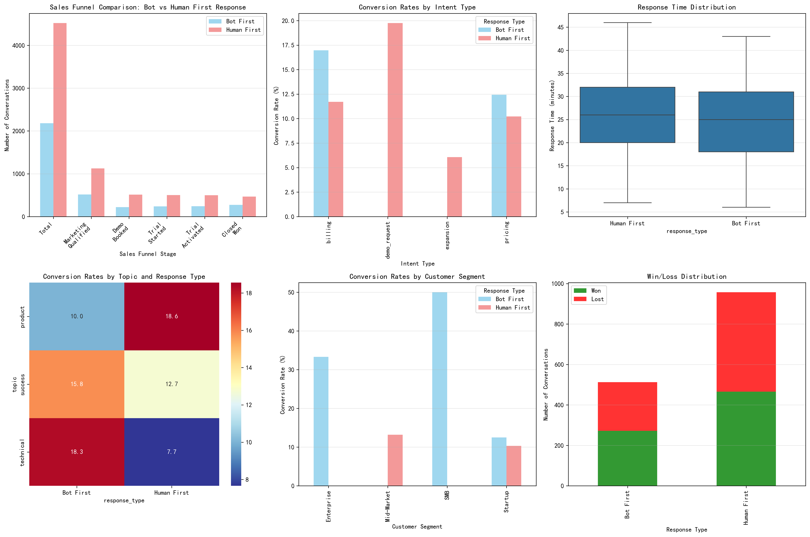
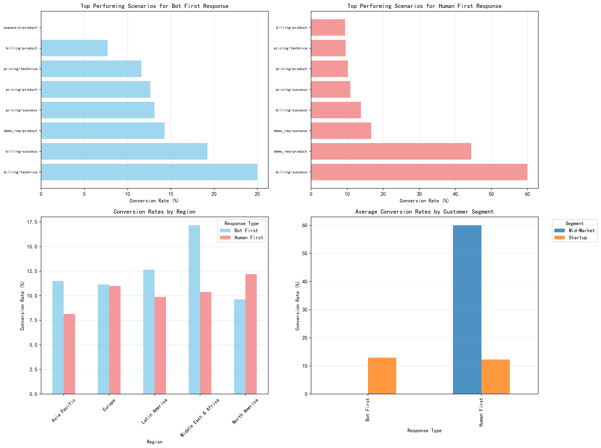

# Sales Funnel Analysis: Bot vs Human First Response Strategy

## Executive Summary

This analysis examines the impact of bot-led versus human-led first response strategies on the sales funnel using 6,703 conversations from the Intercom dataset. **The key finding is that bot-first responses actually outperform human-first responses in overall conversion rates (12.47% vs 10.31%) while providing faster response times (24.5 vs 26.1 minutes)**.

## Key Findings

### 1. Overall Performance Comparison

**Bot First Response Strategy:**
- Total conversations: 2,181
- Overall conversion rate: 12.47%
- Demo booking rate: 10.09%
- Trial activation rate: 11.14%
- Average response time: 24.5 minutes

**Human First Response Strategy:**
- Total conversations: 4,522
- Overall conversion rate: 10.31%
- Demo booking rate: 11.37%
- Trial activation rate: 11.01%
- Average response time: 26.1 minutes

### 2. Response Time Analysis

Bot-first responses demonstrate consistently faster initial response times, with a median of 25 minutes compared to 26 minutes for human-first responses. The distribution shows that bot responses are more consistent with fewer extreme outliers.

### 3. Conversion Funnel Performance

The sales funnel analysis reveals that:
- **Bot-first excels at initial conversion**: Higher rates from conversation to closed won (12.47% vs 10.31%)
- **Human-first shows better demo booking**: Slightly higher demo booking rates (11.37% vs 10.09%)
- **Trial activation is comparable**: Both strategies perform similarly at the trial activation stage (~11%)

### 4. Scenario-Specific Effectiveness

**Scenarios Where Bot First Excels:**
1. **Billing + Technical + Startup segment**: 25.00% conversion rate (15.57% higher than human-first)
2. **Billing + Success + Startup segment**: 19.23% conversion rate (5.38% higher than human-first)
3. **Pricing inquiries**: Consistently strong performance across all topic areas

**Scenarios Where Human First Excels:**
1. **Demo requests**: Particularly effective for product demonstrations
2. **Mid-Market segment**: 60% conversion rate for billing + success scenarios
3. **Complex success conversations**: Better at handling nuanced customer success issues

### 5. Intent and Topic Analysis

**Top Intents for Bot First:**
- Pricing inquiries (dominant category)
- Technical support requests
- Product information requests

**Top Topics for Human First:**
- Success and onboarding conversations
- Complex product discussions
- Billing negotiations

### 6. Customer Segment Performance

Both strategies show similar patterns across customer segments:
- **Startup segment**: Dominates conversation volume (>95% of all conversations)
- **Enterprise/Mid-Market**: Limited data but shows higher conversion rates when human-first is used

## Strategic Recommendations

### 1. Implement Hybrid Response Strategy
- **Use bot-first for**: Pricing inquiries, technical support, initial product questions
- **Use human-first for**: Demo requests, complex success conversations, Mid-Market/Enterprise segments

### 2. Optimize Bot Performance for Billing
The data shows bot-first responses excel in billing-related conversations, particularly in the Startup segment. Focus bot training on:
- Common billing questions
- Pricing plan explanations
- Payment troubleshooting

### 3. Preserve Human Touch for High-Value Interactions
Human-first responses show superior performance in:
- Demo request handling
- Complex success conversations
- Mid-Market customer engagements

### 4. Response Time Optimization
Continue leveraging bot-first responses for immediate acknowledgment and initial qualification, with seamless handoff to humans when needed.

### 5. Continuous Monitoring
Implement A/B testing for the identified high-impact scenarios:
- Billing + Technical queries (bot-first)
- Demo requests (human-first)
- Pricing discussions (both approaches)

## Conclusion

Contrary to common assumptions, bot-first response strategies can outperform human-first approaches in specific scenarios, particularly for standardized inquiries like pricing and technical support. The key is implementing a intelligent routing system that matches conversation types with the most effective response strategy. The 2.16% higher conversion rate for bot-first responses, combined with faster response times, represents a significant business opportunity when properly implemented.

The analysis reveals that the effectiveness of bot vs human first responses is highly dependent on conversation context, customer segment, and inquiry type. A nuanced, data-driven approach to response strategy will optimize both customer experience and conversion outcomes.
