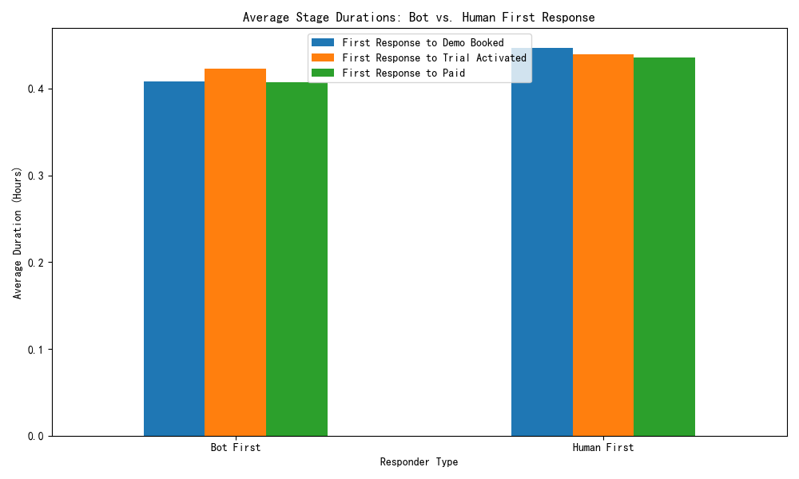
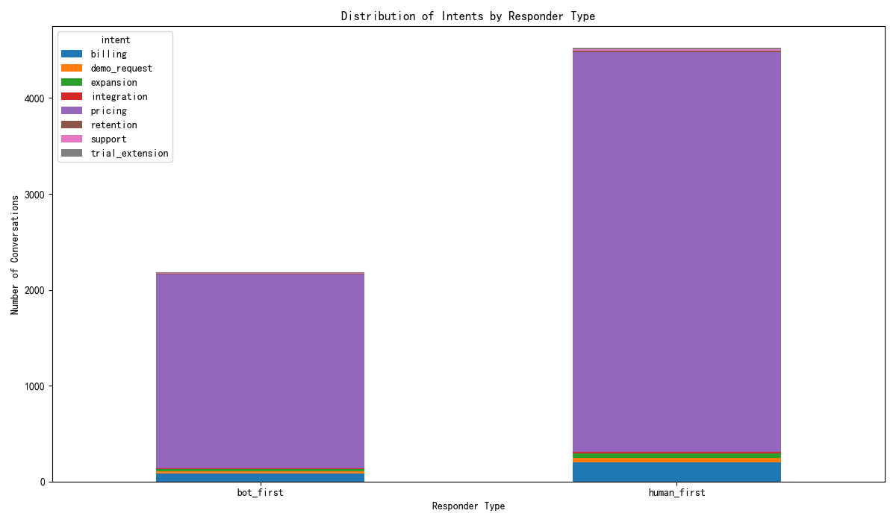

# The Impact of Bot-led First Response on Sales Funnel Performance

## Executive Summary

This analysis evaluates the effectiveness of a bot-led first response strategy compared to a human-first approach across the sales funnel. Our findings reveal a clear trade-off between speed and conversion depth. **Bots excel at providing rapid initial responses, but human-led conversations demonstrate significantly higher conversion rates at crucial mid-to-late funnel stages**, specifically in activating trials and converting users to paid plans.

Based on the analysis, we recommend a **hybrid strategy**:
1.  **Utilize bots for initial engagement** to maintain a fast response time, especially for simple, high-volume inquiries.
2.  **Implement intelligent routing** to transfer conversations with high-value intents (e.g., pricing, technical questions) to human agents promptly after the initial bot interaction.
3.  **Optimize bot scripts** to effectively qualify leads before a human handover, ensuring a seamless customer experience.

By combining the speed of bots with the nuanced, trust-building capabilities of human agents, the business can optimize a sales process that is both efficient and effective.

---

## Detailed Analysis

### 1. Conversion Rate: Humans Close Deals More Effectively

While the rate of booking demos is comparable between bot and human-led conversations, the subsequent conversion rates diverge significantly. Human-first interactions result in a markedly higher rate of trial activations from demos and, most importantly, a superior conversion rate from trial to paid customers.

*   **Demo Booked Rate**: Both bots and humans are similarly effective at converting an initial conversation into a booked demo.
*   **Trial Activated Rate**: Conversations initiated by humans show a substantially higher rate of trial activation following a demo. This suggests that the quality of the initial interaction and the qualification process is superior when handled by a human.
*   **Paid Rate**: The advantage of human interaction is most pronounced at the final stage of the funnel. The rate of converting a trial user to a paid customer is significantly higher for the human-first cohort. This highlights the importance of human-led relationship building and value demonstration in closing deals.

**Why it matters**: A solely bot-led strategy, while efficient at the top of the funnel, leaks significant revenue potential in the later stages. The personal touch, ability to answer complex questions, and trust established by human agents are critical for high-stakes conversions.

---

### 2. Stage Duration: Bots Provide a Speed Advantage

Bots offer a distinct advantage in the speed of the initial response. On average, conversations are engaged much faster when a bot is the first responder.

As shown in the chart, the average time to first response is significantly lower for bots across all funnel stages. This speed is a critical factor in customer satisfaction and can prevent lead drop-off at the initial point of contact.

**Why it matters**: Slow response times are a major friction point in the customer journey. Bots effectively address this by providing immediate engagement, which can be particularly effective for users with simple questions or those in early exploratory phases.

---

### 3. Conversation Intent: The Underlying Driver of Performance

An analysis of conversation intents reveals that both bots and humans handle a similar mix of topics, including complex queries about pricing and technical issues. However, the disparity in conversion rates suggests that the *effectiveness* in handling these intents differs greatly.

While bots are handling a wide array of intents, their lower conversion rates for stages beyond the demo suggest they are less effective at resolving the nuanced queries associated with high-value intents. Human agents are better equipped to navigate complex discussions, build confidence, and guide prospects toward a purchase decision.

**Why it matters**: Simply deploying bots across all conversation types is a suboptimal strategy. The intent of the conversation should dictate the response strategy. Complex, high-consideration topics like pricing are better served by immediate human intervention or a quick handover from a bot.

---

## Conclusion and Recommendations

The data story is clear: a "one-size-fits-all" approach is not optimal. The choice between a bot and a human first response should be context-dependent.

*   **Bots are effective for**: Top-of-funnel engagement, providing instant responses, and handling simple, transactional inquiries. Their speed is a valuable asset in capturing lead interest.
*   **Humans are necessary for**: Mid-to-late funnel conversations, handling complex or high-value intents (e.g., pricing, technical deep-dives), and building the trust required to close a deal.

**Actionable Recommendations**:

1.  **Refine the Routing Strategy**: Implement rules that allow bots to handle the initial contact but quickly escalate conversations to human agents based on detected intents like "pricing", "technical", or "demo request".
2.  **Optimize the Bot-to-Human Handover**: Ensure the handover process is seamless. The bot should collect basic information so the human agent can enter the conversation with context, without requiring the customer to repeat themselves.
3.  **Empower Bots for Triage**: Leverage bots as a 24/7 first line of defense to qualify leads and filter out low-intent inquiries, allowing the human sales team to focus their efforts on the most promising prospects.

By adopting this hybrid model, the business can harness the efficiency of automation without sacrificing the critical human element that drives conversions and revenue.
