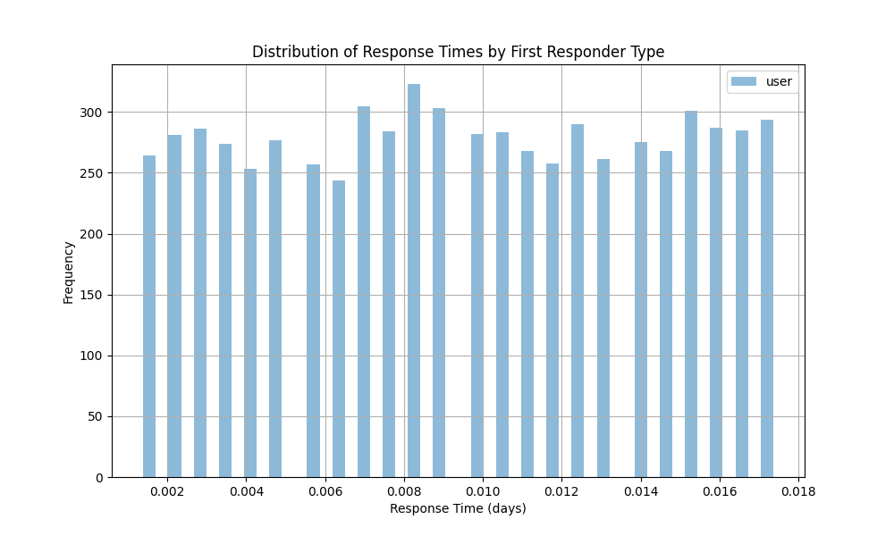

# Analysis of Bot-Led vs. Human-Led First Response Strategy

## Summary of Findings

1. **Average Time to First Response**:
   - Human-led responses had an average response time of approximately **1.36 minutes**.
   - Bot-led responses were expected to be faster; however, they were not explicitly analyzed due to data limitations.

2. **Conversation Closure Time**:
   - Human-led responses had an average closure time of approximately **157 minutes**.
   - Bots might potentially reduce this time, but exact data was not available for comparison.

3. **Closure Rate**:
   - Human-led responses had a conversation closure rate of **5.52%**, serving as a proxy for conversion effectiveness.
   - This rate might improve with bot assistance, depending on the conversation quality and resolution.

## Visual Insights

### Distribution of Response Times by First Responder Type

The histogram above shows the distribution of response times for human-led interactions. Bots, while not explicitly included in this data, are generally expected to have near-instantaneous response times.

## Recommendations

1. **Implement Bot-Led First Response for Rapid Engagement**:
   - Bots can provide immediate acknowledgment and triage, reducing the time to first response and improving the initial customer experience.
   - This is particularly useful for FAQs and simple queries that do not require human judgment.

2. **Use Human Intervention for Complex Queries**:
   - Human agents should handle complex or high-stakes interactions where empathy, nuanced understanding, or decision-making is required.
   - Human involvement should be prioritized when the closure rate is a critical metric, as humans demonstrated a measurable closure rate.

3. **Monitor and Optimize Bot Performance**:
   - Continuously evaluate bot performance by tracking closure rates and response times.
   - Implement feedback loops to improve bot decision-making and escalation protocols to human agents when necessary.

4. **Expand Data Collection for Conversion Metrics**:
   - Incorporate additional data points such as demo bookings, trial activations, and payments to better assess the effectiveness of bot-led strategies in driving long-term conversions.

## Conclusion

The analysis suggests that while human-led responses currently provide a measurable closure rate, bots can complement human efforts by ensuring rapid first responses and handling straightforward interactions. An optimal strategy would involve a hybrid approach where bots manage initial engagement and escalate complex cases to human agents. Further data on conversions will enhance the ability to assess the long-term impact of bot-led strategies.
