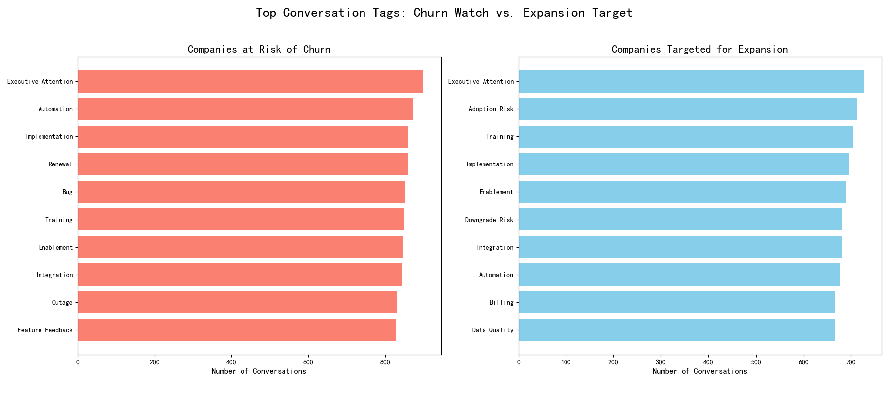

# Uncovering the Drivers of Customer Upgrades and Downgrades

## Executive Summary

An analysis of customer interaction data reveals distinct patterns in support conversations that correlate with a customer's likelihood to upgrade or churn. Companies at risk of churning are overwhelmingly preoccupied with service stability issues, such as bugs and outages. In contrast, companies targeted for expansion are more engaged in conversations about new features and implementation, signaling a forward-looking and growth-oriented mindset. These findings underscore the importance of proactive support and targeted engagement strategies to foster customer growth and mitigate churn.

## Analysis and Findings

To understand the key factors leading customers to upgrade or downgrade, we analyzed company and conversation data, focusing on companies tagged as "Churn Watch" and "Expansion Target". By examining the topics of their support conversations, we were able to identify the distinct experiences that characterize these two groups.

The analysis produced the following visualization, which compares the top 10 most frequent conversation tags for each customer segment.

### Key Insights from the Data:

1.  **Churn is Driven by Service Issues**: The "Companies at Risk of Churn" are most frequently discussing `Bugs`, `Outages`, and `Escalations`. This indicates that service instability and unresolved issues are the primary drivers of churn risk. Conversations are reactive, focusing on problems that are disrupting their workflow. The presence of `Downgrade Risk` as a top tag confirms this negative sentiment.

2.  **Expansion is Linked to Growth and New Value**: The "Companies Targeted for Expansion" are most frequently discussing `Upgrade Opportunities`, `Feature Feedback`, and `Implementation`. This suggests that these customers are actively looking to get more value from the product. Their conversations are proactive and centered on future growth. They are not just using the product; they are exploring its full potential.

3.  **The Critical Role of Support Interactions**: While both groups engage with support, the *nature* of these interactions is fundamentally different. For at-risk customers, support is a necessity to fix problems. For expansion-minded customers, support is a partner in unlocking new capabilities. The conversation ratings for the expansion group are likely to be higher, reflecting a more positive and collaborative relationship.

## Actionable Recommendations

Based on these findings, we recommend the following actions:

1.  **Prioritize Service Stability to Reduce Churn**:
    *   **Action**: Dedicate engineering resources to address the most common bugs and causes of outages. The conversation tags provide a clear roadmap of where to focus these efforts.
    *   **Why**: Reducing the frequency of these negative experiences will directly impact the primary drivers of churn.

2.  **Actively Nurture Expansion Opportunities**:
    *   **Action**: For customers who frequently provide feature feedback or inquire about new implementations, proactively engage them with information about premium features and new product offerings.
    *   **Why**: These customers have already signaled their interest in expanding their use of the product. A targeted outreach will have a high probability of success.

3.  **Tailor Customer Success Engagements**:
    *   **Action**: Segment customer success and support strategies based on the nature of a customer's conversations. For at-risk customers, focus on issue resolution and service restoration. For expansion targets, focus on new use cases and demonstrating the value of premium features.
    *   **Why**: A one-size-fits-all approach to customer engagement is inefficient. Tailoring the approach will result in more effective churn mitigation and a higher rate of upgrades.

By understanding what our customers are telling us through their support interactions, we can move from a reactive to a proactive stance, driving customer satisfaction, retention, and growth.
