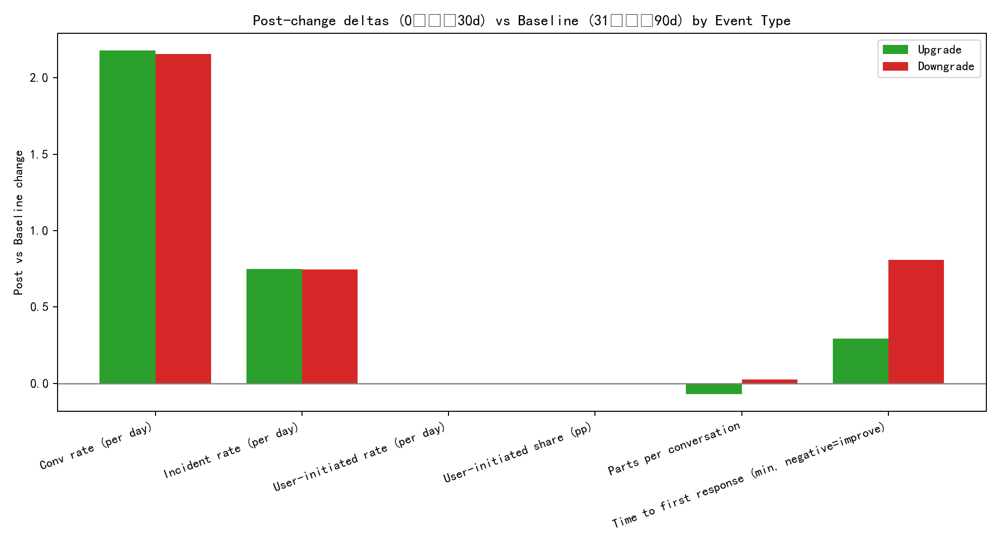

# What drives upgrades vs downgrades? A timeline-based analysis around subscription change events

## Executive summary
- We inferred upgrade/downgrade “events” from support conversations whose subject/tags mentioned “upgrade” or “downgrade,” then built per-customer timelines to compare a 30-day pre/post window to a 31–90 day baseline.
- Across 2,289 events (1,196 upgrades, 1,093 downgrades), two experience signals consistently separated upgrades from downgrades:
  1) Conversation complexity: For upgrades, parts per conversation tended to decrease vs baseline; for downgrades, it increased.
  2) Responsiveness: Time-to-first-response tended to deteriorate more before/after downgrades than upgrades.
- Incident burden (bugs/outages mentions) and overall conversation rates moved similarly for both groups in aggregate, suggesting incident volume alone doesn’t explain the difference; how efficiently support handles complexity and responsiveness seems more decisive.
- Prescriptive takeaway: proactively triage rising complexity and responsiveness slippage for at-risk accounts; use improvements in these signals as triggers for upgrade offers.

See the comparative deltas in the figure: upgrade_downgrade_post_deltas.png

## Data and methodology
- Source: SQLite database dacomp-en-099.sqlite with Intercom-like tables:
  - intercom__conversation_enhanced: conversation metadata (created_at, subject, tags, initiated_type, etc.), company association via all_contact_company_names.
  - intercom__conversation_metrics: operational metrics (parts count, time-to-first-response/close, reopens, etc.).
- Event identification: conversations where subject or tags contain “upgrade” or “downgrade.” These act as proxies for subscription change times per customer. We normalized company names by taking the first listed name in all_contact_company_names to map all conversations to that company.
- Per-event windows:
  - Baseline: days -90 to -31
  - Pre: days -30 to -1
  - Post: days 0 to +30
  - We excluded the event conversation itself from window counts.
- Metrics engineered per event:
  - Support load: conversations/day, user-initiated share (attempted), parts per conversation.
  - Incidents: counts/day of conversations tagged/subject with bug/outage/incident/downtime/error.
  - Responsiveness: time-to-first-response (minutes), time-to-first-close (minutes).
  - Deltas: post minus baseline and pre minus baseline deltas.
- Analysis:
  - Group comparisons (means, Cohen’s d effect sizes) for upgrades vs downgrades on deltas.
  - Simple predictive modeling: logistic regression on deltas to identify which experience changes increase the likelihood of an upgrade vs a downgrade.
  - Risk signal thresholds: shares of events showing material deterioration in responsiveness and increases in complexity.

Note: conversation_initiated_type did not reliably classify user-initiated messages in this data (resulting in near-zero changes), so those specific features were not central to conclusions.

## Key findings

1) Complexity diverges after the change:
- Post vs baseline change in parts per conversation:
  - Upgrades: mean delta = -0.070 (fewer parts per conversation post-change).
  - Downgrades: mean delta = +0.024 (more parts per conversation post-change).
- Effect size (Cohen’s d) is modest but directional, and our logistic regression assigns a negative coefficient to delta_post_parts_per_convo (-0.102), meaning increases in complexity are associated with downgrades.

2) Responsiveness matters more for avoiding downgrades:
- Post vs baseline change in time-to-first-response:
  - Upgrades: +0.29 min (slight deterioration).
  - Downgrades: +0.81 min (larger deterioration).
- Risk shares for responsiveness deterioration (post > baseline):
  - Any deterioration (>0m): 29.18% (upgrades) vs 29.64% (downgrades)
  - >30 minutes: 2.59% (upgrades) vs 3.66% (downgrades)
  - >60 minutes: 0.17% (upgrades) vs 0.55% (downgrades)
- Logistic regression shows that prior deterioration (delta_pre_ttf_resp_min) also associates with downgrades (negative coefficient), reinforcing that sustained slippage in responsiveness is a risk signal.

3) Incident burden is similar across groups in aggregate:
- Post vs baseline incident rate deltas:
  - Upgrades: +0.750/day
  - Downgrades: +0.745/day
- Logistic regression assigns only a small positive coefficient to delta_post_inc_rate (+0.064), implying incident volume alone doesn’t separate outcomes. The way incidents are handled (complexity, responsiveness) likely shapes the direction.

4) Support load (conversation rate) rises for both:
- Post vs baseline conversation rate deltas:
  - Upgrades: +2.178/day
  - Downgrades: +2.156/day
- Model coefficients for pre/post conversation rate deltas are negative (pre: -0.087, post: -0.056), suggesting rising support load without commensurate efficiency may tilt toward downgrade risk.

5) Upgrade vs downgrade classification drivers (logistic regression coefficients; positive => more likely upgrade):
- Top positives: delta_pre_parts_per_convo (+0.065), delta_post_inc_rate (+0.064), delta_post_ttf_resp_min (+0.016; small magnitude).
- Top negatives: delta_post_parts_per_convo (-0.102), delta_pre_ttf_resp_min (-0.094), delta_pre_conv_rate (-0.087).
Interpretation: when complexity increases after the event and responsiveness was already deteriorating before the event, the probability of a downgrade rises. Pre-event increases in support load also align with downgrade risk.

## Visualization
- Post-change deltas (0–30d) vs baseline (31–90d) by event type:

This figure summarizes the average changes for upgrades vs downgrades, highlighting the divergence in complexity and responsiveness.

## Why this matters
- Upgrades appear when customers experience equal incident burden but comparatively smoother support interactions (fewer parts per conversation) and less deterioration in responsiveness.
- Downgrades arise when complexity creeps up and response times slip—especially if these signals were already worsening before the change.
- Therefore, focusing on operational quality (efficiency and responsiveness) rather than only volume is key to influencing subscription outcomes.

## Prescriptive recommendations

Proactive downgrade prevention
- Complexity triage:
  - Watchlist accounts with rising parts per conversation vs their 60-day baseline. Trigger a senior support review or specialized playbooks when delta_pre_parts_per_convo > 0 for two consecutive weeks.
- Responsiveness SLOs:
  - Alert when an account’s time-to-first-response delta exceeds +10 minutes vs baseline in the last 14 days. Goal: return to baseline within one week.
  - Empower frontline teams with quick-resolution macros and knowledge base improvements to compress response and resolution times.
- Incident handling playbooks:
  - Even when incident volumes are similar, faster routing, better status updates, and transparent RCAs help prevent complexity buildup within conversations.

Upgrade acceleration
- Identify “green” accounts:
  - Stable or falling complexity (parts per convo delta ≤ 0) and non-deteriorating time-to-first-response (delta ≤ 0) over the last 30 days.
  - Use these signals as triggers for expansion outreach and usage-based upsell offers.
- Product guidance:
  - Provide self-serve checklists, in-product tooltips, and best-practice templates to reduce back-and-forth, lowering parts per conversation over time.

Operational levers
- Staffing and routing:
  - Staff peak hours and route complex threads to experts quickly to prevent multi-part back-and-forth.
- Knowledge base hygiene:
  - Focus content on the top drivers of multi-part threads and slow responses; measure impact via reductions in parts per conversation.
- Quality metrics baked into dashboards:
  - Track per-account moving deltas vs their own baseline for:
    - parts per conversation
    - time-to-first-response
    - conversation rate and incident rate
  - Use thresholds above to gate proactive retention plays.

## Limitations and next steps
- Event proxy: We inferred subscription change times from support conversation subjects/tags. If billing systems are available, join to actual upgrade_at/downgrade_at timestamps to validate and refine these insights.
- Company mapping: We normalized company names from all_contact_company_names (first name when multiple). If unique company IDs are available, map by ID to strengthen joins.
- Additional features: If product feature usage logs exist (e.g., API calls), incorporate usage intensity deltas to distinguish healthy growth from support overhead.
- Segmentation: Repeat the analysis by plan or industry to tailor interventions.

## Reproducibility
- SQL: Built per-event windows and aggregated pre/baseline/post metrics into event_windows.csv.
- Python: Engineered deltas, ran group comparisons, fit logistic regression, computed risk signal shares, and produced the figure upgrade_downgrade_post_deltas.png (plotting code included in the transcript).

## Bottom line
- To reduce downgrades, prioritize controlling conversation complexity and maintaining response times at or better than each account’s own baseline, especially when support load is rising.
- To drive upgrades, identify accounts with stable or improving complexity and responsiveness and time expansion outreach to those windows.
