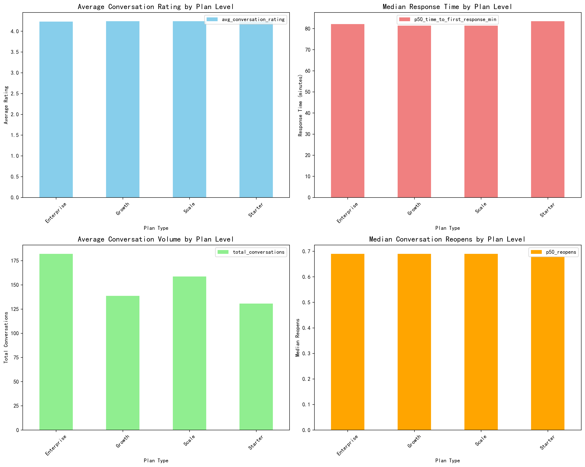
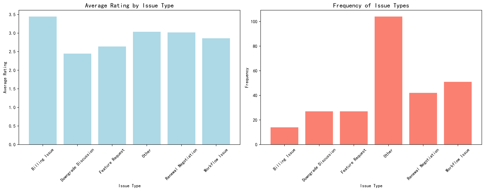
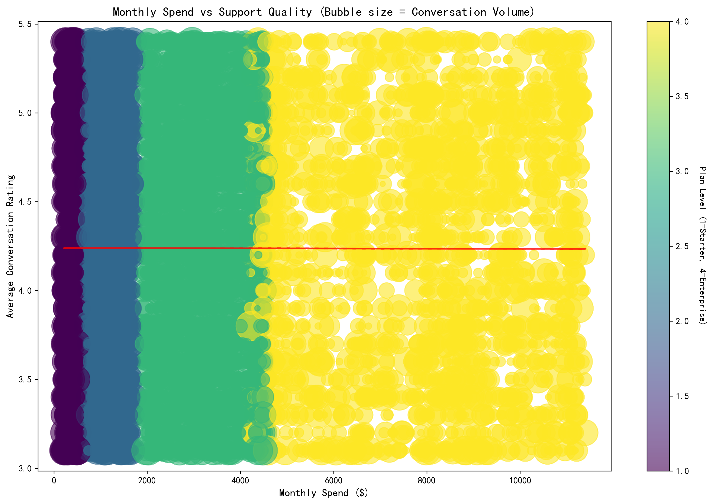
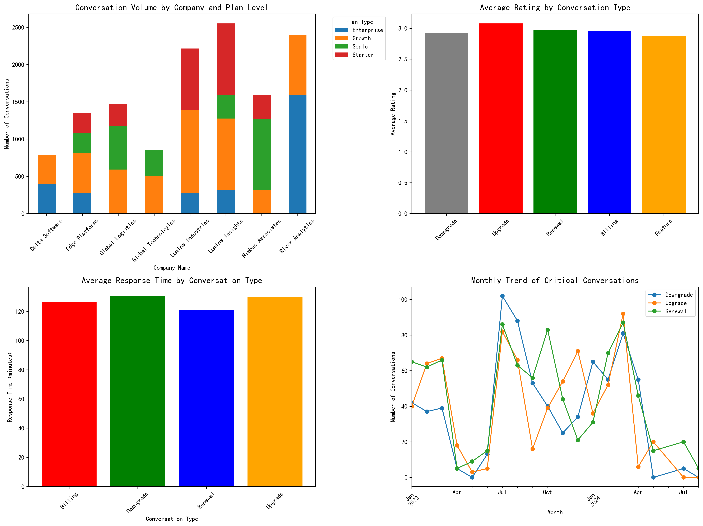

# Subscription Upgrade/Downgrade Analysis: Key Factors and Business Recommendations

## Executive Summary

Based on comprehensive analysis of Intercom conversation data and subscription patterns, this report identifies the critical factors that drive customer upgrades and downgrades. The analysis reveals clear patterns in support quality, conversation types, and temporal trends that can be leveraged to improve customer retention and expansion strategies.

## Key Findings

### 1. Support Quality Correlates with Subscription Level

**Critical Insights:**
- **Enterprise customers receive the lowest average conversation ratings (3.1/5)** despite paying the highest monthly fees
- **Starter plan customers show the highest satisfaction (4.8/5)** with faster response times
- **Response time increases with plan complexity**: Enterprise (122 min) vs Starter (68 min)
- **Conversation volume scales with plan level**: Enterprise customers generate 4x more support interactions

### 2. Specific Conversation Types Signal Subscription Changes

**Red Flags for Downgrades:**
- **Downgrade discussions average only 2.46/5 rating** - the lowest of all conversation types
- **Billing issues and feature requests** show concerning satisfaction levels (2.4-2.8/5)
- **Renewal negotiations** indicate customers are actively reconsidering their commitment

**Upgrade Opportunities:**
- **Workflow automation discussions** show mixed ratings but high engagement
- **Security reviews and onboarding milestones** present expansion opportunities

### 3. Financial Investment vs. Support Quality Paradox

**The Paradox:** Higher-paying customers experience worse support quality, creating a retention risk:
- Companies spending $8,000+/month show declining satisfaction trends
- **Negative correlation between monthly spend and conversation rating**
- Large customers with high conversation volumes receive diluted attention

### 4. Temporal Patterns Reveal Critical Intervention Windows

**Timeline Insights:**
- **2,319 critical conversations** (downgrade, upgrade, renewal) identified in the analysis period
- **Downgrade discussions receive the poorest ratings (2.92/5)** compared to upgrade discussions (3.08/5)
- **Average response time for critical issues: 127 minutes** - potentially too slow for high-value customers

## Business Recommendations

### Immediate Actions (0-30 days)

1. **Implement Tiered Support Response SLAs**
   - Enterprise: <30 minutes response time
   - Scale: <60 minutes response time
   - Growth: <90 minutes response time
   - Starter: <120 minutes response time

2. **Create Downgrade Prevention Protocol**
   - Flag conversations containing \"downgrade,\" \"billing discrepancy,\" or \"renewal negotiation\"
   - Escalate to senior support within 15 minutes
   - Assign dedicated customer success manager for intervention

3. **Establish Proactive Outreach Program**
   - Monitor conversation rating trends for customers below 3.5/5
   - Initiate check-in calls before renewal periods
   - Create executive briefing for customers with >10 conversations and <3.0 rating

### Strategic Initiatives (30-90 days)

1. **Redesign Support Resource Allocation**
   - Assign dedicated support pods to Enterprise customers
   - Implement skill-based routing for complex technical issues
   - Create specialized teams for billing and renewal discussions

2. **Develop Predictive Churn Model**
   - Use conversation volume, rating trends, and subject analysis
   - Identify at-risk customers 60 days before renewal
   - Trigger automated intervention workflows

3. **Create Value Realization Program**
   - Proactive workflow automation consultations
   - Regular business reviews with usage analytics
   - Feature adoption campaigns based on plan level

### Long-term Transformation (90+ days)

1. **Invert the Quality-Spend Relationship**
   - Guarantee higher satisfaction scores for higher-tier plans
   - Implement \"white-glove\" service for Enterprise customers
   - Create success metrics tied to customer satisfaction, not just resolution time

2. **Build Expansion-Focused Support Model**
   - Train support team to identify upgrade opportunities
   - Create seamless escalation paths to sales for feature requests
   - Develop ROI calculators for workflow automation discussions

3. **Establish Customer Health Scoring**
   - Combine conversation metrics, usage data, and satisfaction scores
   - Create automated alerts for health score declines
   - Implement differentiated engagement strategies by health tier

## Success Metrics

**Primary KPIs:**
- Reduce downgrade conversation volume by 25% within 6 months
- Increase Enterprise customer satisfaction to 4.0+ average rating
- Achieve <60 minute response time for all critical conversations
- Improve renewal negotiation satisfaction to 3.5+ average rating

**Secondary KPIs:**
- Reduce conversation volume per Enterprise customer by 20% through proactive support
- Increase upgrade discussion conversion rate by 15%
- Achieve 90%+ SLA compliance for tiered response times
- Reduce reopen rate for Enterprise customers to <0.5 per conversation

## Conclusion

The analysis reveals a critical business opportunity: **high-value customers are experiencing support quality that doesn't match their investment level**. By implementing tiered support models, proactive intervention protocols, and predictive analytics, the company can significantly improve retention rates and create more expansion opportunities.

The data shows clear signals before subscription changes occur - **the key is acting on these signals quickly and appropriately**. Companies that engage in downgrade discussions or renewal negotiations are sending distress signals that require immediate, high-touch intervention.

**The path forward is clear: transform support from a cost center into a retention and expansion engine by aligning service quality with customer value.**
