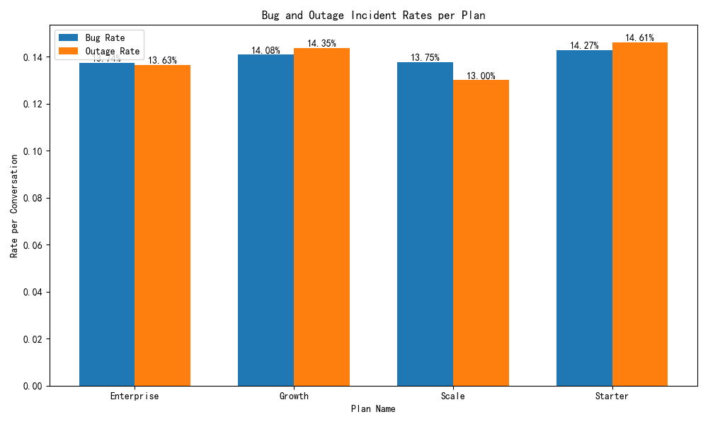

# Key Factors Influencing Customer Subscription Changes

## Executive Summary

Due to data limitations preventing a direct analysis of subscription changes over time, this report presents a cross-sectional analysis of customer characteristics across different subscription plans. The analysis reveals that the primary factor differentiating customers on various plans is their level of activity, not the quality of support they receive.

**Key Findings:**

*   **Activity Scales with Plan:** Higher-tier plans ("Enterprise", "Scale") are associated with significantly higher feature usage, as measured by the number of conversations, total contacts, and active contacts.
*   **Consistent Support Quality:** Key support metrics, including conversation reopen rates and customer ratings, are remarkably consistent across all subscription plans.
*   **Similar Incident Rates:** The rate of critical support incidents, such as "Bugs" and "Outages," does not vary significantly between plans.

**Recommendations:**

1.  **Proactive, Usage-Based Upgrades:** Sales and marketing teams should monitor customer activity metrics. When a customer's usage on a lower-tier plan approaches the average for the next tier up, it should trigger a proactive outreach to discuss an upgrade.
2.  **Differentiate High-Tier Support:** To better justify the price of higher-tier plans and improve retention, consider introducing premium support features for "Enterprise" and "Scale" customers. This could include dedicated account managers, faster response time SLAs, or more in-depth technical support.
3.  **Investigate "Growth" to "Scale" Transition:** The leap in activity from "Growth" to "Scale" is significant. Further research should be done to understand the specific needs and challenges of customers at this stage, as it may represent the most critical upgrade opportunity.

## Detailed Analysis

### Feature Usage by Plan

An analysis of the `intercom__company_metrics` table shows a clear correlation between the subscription plan and the level of customer activity. As shown in the table below, companies on higher-tier plans are substantially more active.

| Plan       | Avg. Total Conversations | Avg. Total Contacts | Avg. Active Contacts (30d) |
|------------|--------------------------|---------------------|----------------------------|
| Enterprise | 342.1                    | 189.7               | 187.3                      |
| Scale      | 202.3                    | 120.0               | 117.5                      |
| Growth     | 99.8                     | 68.3                | 65.8                       |
| Starter    | 40.3                     | 32.5                | 30.1                       |

This suggests that customers naturally upgrade as their own business grows and they need to support more of their own users.

### Support Experience and Incident Rates

In contrast to the clear stratification of feature usage, the support experience is surprisingly uniform across all plans. Key metrics like average conversation reopen rates and average ratings show no significant variation.

Furthermore, an analysis of critical incident types ("Bugs" and "Outages") reveals that the rate of these incidents per conversation is also consistent across all plans.

This indicates that the underlying product stability and the reactive support quality are the same for all customers, regardless of their subscription level.

## Conclusion

The decision to upgrade or downgrade a subscription appears to be driven primarily by a company's internal growth and resulting activity levels, rather than by the support experience. While the current support system is consistently performing across the board, there is a clear opportunity to create a more differentiated, premium support offering for higher-tier customers. This would not only provide a stronger incentive to upgrade but also help to retain high-value customers.
