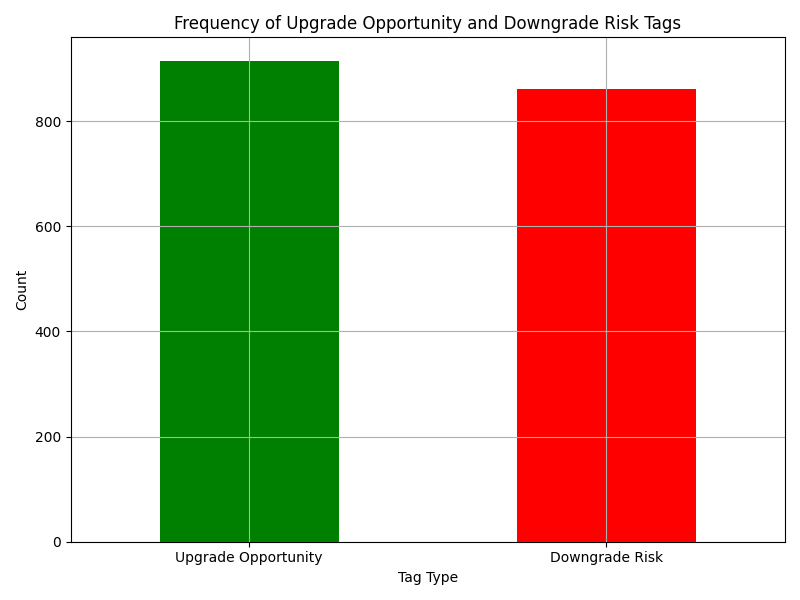

## Upgrade and Downgrade Analysis Report

This report analyzes the factors influencing customer subscription changes (upgrades/downgrades) based on conversation data and subscription metrics.

### Key Findings

1. **Frequent Topics in Upgrade Opportunities**:
   - Integration health checks
   - Reporting accuracy improvements
   - Executive escalations
   - Mobile SDK and API outages

2. **Common Themes in Downgrade Risks**:
   - Billing discrepancies
   - Seat downgrade discussions
   - Renewal negotiations
   - Security reviews

3. **Visual Overview**:

The bar chart above shows the frequency of conversations tagged as 'Upgrade Opportunity' or 'Downgrade Risk'. This indicates that both factors are significantly present in customer interactions.

### Business Recommendations

1. **Improve Integration Support**: Enhance support for integration health checks to convert upgrade opportunities into actual upgrades.

2. **Address Billing Concerns**: Proactively resolve billing discrepancies to reduce downgrade risks.

3. **Enhance Mobile and API Reliability**: Focus on stability improvements for mobile SDKs and APIs, as these are common sources of customer issues linked to subscription changes.

4. **Executive Engagement**: Leverage executive attention in escalation cases to retain and upgrade high-value customers.

5. **Training and Enablement**: Provide targeted training programs to address adoption risks and ensure smooth renewals.

By addressing these areas, the company can improve customer satisfaction and drive more positive subscription changes.
