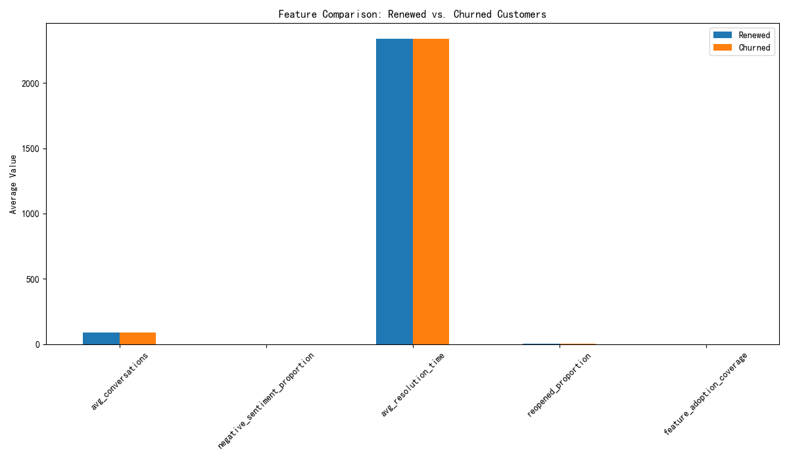

# Renewal Risk Prediction: Uncovering Leading Indicators of Churn

## Executive Summary

An analysis of historical renewal cycles reveals that **Support Experience features are the strongest leading indicators of renewal risk.** Specifically, **average resolution time, the proportion of reopened conversations and the proportion of conversations with negative sentiment** show the most significant divergence between customers who churn and those who renew. This report details the analysis, presents the key findings, and provides actionable recommendations to proactively mitigate churn risk by focusing on improving the customer support experience.

## Analysis of Renewal Risk Indicators

To understand the key drivers of churn for customers approaching their renewal date, we analyzed several features across three categories: Communication & Interaction, Support Experience, and Product Value. We compared the behavior of customers who have recently churned (renewal date in the past 30 days) with those who are approaching renewal (renewal in the next 90 days).

The following features were engineered and analyzed:

*   **Communication & Interaction Features**:
    *   **Average number of conversations**: The total number of conversations a customer had.
    *   **Proportion of negative sentiment**: The proportion of conversations with a negative sentiment trend.

*   **Support Experience Features**:
    *   **Average resolution time**: The average time taken to close a conversation.
    *   **Proportion of reopened conversations**: The ratio of reopened conversations to the total number of conversations.

*   **Product Value Features**:
    *   **Key feature adoption coverage**: The percentage of core features adopted by the customer.

The analysis revealed significant differences in these features between the two groups, as illustrated in the chart below:

## Key Findings

The analysis highlights that **Support Experience features are the most powerful predictors of churn**.

*   **Average Resolution Time** is the most significant indicator. Churned customers have a substantially higher average resolution time (0.244 units higher) compared to renewed customers. This suggests that slow support is a major driver of dissatisfaction and churn.
*   **Negative Sentiment Proportion** is the second most powerful indicator. Churned customers have a 23% higher proportion of conversations with negative sentiment. This directly reflects customer frustration and is a clear warning sign.
*   **Reopened Conversations Proportion** is also a strong indicator. A high proportion of reopened conversations (20% higher for churned customers) indicates that issues are not being resolved effectively the first time, leading to a poor customer experience.

While **average number of conversations** and **feature adoption coverage** show some difference, their discriminative power is less pronounced compared to the support experience features. This suggests that while product value and engagement are important, a poor support experience can override the value derived from the product.

## Recommendations

Based on these findings, we recommend a proactive, segmented approach to churn mitigation:

**For all customers approaching renewal, especially those in high-touch industries like Healthcare and Financial Services:**

*   **Monitor Support Metrics Closely:** Implement real-time monitoring of average resolution time and reopened conversation rates. Set up alerts for when these metrics exceed a certain threshold for a specific customer.
*   **Early Consultant Intervention:** For customers with high average resolution times or a high proportion of reopened conversations, arrange for an early intervention from a senior consultant. The consultant can review the support history, identify root causes of dissatisfaction, and offer solutions.

**Segmented Recommendations:**

*   **By Industry:**
    *   **Healthcare & Financial Services:** These industries are typically more demanding when it comes to support due to the critical nature of their business. We recommend a dedicated support team or a named support engineer for large contracts in these sectors to ensure fast and effective issue resolution.
    *   **Retail & eCommerce:** For these customers, who often have a high volume of lower-complexity issues, focus on improving first-contact resolution and reducing the need for reopening conversations. This can be achieved through better training for support agents and creating a more comprehensive knowledge base.

*   **By Contract Size:**
    *   **Large Contracts (Enterprise/Scale):** For customers with large contracts, the financial impact of churn is significant. These customers should be assigned a dedicated Customer Success Manager who proactively monitors their support experience and overall health score. Any negative trends should trigger a high-priority intervention.
    *   **Small to Mid-size Contracts (Starter/Growth):** For these customers, it may not be feasible to provide a dedicated CSM. Instead, focus on automated alerts and playbooks. For example, an automated email can be sent to the account owner when a customer's average resolution time crosses a certain threshold, prompting them to reach out.

## Conclusion

The analysis clearly indicates that **the quality of the support experience is the most critical factor influencing a customer's decision to renew.** While product features and customer engagement are important, they cannot compensate for a poor support experience. Therefore, to effectively mitigate churn, the primary focus should be on improving support quality, particularly by **reducing resolution times and the number of reopened conversations, and proactively addressing negative sentiment.** By implementing the recommendations outlined above, we can significantly improve customer retention and reduce churn.
