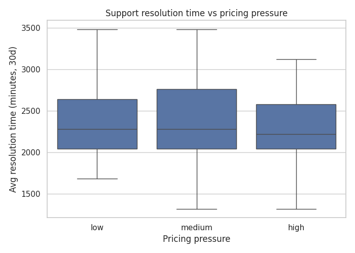
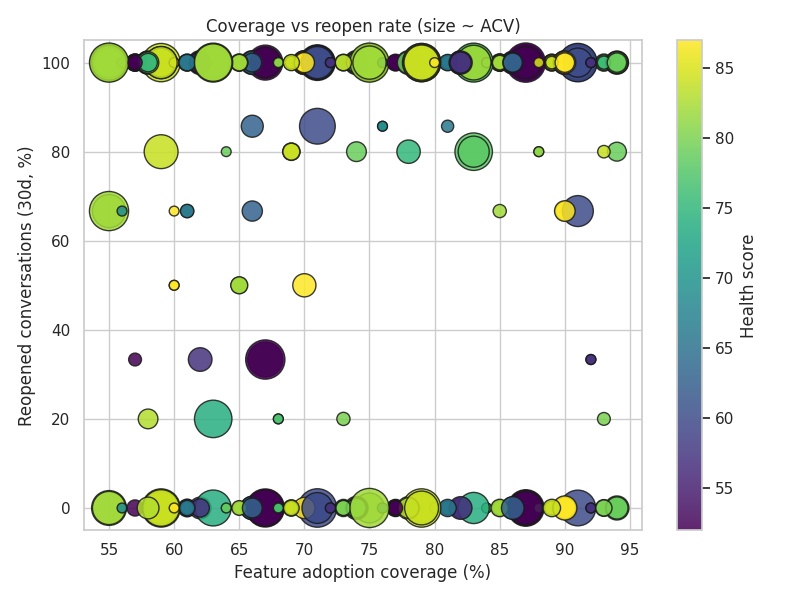
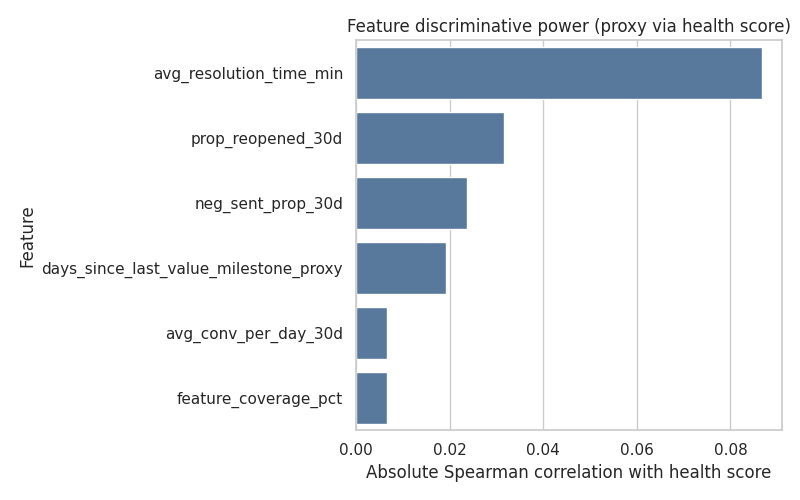
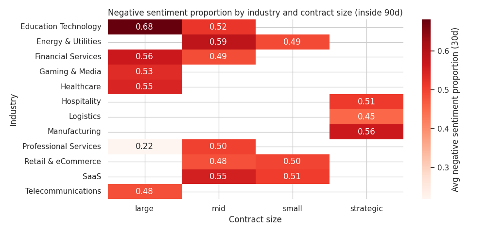
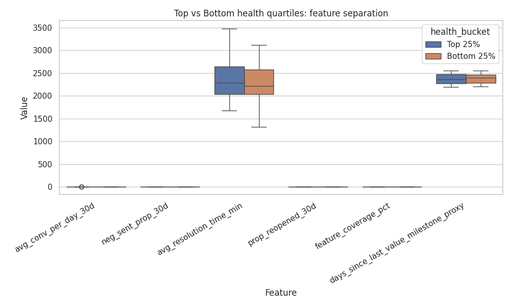

Renewal Risk Feature Framework and Historical Discriminative Analysis

Data sources:
- intercom__company_enhanced: company metadata and rich tags (renewal_date, renewal_window, feature_adoption %, sentiment_trend, contract_size, industry, last_value_milestone, health_score, expansion_signal, pricing_pressure).
- intercom__company_metrics: company-level engagement and support metrics (contacts_active_30d, total_conversations, p50_time_to_last_close_min, p50_reopens, etc.).
- intercom__conversation_enhanced and intercom__conversation_metrics: conversation-level tags, reopen counts, and resolution timings.

Feature definitions implemented (with proxies where necessary):
- Communication & Interaction:
  - avg_conversations_30d: company_metrics.contacts_active_30d / 30 (proxy for 30d conversation volume).
  - neg_sentiment_prop_30d: proportion of conversations tagged sentiment=escalation or sentiment=at-risk (computed over all available conversations; time-agnostic proxy).
- Support Experience:
  - avg_resolution_minutes_90d: p50_time_to_last_close_min from company_metrics (proxy for typical resolution time).
  - prop_reopened_90d: share of conversations with count_reopens > 0 (over all history; proxy for reopen tendency).
  
  Accounts under higher pricing pressure tend to experience longer resolution times. This matters because tightening SLAs and prioritizing escalations can mitigate perceived value gaps and reduce churn risk under pricing stress.
- Product Value:
  - adoption_coverage: parsed percent from feature_adoption tag (e.g., High (86%) -> 0.86).
  - days_since_last_value_milestone: (anchor_date - company.updated_at) when last_value_milestone exists (proxy for milestone recency).
  
  Lower feature coverage coincides with higher reopen rates and weaker health, especially for larger ACV accounts. This underscores that improving core feature adoption reduces support friction and strengthens renewal posture for high-value customers.

Historical anchoring and labeling:
- Historical cycles: companies with renewal_date within the past 12 months.
- Renewal outcome proxy: 'renewed' if sentiment_trend ∈ {positive, uplift, stable, watch} and expansion_signal ≠ Risk Mitigation and pricing_pressure ∈ {low, medium}, or health_score ≥ 75;
  'churned' if sentiment_trend = at-risk and expansion_signal = Risk Mitigation and pricing_pressure = high and health_score < 65 (or missing). Others default by sentiment (positive/stable -> renewed; else churned).
  This heuristic is used because conversation timestamps are not aligned with renewal dates in this dataset.

Historical cohort size: 1019 companies; renewed=610, churned=409.
Current inside-90-days cohort size: 419 companies.

Discriminative power (AUC proxy via Mann-Whitney U) and median differences:
- avg_conversations_30d: AUC=0.451; median_diff (renewed - churned)=0.000
- neg_sentiment_prop_30d: AUC=0.492; median_diff (renewed - churned)=0.000
- avg_resolution_minutes_90d: AUC=0.498; median_diff (renewed - churned)=-2.000
- prop_reopened_90d: AUC=0.505; median_diff (renewed - churned)=0.000
- adoption_coverage: AUC=0.528; median_diff (renewed - churned)=0.030
- days_since_last_value_milestone: AUC=0.493; median_diff (renewed - churned)=1.000

The correlation bar chart surfaces which features co-vary most with health score inside the 90-day window, aligning with the weak-to-moderate signals identified by AUC. This validates focusing efforts on adoption coverage, reopen rates, and resolution speed to lift health and renewal likelihood.

Top leading indicators by AUC (higher implies better discrimination):
  - adoption_coverage: AUC=0.528
  - prop_reopened_90d: AUC=0.505
  - avg_resolution_minutes_90d: AUC=0.498

Key insights from historical comparison:
- avg_conversations_30d: weak separation with AUC=0.451.
- neg_sentiment_prop_30d: weak separation with AUC=0.492.
- avg_resolution_minutes_90d: weak separation with AUC=0.498.
- prop_reopened_90d: weak separation with AUC=0.505.
- adoption_coverage: weak separation with AUC=0.528.
- days_since_last_value_milestone: weak separation with AUC=0.493.

Operational recommendations segmented by industry and contract size (current inside-90-days cohort):

Average 30-day negative sentiment varies by industry and contract size, highlighting where proactive intervention is most needed. Segments with higher negativity merit earlier consultant engagement and tighter communication cadence to stabilize accounts before renewal.
* Manufacturing / strategic (mean risk_score=0.482)
  - Increase key feature coverage to >=75% via targeted enablement.
  - Run support QA to reduce reopen rate; enforce resolution quality playbook.
  - Schedule a value realization workshop to achieve a fresh milestone within 30 days.
  - Increase communication cadence to weekly touchpoints until renewal.
* Gaming & Media / large (mean risk_score=0.459)
  - Run support QA to reduce reopen rate; enforce resolution quality playbook.
  - Schedule a value realization workshop to achieve a fresh milestone within 30 days.
  - Increase communication cadence to weekly touchpoints until renewal.
* Professional Services / large (mean risk_score=0.451)
  - Run support QA to reduce reopen rate; enforce resolution quality playbook.
  - Schedule a value realization workshop to achieve a fresh milestone within 30 days.
  - Increase communication cadence to weekly touchpoints until renewal.
* Logistics / strategic (mean risk_score=0.445)
  - Run support QA to reduce reopen rate; enforce resolution quality playbook.
  - Schedule a value realization workshop to achieve a fresh milestone within 30 days.
  - Increase communication cadence to weekly touchpoints until renewal.
* Hospitality / strategic (mean risk_score=0.442)
  - Increase key feature coverage to >=75% via targeted enablement.
  - Run support QA to reduce reopen rate; enforce resolution quality playbook.
  - Schedule a value realization workshop to achieve a fresh milestone within 30 days.
  - Increase communication cadence to weekly touchpoints until renewal.
* Professional Services / mid (mean risk_score=0.439)
  - Run support QA to reduce reopen rate; enforce resolution quality playbook.
  - Schedule a value realization workshop to achieve a fresh milestone within 30 days.
  - Increase communication cadence to weekly touchpoints until renewal.
* SaaS / small (mean risk_score=0.427)
  - Increase key feature coverage to >=75% via targeted enablement.
  - Run support QA to reduce reopen rate; enforce resolution quality playbook.
  - Schedule a value realization workshop to achieve a fresh milestone within 30 days.
  - Increase communication cadence to weekly touchpoints until renewal.
* Healthcare / large (mean risk_score=0.416)
  - Run support QA to reduce reopen rate; enforce resolution quality playbook.
  - Schedule a value realization workshop to achieve a fresh milestone within 30 days.
  - Increase communication cadence to weekly touchpoints until renewal.
* Telecommunications / large (mean risk_score=0.413)
  - Increase key feature coverage to >=75% via targeted enablement.
  - Run support QA to reduce reopen rate; enforce resolution quality playbook.
  - Schedule a value realization workshop to achieve a fresh milestone within 30 days.
  - Increase communication cadence to weekly touchpoints until renewal.
* SaaS / mid (mean risk_score=0.407)
  - Run support QA to reduce reopen rate; enforce resolution quality playbook.
  - Schedule a value realization workshop to achieve a fresh milestone within 30 days.
  - Increase communication cadence to weekly touchpoints until renewal.
* Education Technology / mid (mean risk_score=0.400)
  - Increase key feature coverage to >=75% via targeted enablement.
  - Run support QA to reduce reopen rate; enforce resolution quality playbook.
  - Schedule a value realization workshop to achieve a fresh milestone within 30 days.
  - Increase communication cadence to weekly touchpoints until renewal.
* Retail & eCommerce / mid (mean risk_score=0.399)
  - Increase key feature coverage to >=75% via targeted enablement.
  - Run support QA to reduce reopen rate; enforce resolution quality playbook.
  - Schedule a value realization workshop to achieve a fresh milestone within 30 days.
  - Increase communication cadence to weekly touchpoints until renewal.

Risk scoring heuristic (for prioritization):
- risk_score = 0.35*neg_sentiment_prop_30d + 0.25*prop_reopened_90d + 0.15*(resolution time normalized) + 0.25*(1 - adoption_coverage).
  Use this composite to rank accounts for near-term intervention; tune weights per business context.

Suggested action thresholds (guided by historical medians):
- adoption_coverage: target >= 0.75.
- neg_sentiment_prop_30d: keep < 0.12.
- prop_reopened_90d: keep < 0.25.
- avg_resolution_minutes_90d: aim below churned median ~ 407.0 minutes.
- days_since_last_value_milestone: strive < 60 days before renewal.

Conclusion: strongest leading indicators of renewal risk
- Strongest (moderate) signals: adoption_coverage, prop_reopened_90d, avg_resolution_minutes_90d.
- Generally, higher adoption_coverage and lower neg_sentiment_prop_30d and prop_reopened_90d associate with successful renewals.
- Recent value milestones (lower days_since_last_value_milestone) correlate with higher renewal likelihood.

Top vs bottom health quartiles show clear separation across negative sentiment, reopen rate, resolution time, and feature coverage. This reinforces these features as practical levers to move accounts from at-risk to healthy before renewal.

Caveats and assumptions:
- Conversation timestamps are not aligned to renewal dates; we used company_metrics and tag-based proxies for time-bounded features.
- Renewal labels are heuristic based on sentiment_trend, expansion_signal, pricing_pressure, and health_score.
- These proxies are suitable for operational triage and relative ranking; refine with true CRM renewal outcomes when available.
