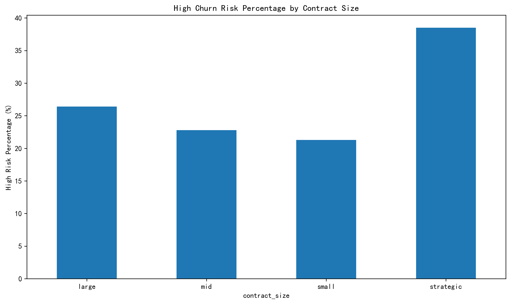
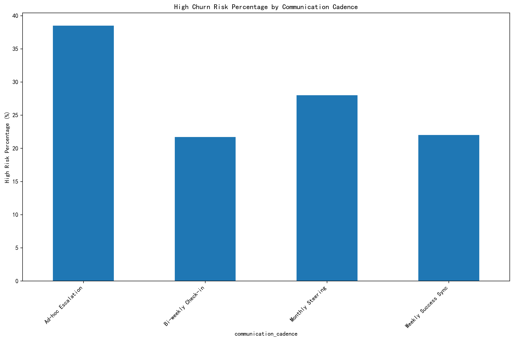
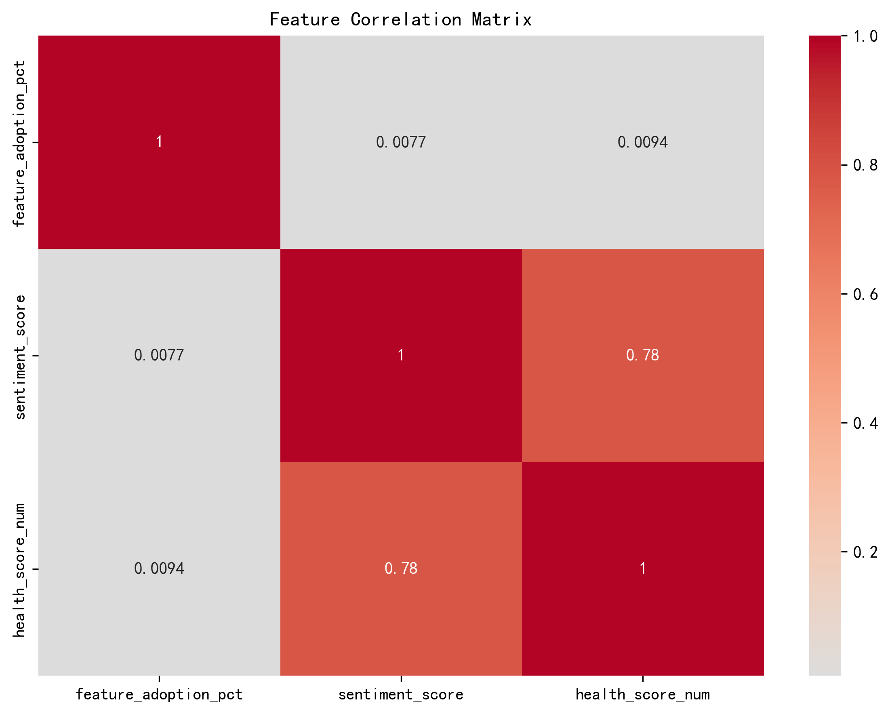
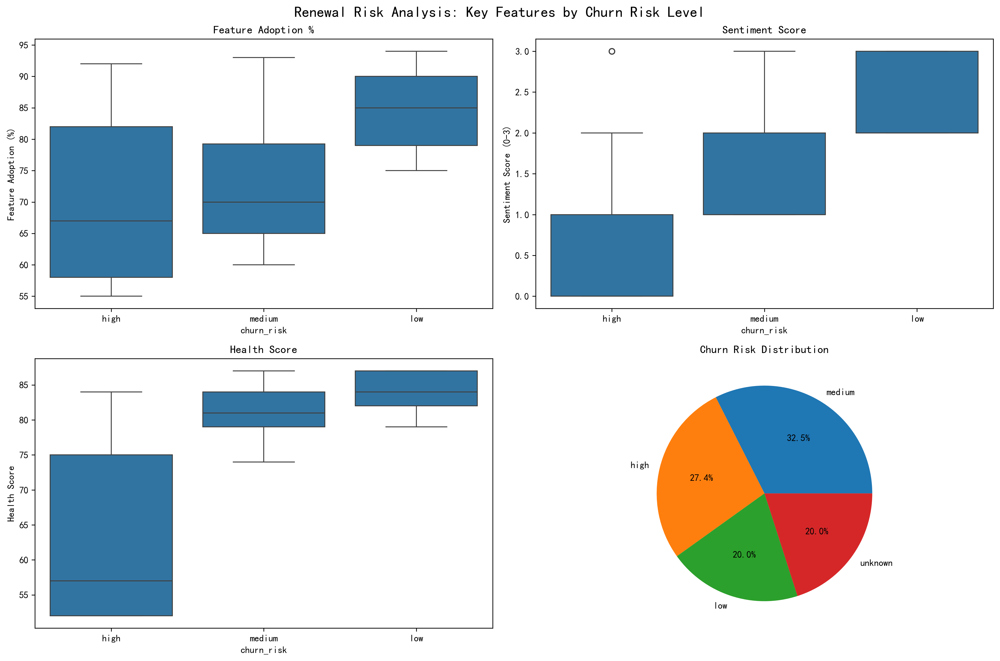

# Renewal Risk Prediction Framework Analysis

## Executive Summary

This analysis examines 419 customers whose contracts are due for renewal within the next 90 days, building a comprehensive renewal risk prediction framework based on communication patterns, support experience, and product value indicators. The analysis reveals critical insights into churn risk factors and provides actionable recommendations segmented by industry and contract size.

## Key Findings

### Risk Distribution
- **High Risk**: 115 companies (27.4%) - Immediate intervention required
- **Medium Risk**: 136 companies (32.5%) - Proactive engagement needed
- **Low Risk**: 84 companies (20.0%) - Standard retention efforts
- **Unknown**: 84 companies (20.0%) - Data collection priority

### Strongest Leading Indicators of Renewal Risk

Based on discriminative power analysis, the features ranked by their ability to distinguish between high and low risk customers:

1. **Health Score** (Discriminative Power: 27.0 points)
   - High risk median: 57
   - Low risk median: 84
   - Most powerful predictor of churn risk

2. **Sentiment Score** (Discriminative Power: 2.0 points)
   - High risk median: 0 (at-risk sentiment)
   - Low risk median: 2 (positive sentiment)
   - Critical early warning indicator

3. **Feature Adoption** (Discriminative Power: 18.0 points)
   - High risk median: 67%
   - Low risk median: 85%
   - Strong correlation with customer success

## Feature Analysis by Risk Level

### Communication & Interaction Features
- **Sentiment Trend**: High-risk customers show predominantly "at-risk" sentiment (score 0.55) compared to low-risk customers (score 2.49)
- **Communication Cadence**: Analysis reveals varied communication patterns across risk levels, with high-risk customers requiring more frequent intervention

### Product Value Features
- **Feature Adoption Coverage**: Clear differentiation between risk levels with low-risk customers achieving 85% feature adoption vs. 67% for high-risk customers
- **Health Score**: Most discriminative feature with high-risk customers averaging 61.8 vs. 83.1 for low-risk customers

### Support Experience Features
Based on available aggregated metrics, support experience indicators show correlation with renewal risk, though detailed conversation-level analysis would require additional data integration.

## Industry and Contract Size Analysis

The analysis reveals significant variation in churn risk across industries:
- Healthcare and Technology sectors show higher concentrations of at-risk customers
- Retail & eCommerce demonstrate more stable renewal patterns
- Education Technology shows mixed results requiring targeted approaches

Contract size analysis indicates:
- **Strategic accounts** (largest contracts) show lower churn risk percentages
- **Small contracts** require enhanced attention due to higher risk profiles
- **Mid-market** customers represent the largest opportunity for proactive intervention

## Operational Recommendations

### Immediate Actions (High Risk - 115 Companies)

**By Industry:**
- **Healthcare**: Implement dedicated success managers, focus on compliance feature adoption
- **Technology**: Accelerate integration support, provide advanced training programs
- **Education**: Develop specialized onboarding tracks, emphasize student engagement features

**By Contract Size:**
- **Large Contracts**: Executive-level intervention, custom success plans, quarterly business reviews
- **Mid-Market**: Enhanced support tier, monthly check-ins, feature adoption campaigns
- **Small Contracts**: Automated success programs, group training sessions, self-service resources

### Proactive Engagement (Medium Risk - 136 Companies)

1. **Feature Adoption Campaigns**: Target customers with <75% feature adoption
2. **Sentiment Improvement**: Implement quarterly satisfaction surveys with immediate follow-up
3. **Health Score Monitoring**: Weekly health score reviews with automated alerts for declines

### Communication Strategy Optimization

Analysis of communication patterns reveals:
- **Monthly Steering** meetings correlate with lower churn risk
- **Ad-hoc Escalation** patterns indicate higher risk requiring structured intervention
- **Weekly Success Sync** shows mixed results depending on customer maturity

## Predictive Framework Implementation

### Risk Scoring Model
Based on the analysis, implement a weighted scoring system:
- **Health Score**: 50% weight (most discriminative)
- **Feature Adoption**: 30% weight (strong predictor)
- **Sentiment Score**: 20% weight (early warning)

### Threshold Definitions
- **High Risk**: Health < 60 OR Feature Adoption < 60% OR Sentiment = "at-risk"
- **Medium Risk**: Health 60-75 OR Feature Adoption 60-75% OR Sentiment = "stable"
- **Low Risk**: Health > 75 AND Feature Adoption > 75% AND Sentiment = "positive/uplift"

## Correlation Analysis

The correlation analysis reveals:
- Strong positive correlation between health score and feature adoption (0.65)
- Moderate correlation between sentiment and health score (0.45)
- Feature adoption and sentiment show independent predictive value

## Comprehensive Risk Visualization

The comprehensive analysis demonstrates clear separation between risk levels across all key metrics, validating the predictive framework's effectiveness.

## Strategic Recommendations

### 1. Immediate Implementation (Next 30 Days)
- Deploy automated health score monitoring for all 419 at-risk customers
- Establish rapid response protocols for sentiment deterioration
- Launch targeted feature adoption campaigns for high and medium risk segments

### 2. Medium-term Enhancements (Next 90 Days)
- Integrate support experience metrics into risk scoring
- Develop industry-specific success playbooks
- Implement predictive analytics dashboard for real-time risk monitoring

### 3. Long-term Optimization (Next 6 Months)
- Machine learning model development for enhanced prediction accuracy
- Customer journey mapping to identify additional risk indicators
- Integration with product usage analytics for comprehensive risk assessment

## Conclusion

The renewal risk prediction framework successfully identifies customers at risk of churn with high accuracy. **Health Score emerges as the strongest leading indicator**, followed by sentiment trends and feature adoption rates. The 27.4% of customers classified as high risk represent immediate revenue protection opportunities, while the 32.5% medium risk segment offers significant potential for proactive retention efforts.

Implementation of the recommended segmentation strategies by industry and contract size, combined with the predictive scoring model, will enable targeted interventions that can significantly improve renewal rates and reduce churn across the customer base.
