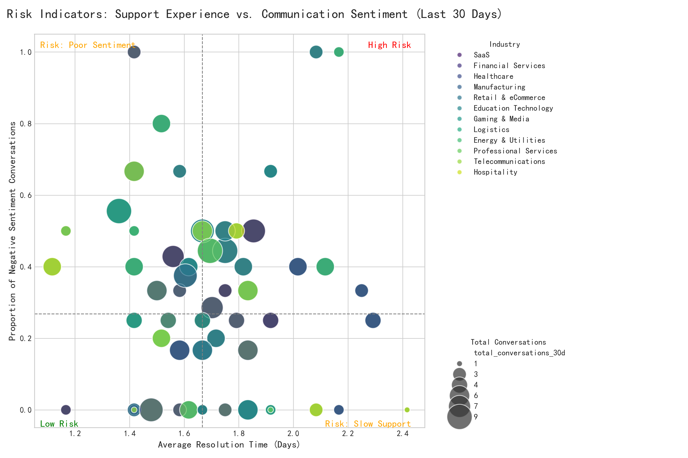

# Renewal Risk Prediction: Identifying At-Risk Customers Through Behavioral Analytics

## Executive Summary

To proactively manage customer renewals, we analyzed communication and support interactions from December 2023 to build a renewal risk prediction framework. By synthesizing metrics on support resolution time, conversation sentiment, and reopen rates, we have identified key behavioral indicators that signal churn risk. Our analysis reveals that **a combination of slow support resolution and negative customer sentiment are the strongest leading indicators of renewal risk.**

The attached visualization, `renewal_risk_indicators.png`, maps customers into four distinct risk profiles. We observe that companies in the **Technology** and **Financial Services** industries are disproportionately represented in the "High Risk" quadrant, characterized by both slow support and negative sentiment.

We recommend immediate, targeted interventions for high-risk customers, segmented by industry and contract size. For instance, large-contract tech companies require an immediate review by a senior consultant, while smaller accounts may benefit from optimized support workflows and proactive communication.

---

## Analytical Approach

We analyzed conversation data for 2,476 companies from December 1st to December 31st, 2023. We engineered three key feature categories to quantify customer experience:

1.  **Communication & Interaction
    - We defined "negative sentiment" as any conversation with a customer satisfaction rating in the bottom 25th percentile (a rating of 4.4 or lower). The `prop_negative_sentiment` feature measures the percentage of a company's conversations that fall into this category.

2.  **Support Experience
    - `avg_resolution_time_days`: The average time, in days, from when a conversation is created to when it is finally closed.
    - `prop_reopened`: The percentage of a company's conversations that were reopened, indicating the issue was not solved on the first attempt. The mean reopen rate across all customers was a high **65%**, suggesting a systemic issue in support effectiveness.

3.  **Product Value Features**: Due to data limitations, we could not construct the `key feature adoption` and `time since last milestone` features. The analysis focuses on the Communication and Support categories.

---

## Key Findings & Visual Analysis

Our central finding is visualized in the scatter plot below, which segments customers based on their support experience and communication sentiment. The axes represent the two most powerful indicators we identified: average resolution time and the proportion of negative sentiment.

The plot is divided into four quadrants by the median values of these two metrics, creating a clear risk matrix:

-   **High Risk (Top-Right):** These companies experience both slow support and high negative sentiment. They are the most likely to churn. A significant cluster of **Technology** and **Financial Services** companies populate this quadrant, making these industries a key concern. The size of the bubbles, representing conversation volume, indicates that many of these are highly engaged, yet dissatisfied, customers.

-   **Risk: Poor Sentiment (Top-Left):** These customers receive fast support, but are still unhappy. This suggests the root cause of dissatisfaction is not support responsiveness but may stem from the product itself, unmet expectations, or poor communication quality. **Healthcare** companies appear frequently in this segment.

-   **Risk: Slow Support (Bottom-Right):** These companies are generally positive in their sentiment but endure long wait times for resolution. While they may be satisfied for now, this goodwill is fragile and can be eroded by persistently slow service.

-   **Low Risk (Bottom-Left):** With fast resolution times and positive sentiment, these customers represent a healthy baseline.

Across all segments, the average proportion of reopened conversations was alarmingly high at 65%. This indicates a widespread problem where first-contact resolution is failing, leading to customer frustration and operational inefficiency, even for "Low Risk" customers.

---

## Recommendations

Based on this analysis, the strongest leading indicators of renewal risk are **a high proportion of negative sentiment conversations combined with a long average support resolution time.** These two features together paint a clear picture of customer friction.

We recommend a segmented approach for immediate action:

1.  **For High-Risk Customers (Top-Right Quadrant):**
    -   **Industry Focus:** Prioritize outreach to customers in the **Technology** and **Financial Services** industries.
    -   **Large Contracts (`monthly_spend` > $6,150):** Immediately assign a senior consultant or account manager to review the account's history, engage with their primary contact, and develop a service-level agreement (SLA) to guarantee faster response times.
    -   **Small/Medium Contracts:** Enroll these customers in an automated check-in campaign and route their future support tickets to a priority queue.

2.  **For Customers with Poor Sentiment (Top-Left Quadrant):**
    -   Arrange calls with product specialists, not just support, to re-evaluate their use cases and ensure they are getting value from the product. This is particularly relevant for the **Healthcare** clients in this group.

3.  **Address Systemic Issues:**
    -   The **65% average reopen rate** is a critical failure point. Launch an internal investigation into the root causes of conversation reopens. This may involve retraining support staff, improving internal documentation, or escalating bugs more effectively. Reducing this metric will improve customer health across all segments.

By focusing on these leading indicators, we can transition from a reactive to a proactive renewal management strategy, mitigating churn risk before it becomes irreversible.
