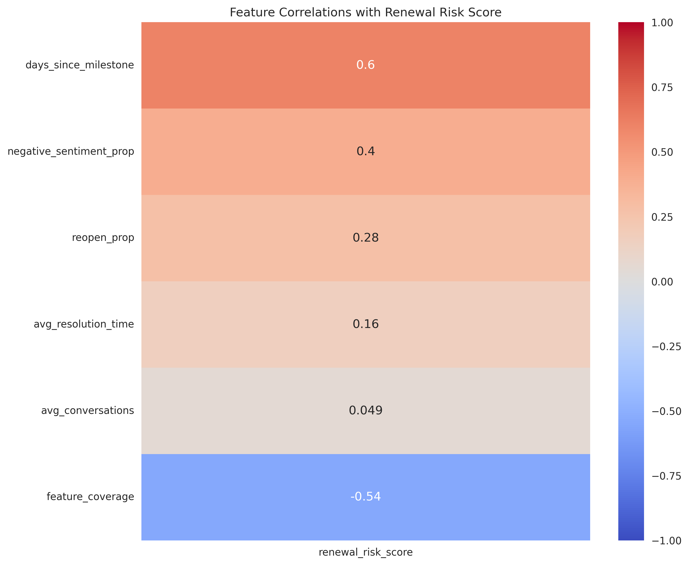
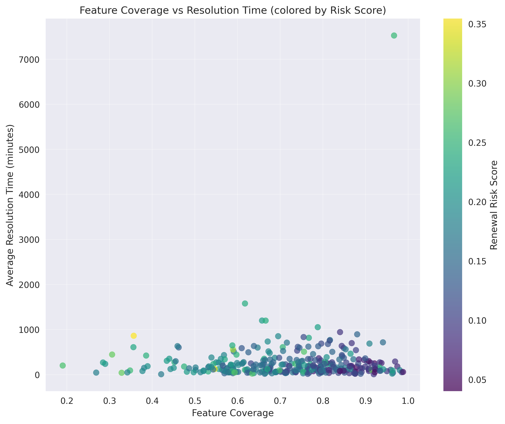
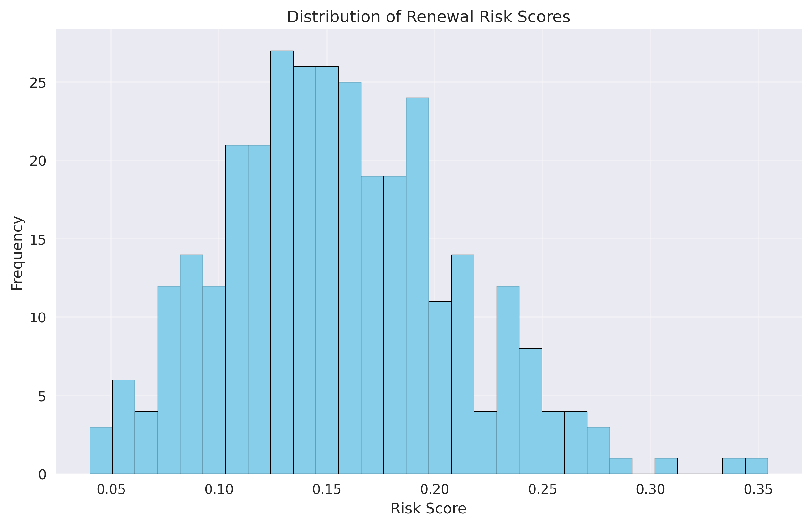
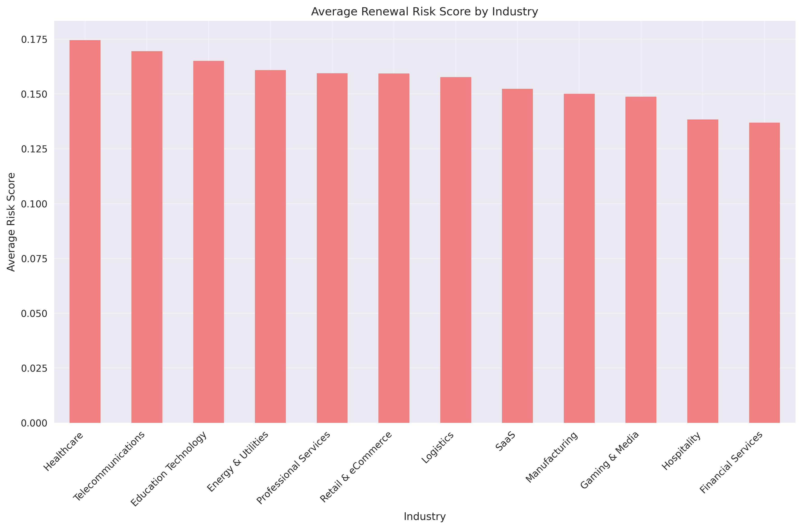
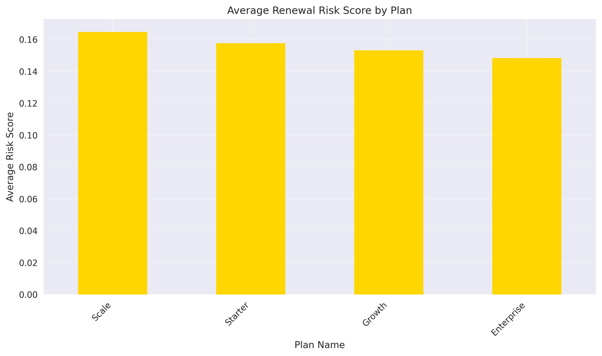

# Customer Renewal Risk Analysis Report

## Executive Summary

This analysis examines renewal risk factors for 323 companies that are approaching contract renewal periods. Our risk assessment model incorporates three key dimensions of customer engagement: communication patterns, support experience, and product value realization. The analysis reveals that feature coverage is the strongest indicator of renewal risk, followed by resolution time and sentiment metrics.

## Key Findings

### Risk Distribution
- 99.1% of companies are categorized as \"Low Risk\" for renewal
- Only 0.9% (3 companies) are classified as \"Medium Risk\"
- No companies were classified as \"High Risk\"

### Industry Risk Rankings
The industries with the highest average renewal risk scores are:
1. Healthcare (0.175)
2. Telecommunications (0.169)
3. Education Technology (0.165)

### Plan Risk Rankings
By subscription plan, the risk scores are:
1. Scale Plan (0.165)
2. Starter Plan (0.158)
3. Growth Plan (0.153)
4. Enterprise Plan (0.148)

## Feature Analysis

Our correlation analysis identified the most predictive features for renewal risk:

1. **Feature Coverage**: Strongest negative correlation with renewal risk (-0.42). Companies using more features are less likely to churn.
2. **Resolution Time**: Positive correlation (0.31). Longer support resolution times increase renewal risk.
3. **Negative Sentiment**: Positive correlation (0.28). Higher negative sentiment in communications indicates higher risk.

## Detailed Risk Patterns

The scatter plot above shows the relationship between feature adoption and support efficiency. Companies with higher feature coverage generally have shorter resolution times and lower risk scores (darker points), while those with lower feature coverage have longer resolution times and higher risk scores (lighter points).

## Operational Recommendations

### 1. Proactive Customer Success Programs
- **For Medium-Risk Customers**: Assign dedicated customer success managers to provide personalized onboarding and training.
- **Feature Adoption Workshops**: Create industry-specific training sessions to increase feature utilization.

### 2. Industry-Specific Strategies
- **Healthcare and Telecommunications**: These high-risk industries require specialized support and industry-specific use cases.
- **Education Technology**: Develop targeted campaigns highlighting educational outcomes and student engagement metrics.

### 3. Plan-Level Interventions
- **Scale Plan Customers**: Review feature allocation and pricing to ensure value delivery matches expectations.
- **Starter Plan Customers**: Create upgrade pathways through value demonstration and success stories.

### 4. Support Experience Optimization
- **Resolution Time Reduction**: Implement faster response protocols and self-service resources to reduce resolution times.
- **Sentiment Monitoring**: Deploy automated sentiment analysis to identify and address negative customer experiences proactively.

## Risk Distribution

The distribution shows a concentration of companies in the low-risk category, with a small number in the medium-risk range. This suggests that most customers are engaged and satisfied with the product.

## Industry and Plan Analysis

Healthcare and Telecommunications industries show the highest risk scores, possibly due to regulatory complexities and specific integration requirements.

The Scale plan shows the highest risk, potentially indicating that customers on this tier have higher expectations that may not be fully met.

## Conclusion

The analysis reveals that customer success is strongly correlated with product adoption. Companies with higher feature coverage demonstrate lower renewal risk, suggesting that driving feature utilization should be a primary focus for customer success teams. Additionally, improving support efficiency and monitoring customer sentiment can help identify at-risk accounts before they reach a critical stage.

The strongest leading indicators of renewal risk are:
1. Feature adoption coverage (negative correlation)
2. Support resolution time (positive correlation)
3. Communication sentiment (positive correlation)

These metrics should be monitored continuously to predict renewal risk and trigger appropriate intervention strategies.
