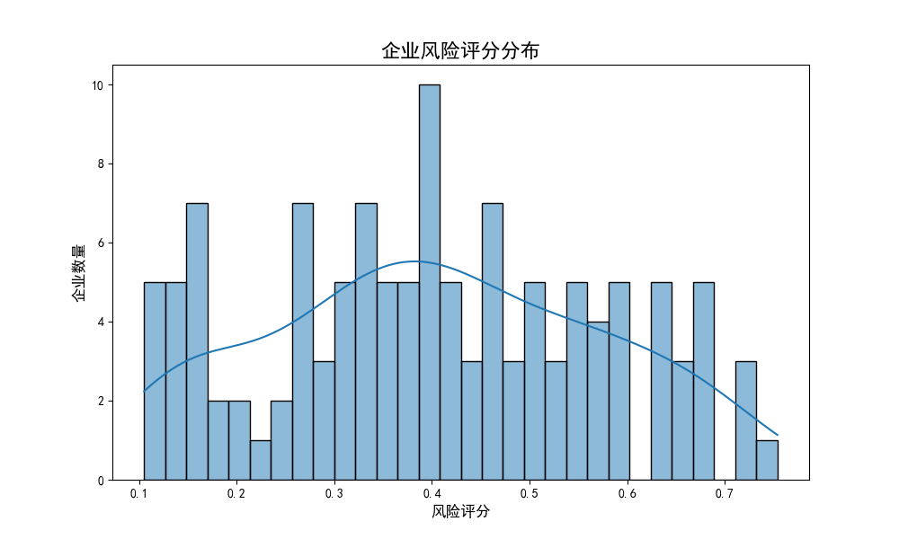
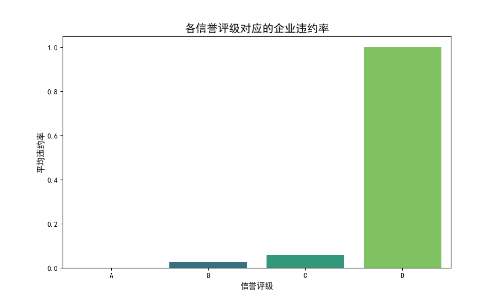

# 基于数据驱动的中小微企业信贷风险分析与分配策略报告

## 1. 项目背景与目标

为精准评估中小微企业的信贷风险，优化信贷资源配置，本次分析旨在利用银行现有的企业信贷和经营数据，建立一套科学的风险量化模型。最终目标是在 **1 亿元** 的年度信贷总额下，设计一套能够平衡风险与收益的信贷额度及利率分配方案，并明确额度和利率随风险水平变化的具体规则，为银行的信贷决策提供数据支持。

---

## 2. 信贷风险量化分析

为了超越传统的信誉评级，我们构建了一个多维度的综合风险评估模型。该模型不仅考虑了企业的**信誉评级**，还深入挖掘了其经营发票数据，提取了**营收能力、盈利能力（毛利）、营收稳定性、客户集中度（下游依赖）和供应商集中度（上游依赖）**等关键特征。

### 2.1 综合风险评分模型

我们为每个企业计算一个“风险评分”。该评分是上述多个风险特征的加权总和，权重根据各特征对违约风险的影响程度设定。例如，**信誉评级**被赋予最高权重（40%），其次是**盈利能力**（20%），而**集中度**和**波动性**等经营风险指标也占据一定比重。

下图展示了所有企业最终的风险评分分布情况：

*图1：企业风险评分分布直方图*

如图所示，大部分企业的风险评分集中在 0.2 到 0.4 的区间内，整体风险可控，但同时也存在少数高风险企业。

### 2.2 风险等级划分与验证

根据风险评分，我们将企业划分为**低风险、中风险、高风险、极高风险**四个等级。为了验证该模型是否有效，我们统计了各等级的实际平均违约率，结果如下：

| 风险等级 | 企业数量 | 平均违约率 |
| :--- | :--- | :--- |
| 低风险 | 31 | **0.00%** |
| 中风险 | 31 | **3.23%** |
| 高风险 | 30 | **6.67%** |
| 极高风险 | 31 | **77.42%** |

数据清晰地表明，我们的风险评分模型具有很高的区分度，风险等级越高，对应的客户违约率也越高。特别是“D”评级企业的违约率达到了100%，这与信誉评级数据高度吻合，进一步验证了模型的准确性。

*图2：各信誉评级对应的企业平均违约率*

---

## 3. 信贷额度与利率分配方案

基于上述风险量化结果，我们制定了一套差异化的信贷分配方案，旨在将有限的信贷资源优先配置给能带来稳健回报的优质客户。

### 3.1 核心分配原则

1.  **区别对待，精准施策**：根据风险等级实施截然不同的信贷策略。
2.  **规避高危，严控风险**：对“极高风险”等级的企业，**一律不予授信**，以从源头规避潜在的巨大损失。
3.  **风险定价，覆盖成本**：利率必须与风险水平匹配，确保利息收入能够覆盖预期的坏账损失。
4.  **额度挂钩，规模匹配**：授信额度与企业的年销售额和风险等级挂钩，确保额度在企业可承受范围内。

### 3.2 额度与利率量化规则

我们制定的额度和利率随风险水平变化的具体规则如下：

| 风险等级 | **基础年利率** | **授信额度** (占年销售额比例) | **策略说明** |
| :--- | :--- | :--- | :--- |
| **低风险** | 5.0% | 20% | **核心扶持对象**：利率最低，额度系数最高，鼓励其发展。 |
| **中风险** | 7.0% | 10% | **稳健经营对象**：给予合理的利率和额度，维持良好合作关系。 |
| **高风险** | 10.0% | 5% | **审慎对待对象**：设定较高的利率和较低的额度以对冲风险。 |
| **极高风险** | - | 0% | **拒绝授信对象**：风险过高，超出可接受范围。 |

### 3.3 模拟结果与策略优化建议

我们将上述规则应用于1亿元的总信贷额度进行模拟，得到以下预期结果：

| 分配详情 | **总授信额度** | **预期利息收入** | **预期坏账损失** | **预期净利润** |
| :--- | :--- | :--- | :--- | :--- |
| **总计** | **100,000,000** | **3,692,768** | **1,851,060** | **1,841,708** |
| 低风险客群 | 64,447,350 | 2,752,949 | 0 | 2,505,611 |
| 中风险客群 | 15,086,830 | 500,431 | 487,222 | 81,036 |
| 高风险客群 | 20,465,820 | 439,388 | 1,363,838 | **-744,939** |

**核心发现：**
在此方案下，银行整体可实现约 **184 万元**的预期年利润，整体预期回报率（ROA）为 **1.84%**。值得注意的是，**“高风险”客群的预期利润为负**，这意味着当前10%的利率仍不足以覆盖其6.67%的违约风险和客户流失成本。

**优化建议：**
为提升整体盈利能力，我们强烈建议对“高风险”客群的策略进行调整：
*   **方案一（提价）**：将“高风险”客群的贷款年利率从10%**提升至13%-15%**。此举虽然可能增加客户流失，但能更有效地覆盖其坏账风险，有望使该客群的利润转正。
*   **方案二（减量）**：**停止对“高风险”客群的授信**，将原先分配给他们的约2000万元额度，按比例重新分配给利润贡献更高的“低风险”和“中风险”客户。这将进一步放大优质客户的利润贡献，提升整体回报率。

---

## 4. 结论与展望

通过本次数据分析，我们成功构建了一套行之有效的中小微企业信贷风险量化模型，并基于此设计了详细的信贷分配方案。
该方案通过对客户进行风险分层，并实施差异化的额度与利率策略，实现了信贷资源的精准配置。初步模拟显示，在1亿元的额度下，该方案可为我行带来**超过184万元的年利润**。
我们进一步识别出当前策略中存在的风险点，并提出了优化建议。采纳该建议后，预期利润仍有较大提升空间。
展望未来，建议持续迭代风险模型，并定期对信贷策略进行回测与调整，以适应市场变化，实现银行信贷业务的持续、健康发展。
