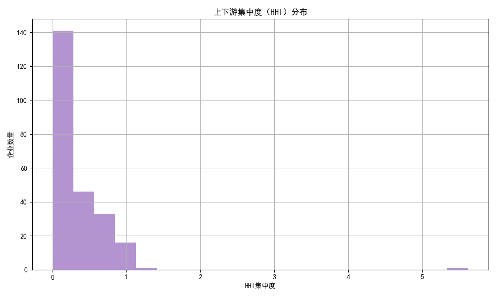
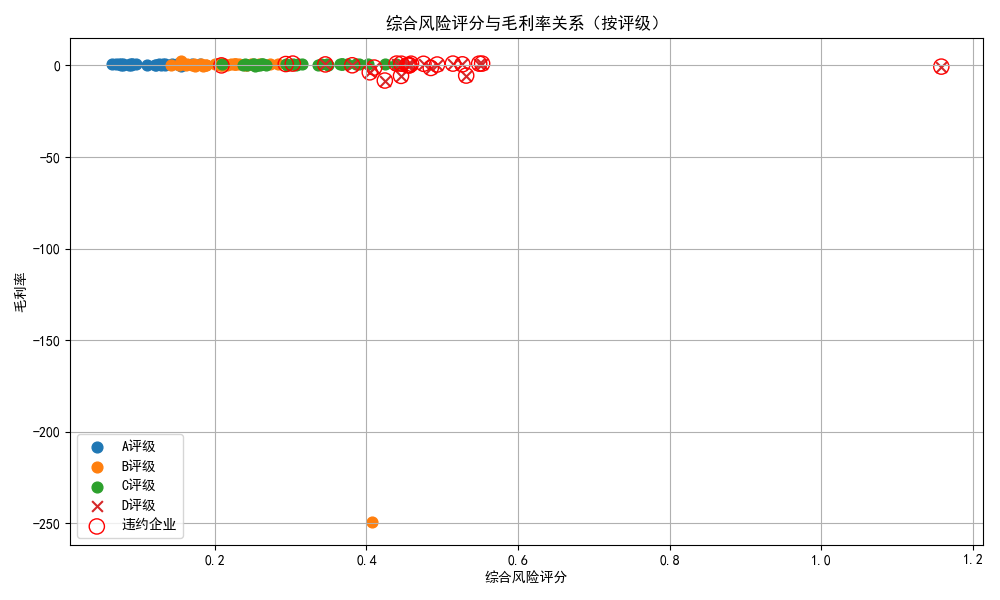
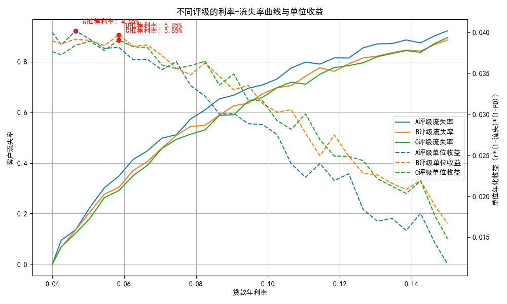
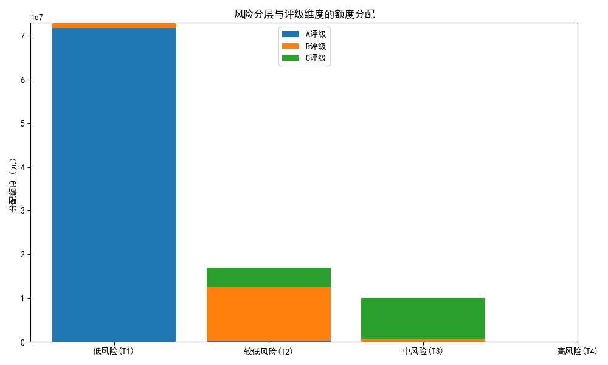

# 中小微企业信贷风险量化与额度/利率分配方案（基于有信贷记录企业）

## 摘要
- 我们基于企业评级与违约标签，结合经营性发票数据（营收能力、盈利稳定性、上下游依赖度）构建企业综合风险评分与分层，并与“年利率-客户流失率”曲线联动，设计了额度与利率的分配方案。
- 在年度总授信额度为 1 亿元约束下，剔除 D 级（已观测违约率=100%）后，采用“能力×分层权重”法分配额度：低风险层（T1）≈7301万元，T2≈1702万元，T3≈997万元，T4=0。
- 利率方面：在利率-流失率曲线下按评级最大化单位收益得到基准利率，再按风险层微调（T1 -25bp，T2 0bp，T3 +25bp，T4不授信）。得到基准推荐利率：A≈4.65%，B≈5.85%，C≈5.85%（随后按层级微调）。
- 采用基准流失率与样本违约率（PD）估计，单位授信年化预期利息收益率约在3.9%-4.0%区间，整体预期年化利息收入约在3.9-4.1百万元（100,000,000 × ~4%）。


## 一、数据与样本概览
- 数据库表：
  - 有信贷记录企业_企业信息：企业代号、企业名称、信誉评级、是否违约
  - 有信贷记录企业_销项发票信息：企业代号、开票日期、购方代号、金额等
  - 有信贷记录企业_进项发票信息：企业代号、开票日期、销方代号、金额等
  - 年利率与客户流失率：贷款年利率、不同评级客户流失率
- 样本规模：
  - 有信贷企业数：123 家；违约企业数：27 家
  - 发票时间范围：2016-10 至 2020-02；2019年口径数据充分（销项53,770，进项92,452）
- 评级分布与违约率（企业侧标签）：
  - A：27家，违约率 0.00%
  - B：38家，违约率 2.63%
  - C：34家，违约率 5.88%
  - D：24家，违约率 100.00%

这些事实为后续风险量化与配置提供了坚实的标签与特征基础。

## 二、经营指标与风险因子构建（2019年口径）
- 营收能力：企业2019年销项合计（sales_total_2019）
- 毛利与毛利率：毛利=销项-进项（按月聚合后求和），毛利率=毛利合计/销项合计
- 稳定性（波动）：按月序列计算CV（标准差/均值）
  - 销售CV越高，经营越不稳定，风险越高
  - 毛利CV辅助观测盈利不稳定性
- 上下游依赖度（集中度）：用HHI衡量
  - 下游HHI：对每企业，按购方份额平方和
  - 上游HHI：对每企业，按供应商份额平方和
- 规模风险：销售规模越小，抗风险能力越弱（对数标准化后取反）

在不做数据清洗前提下，我们以“归一化风险度量”构建综合评分：
- 维度及权重
  - 评级风险权重（A→D映射为 0.10/0.30/0.60/1.00）：30%
  - 营收波动（sales_cv标准化）：25%
  - 上下游依赖度（(HHI上游+下游)/2）：20%
  - 利润压力（1-毛利率归一化）：20%
  - 规模压力（规模越小越高）：5%

综合风险评分值越大，风险越高。以四分位将企业分层为 T1（低）/T2/ T3/ T4（高）。

配图1：上下游集中度（HHI）分布


配图2：综合风险评分与毛利率关系（颜色=评级、空心红圈=已违约）


洞察：
- 已违约企业聚集在高风险评分、低毛利率区域，验证了评分的方向性。
- HHI集中度分布偏右尾，一定比例企业存在显著上下游集中，面临依赖风险。


## 三、利率-流失率关系与最优定价
我们基于“年利率与客户流失率”表，绘制不同评级的利率-流失率曲线，并计算单位授信的预期年化收益：
- 单位收益 = 利率 × (1 - 流失率) × (1 - PD评级)

基于样本PD：A=0%、B≈2.63%、C≈5.88%（D不配置），得到收益最大化的基准利率：
- A：4.65%
- B：5.85%
- C：5.85%

配图3：不同评级的利率-流失率与单位收益


说明：
- 曲线显示随利率上升，流失率上升较快，存在明显的“收益-流失率”权衡。
- 上述基准点处单位收益最优，其结果接近3.9%-4.0%的年化单位收益率。


## 四、额度分配方法与结果（总额度=1亿元）
1) 企业能力分值（用于额度权重）：
- capacity = 销售额 × max(毛利率,0) × (1 - 波动风险) × (1 - 依赖风险) × (1 - 评级PD)

2) 分层权重（风险越高权重越低）：
- T1: 1.20，T2: 1.00，T3: 0.70，T4: 0.00（不配额）
- D评级企业：不配置授信（违约率=100%）

3) 分配结果（聚合）：
- T1：约 7301 万元
- T2：约 1702 万元
- T3：约 997 万元
- T4：0 元

配图4：风险分层与评级维度的额度分配（堆叠柱）


进一步的操作性规则：
- 单户额度上限与经营规模挂钩：建议
  - T1：不超过企业2019年销售额的20%
  - T2：不超过15%
  - T3：不超过10%
  - 同时设单户绝对上限，避免过度集中（如 2000 万元封顶）
- 组合集中度约束：单个行业/区域/核心买方关联企业合计不超过组合的20%（可按内部行业标准编码划分）。
- 动态调整：按季重算风险评分，变更分层与权重；如企业进入T4或D级，启动收缩或退出策略。

注意：以上上限与集中度约束为规范性建议，实际落地可由授信政策委员会审议并细化。


## 五、利率定价规则（随风险层/评级的单调规则）
- 基准利率（按评级、单位收益最大化得到）：
  - A：4.65%
  - B：5.85%
  - C：5.85%
  - D：不授信
- 层级微调（体现风险升高的价格补偿）：
  - T1：基准 - 0.25%
  - T2：基准
  - T3：基准 + 0.25%
  - T4：不授信

例：
- A 级：T1≈4.40%，T2≈4.65%，T3≈4.90%
- B/C 级：T1≈5.60%，T2≈5.85%，T3≈6.10%

该规则保证利率对风险水平的单调性；同时又以“基准点”为收益最优区间，控制客户流失。

配合额度规则：
- 额度单调：风险越高（层级越大），额度越低/不配置
- 利率单调：风险越高，利率越高/不配置


## 六、收益性评估（考虑流失率与PD）
用基准利率与对应评级的基准流失率进行估算（作为保守近似）：
- 预期收益率（单位授信）
  - A：0.0465 × (1 - 0.1357) × (1 - 0.0000) ≈ 4.02%
  - B：0.0585 × (1 - 0.3029) × (1 - 0.0263) ≈ 3.94%
  - C：0.0585 × (1 - 0.2902) × (1 - 0.0588) ≈ 3.97%
- 组合层面（100百万元）在A/B/C分配下，综合年化利息收入约 3.9–4.1 百万元，T3小幅加价（+25bp）带来收益小幅提升，但也会抬升流失率，综合收益增量有限。

敏感性提示：
- 若市场承压，流失率整体+5pct，组合收益率大致下降约 r × 5%（r为典型利率≈5–6%），对应约0.25–0.30个百分点，即年化利息收入减少约250–300万元/百亿元授信（按一亿元规模约25–30万元）。
- 若各评级PD整体+1pct，收益率约下降 r×(1-流失)×1pct ≈ 5–6个bp，年化利息收入减少约5–6万元/亿元。


## 七、诊断与策略建议
- 稳定性与依赖度是重要驱动：高CV和高HHI的企业在风险评分中显著拉高。建议对高HHI企业开展上下游多元化辅导，或在授信合同中设置“应收/应付”集中度上限和触发条款。
- 低毛利+小规模企业：边际抗风险能力弱，应配以更高的价格与更低的额度，且附加更严格的信息披露与资金回笼监测。
- D级与T4层：坚决不配置。对C级-T3的客户建议设置“分期考核+滚动发放”，以行为兑现换取额度提升或利率下调。
- 定价-留存的权衡：曲线显示价格敏感性较强，定价偏离基准点过多将带来显著的客户流失；建议价格治理保持在基准±25bp的窄幅区间，配合差异化非价服务提高留存。

## 八、绘图代码片段（可复现）
以下代码用于生成图表（示例片段），确保中文字显示：
```python
import matplotlib.pyplot as plt
plt.rcParams['font.sans-serif'] = ['SimHei']
plt.rcParams['axes.unicode_minus'] = False

# 利率-流失率与单位收益（已在脚本中实现）
# ax1 绘制流失率，ax2 绘制单位收益，并标注推荐利率点
# 详见文件 analyze_credit.py，关键保存文件如下：
# 1) rate_churn_curve.png
# 2) risk_score_scatter.png
# 3) allocation_scheme.png
# 4) hhi_distribution.png
```

## 九、落地执行清单
- 授信前：按季跑批更新企业风险评分与分层，刷新capacity与分配权重，联动额度池。
- 合同定价：以评级基准利率为锚，按层级±25bp微调，严控偏离区间；合同约定经营波动/集中度触发阈值。
- 贷后监控：月度跟踪发票流（销/进项）与毛利率，若CV或HHI显著恶化则动态上调利率或缩减额度；若改善则按机制降低价格或提升额度上限（但不超过分层上限）。
- 压力情景：建立“流失率+PD”双维度压力测试，保障组合收益与风险资本匹配。

---

以上方案在不清洗原始数据的前提下，利用评级标签和经营票据信息实现了“可解释+可执行”的额度与利率联动管理：额度对风险单调递减，利率对风险单调递增；并通过利率-流失率曲线确保收益-留存权衡在最优区间。
