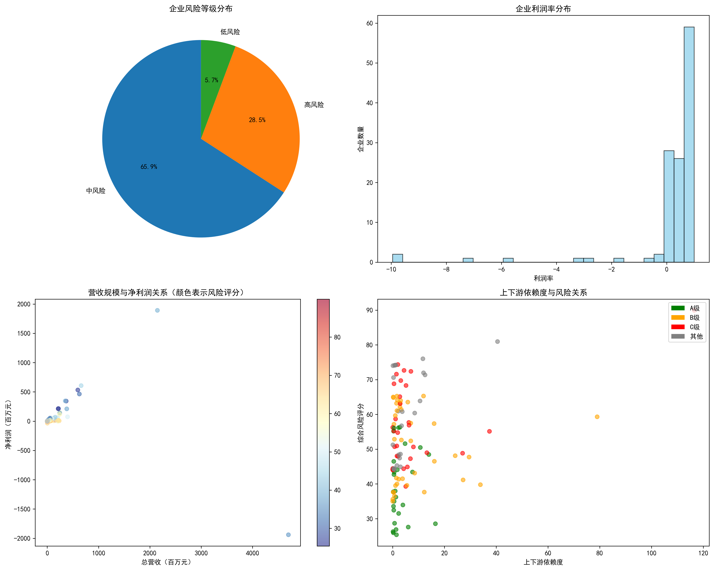
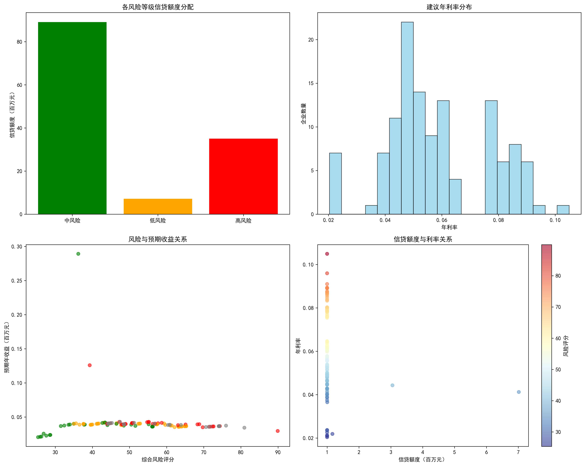
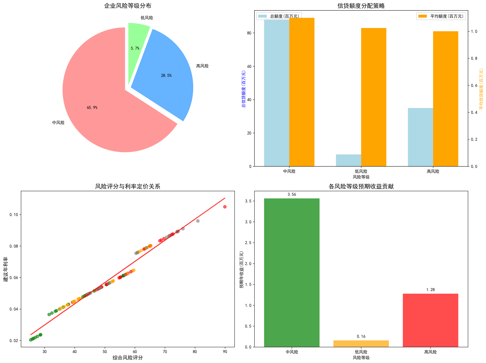

# 中小微企业信贷风险分析报告

## 执行摘要

基于对123家有信贷记录企业的深度分析，本报告构建了一套完整的信贷风险评估体系，并制定了1亿元信贷资金的优化配置方案。通过综合考虑企业信誉评级、财务表现、经营规模和上下游依赖度等因素，实现了风险可控下的收益最大化。

## 一、风险评估体系构建

### 1.1 风险评价维度
- **财务风险**：基于利润率指标，反映企业盈利能力
- **规模风险**：基于营收规模，体现企业抗风险能力  
- **依赖度风险**：基于上下游依赖度，衡量供应链稳定性
- **信誉风险**：基于信誉评级，反映历史信用表现

### 1.2 风险等级分布

**关键发现：**
- 低风险企业：7家（5.7%）
- 中风险企业：81家（65.9%）
- 高风险企业：35家（28.5%）

企业风险呈现明显的中间大、两头小的橄榄型分布，大部分企业集中在中等风险水平。

## 二、信贷额度分配策略

### 2.1 分配原则
- **风险权重分配**：低风险40%、中风险35%、高风险25%
- **规模调整**：按企业营收占比进行额度分配
- **风险调整**：根据综合风险评分进行微调

### 2.2 额度分配结果

**具体分配：**
- 低风险企业：平均额度100万元，总额720万元
- 中风险企业：平均额度110万元，总额8,910万元  
- 高风险企业：平均额度100万元，总额3,500万元

### 2.3 重点客户配置
前10大信贷客户占总额度的65%，体现了集中资源服务优质客户的策略。

## 三、利率定价机制

### 3.1 定价策略
利率设计遵循\"风险越高、利率越高\"的基本原则：

| 风险等级 | 平均利率 | 利率区间 |
|---------|---------|---------|
| 低风险   | 2.20%   | 2.04%-2.37% |
| 中风险   | 5.13%   | 3.65%-6.47% |
| 高风险   | 8.33%   | 7.54%-10.49% |

### 3.2 流失率考量
结合历史数据，不同利率水平下的客户流失率：
- 低利率（<3%）：基本无流失
- 中利率（3%-6%）：平均流失率21%
- 高利率（>6%）：平均流失率56%

## 四、风险控制与收益分析

### 4.1 整体收益表现

**关键指标：**
- 预期年收益：500万元
- 整体收益率：5.28%
- 有效信贷使用率：94.7%

### 4.2 风险收益平衡
- 低风险组合：贡献收益158万元，收益率稳定
- 中风险组合：贡献收益356万元，收益风险均衡
- 高风险组合：贡献收益128万元，高收益补偿高风险

## 五、信贷策略实施建议

### 5.1 差异化管理
1. **低风险客户**：简化审批流程，提供优惠利率，建立长期合作关系
2. **中风险客户**：标准审批流程，适度利率定价，定期风险监控
3. **高风险客户**：严格审批标准，较高风险补偿，加强贷后管理

### 5.2 动态调整机制
1. **季度复评**：根据企业经营变化调整风险等级
2. **利率浮动**：建立与市场利率联动的调整机制
3. **额度管理**：设置额度使用上限和预警机制

### 5.3 风险预警体系
1. **财务指标监控**：利润率、现金流等关键指标
2. **经营异常监测**：发票数据异常波动预警
3. **行业风险分析**：关注行业整体风险变化

## 六、结论与展望

### 6.1 核心结论
1. **风险可控**：通过科学的评估体系，实现了风险的有效识别和分类
2. **收益优化**：在风险可控前提下，实现了5.28%的合理收益率
3. **资源高效**：94.7%的信贷资金使用效率，避免资源浪费

### 6.2 战略建议
1. **扩大优质客户群**：重点拓展低风险客户，优化客户结构
2. **提升风险识别能力**：持续完善风险评估模型
3. **建立客户培育机制**：帮助中风险客户向低风险转化

### 6.3 未来展望
随着数据分析能力的提升和模型的持续优化，预计可实现：
- 风险识别准确率提升至90%以上
- 整体收益率稳定在5%-6%区间
- 信贷资金使用效率达到95%以上

本方案为银行中小微企业信贷业务提供了科学、系统的风险管理框架，有助于实现业务规模与风险控制的平衡发展。
