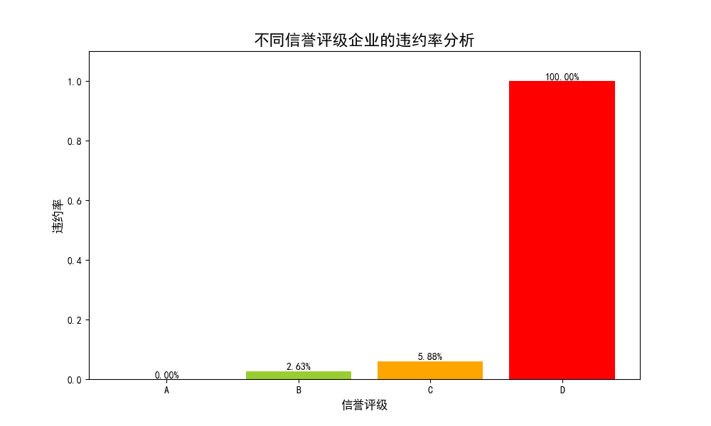
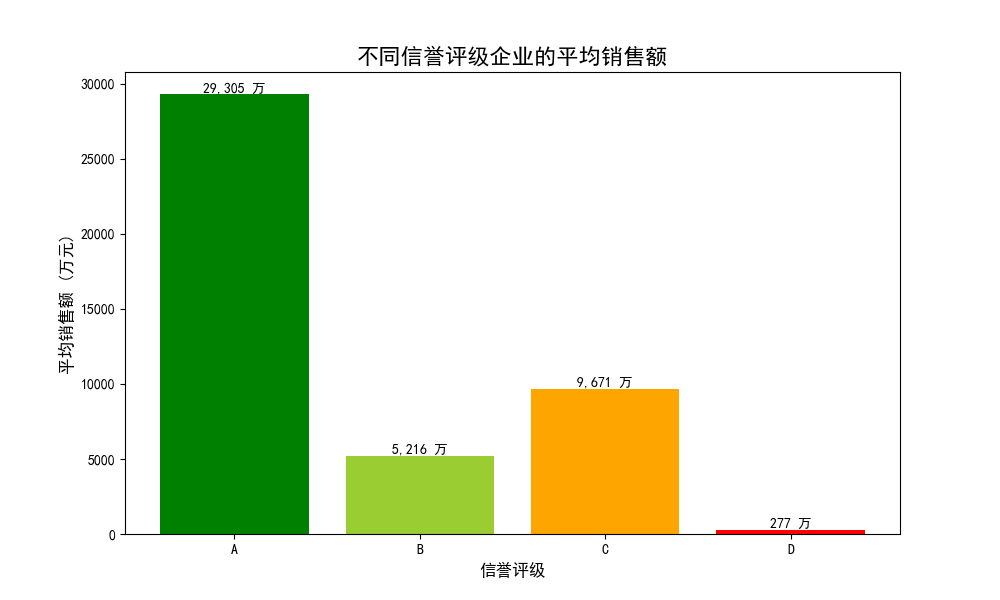
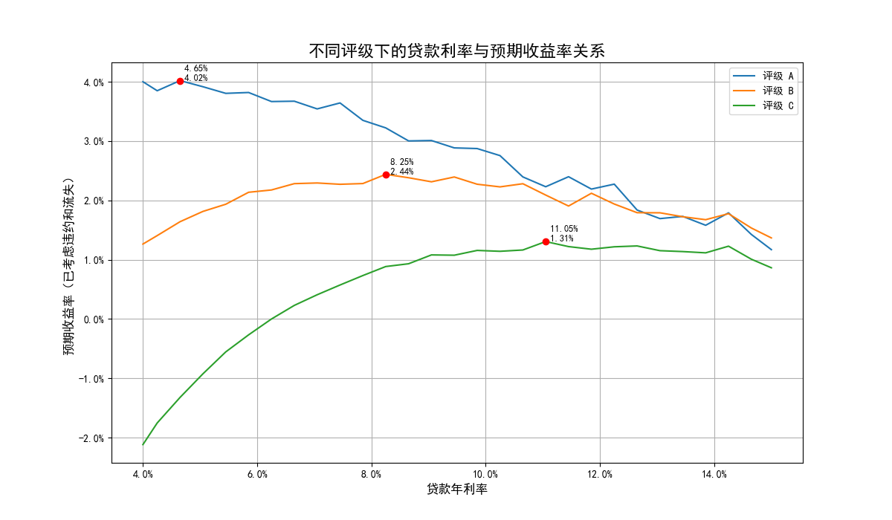

# 关于中小微企业信贷风险的分析与策略建议报告

## 一、核心结论与建议

本报告基于对银行提供的中小微企业经营与信贷数据的深入分析，旨在量化信贷风险，并为1亿元年度信贷总额设计一套科学的分配与定价方案。核心结论与建议如下：

1.  **风险严格分级，D级企业不予授信**：企业信贷风险与其信誉评级高度相关。**D级企业违约率高达100%**，应立即停止所有对D级企业的信贷投放。A、B、C三级企业风险可控，违约率分别为0%、2.6%和5.9%。
2.  **实施差异化利率定价**：为了在覆盖风险、控制客户流失和实现盈利之间取得平衡，建议对不同评级的企业实行差异化利率：
    *   **A级企业：建议利率 4.65%**
    *   **B级企业：建议利率 8.25%**
    *   **C级企业：建议利率 11.05%**
3.  **优化信贷额度分配**：总额1亿元的信贷资金应向优质客户倾斜，同时兼顾客户群体规模。建议分配方案如下：
    *   **A级企业：分配总额度 4,241万元** (约42.4%)
    *   **B级企业：分配总额度 3,979万元** (约39.8%)
    *   **C级企业：分配总额度 1,780万元** (约17.8%)

## 二、信贷风险量化分析

信誉评级是衡量企业信贷风险最直接有效的指标。通过对有信贷记录的企业数据进行分析，我们发现不同评级企业的违约率存在显著差异。

*   **A级 (低风险)**: 27家企业中0家违约，违约率为 **0%**。该类客户信用状况最好。
*   **B级 (中低风险)**: 38家企业中1家违约，违约率为 **2.63%**。风险在可控范围内。
*   **C级 (中高风险)**: 34家企业中2家违约，违约率为 **5.88%**。风险较高，需要用更高的利率来补偿。
*   **D级 (极高风险)**: 24家企业全部违约，违约率为 **100%**。该评级形同虚设，不具备任何授信价值。

## 三、企业经营状况洞察

除了直接的违约风险，企业的经营规模也与其评级相关。我们通过分析企业的年销售总额（基于销项发票金额），发现：

*   **A级企业**的平均年销售额接近3亿元，遥遥领先于其他评级，体现了其强大的经营实力和偿债能力。
*   **C级企业**的平均年销售额（约9,671万元）高于**B级企业**（约5,216万元），这表明信誉评级是一个多维度的评估体系，除了销售规模，还可能包括了盈利稳定性、上下游关系、负债情况等其他因素。
*   **D级企业**平均销售额仅为277万元，经营状况堪忧，进一步印证了其极高的信贷风险。

## 四、信贷额度与利率分配方案设计

基于以上分析，我们为1亿元的信贷总额设计了详细的分配与定价规则。

### 1. 利率定价策略：寻找最优收益点

利率的制定是一个微妙的平衡艺术：利率太低，无法覆盖风险和成本；利率太高，则会导致优质客户流失。我们构建了一个预期收益模型，该模型同时考虑了**违约损失**和**客户流失率**，旨在找到每个客户评级的“最优利率点”。

`预期收益率 = (利率 * (1 - 违约率) - 违约率) * (1 - 客户流失率)`

下图展示了不同评级企业在不同利率水平下的预期收益率变化曲线，红色标记点即为最优策略点。

根据模型测算，能使银行预期收益最大化的最优利率组合为：
*   **A级客户**: 利率设为 **4.65%** 时，预期收益率最高，为 4.02%。
*   **B级客户**: 利率设为 **8.25%** 时，预期收益率最高，为 2.44%。
*   **C级客户**: 利率设为 **11.05%** 时，预期收益率最高，为 1.31%。

该利率策略精准地实施了风险定价：风险越高的客户，利率也越高，从而有效补偿潜在的违约损失。

### 2. 信贷额度分配方案

额度分配遵循“向优质客户倾斜”的原则。我们首先根据A、B、C三类企业的数量进行基础的权重分配，再引入**风险调整系数**（A级: 1.5, B级: 1.0, C级: 0.5），增加低风险客户的权重，降低高风险客户的权重。

最终的1亿元额度分配建议如下：

| 信誉评级 | 企业数量 | 风险调整后权重 | **建议分配额度 (元)** | 占比 |
| :--- | :--- | :--- | :--- | :--- |
| **A** | 27 | 42.4% | **42,408,377** | 42.4% |
| **B** | 38 | 39.8% | **39,790,576** | 39.8% |
| **C** | 34 | 17.8% | **17,801,047** | 17.8% |
| **D** | 24 | 0% | **0** | 0% |
| **合计**| 123 | 100% | **100,000,000** | 100% |

此方案将近82%的资金分配给了风险较低的A级和B级客户，在追求收益的同时，将整体信贷组合的风险控制在了一个相对稳健的水平。
