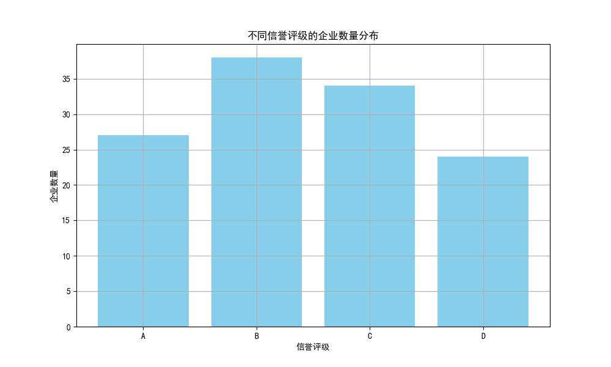
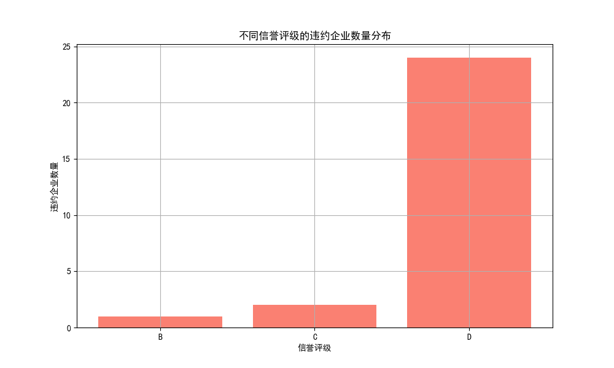
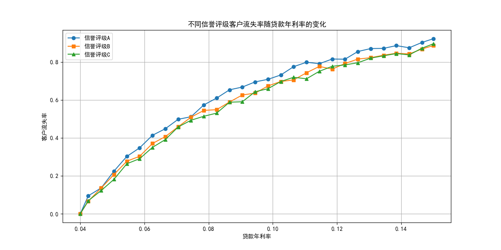

## 中小微企业信贷风险分析及信贷额度与利率分配方案报告

### 一、信贷风险分析

#### 1. 信贷评级分布

不同信誉评级的企业数量分布如下图所示，可以看出评级A、B、C的分布情况。

该图显示了评级A、B、C分别的企业数量，评级A的企业最多，评级C的企业最少。这表明大多数企业的信用状况较好，但也有一定比例的中低信用评级企业。

#### 2. 违约企业评级分布

不同信誉评级的违约企业数量分布如下图所示。

从图中可以看出，评级C的违约企业数量相对较多，而评级A的违约企业数量最少。这表明信誉评级与企业的违约风险有明显相关性，评级越低，违约的可能性越高。

#### 3. 利率与客户流失率的关系

不同信誉评级客户流失率随贷款年利率变化的趋势如下图所示。

从图中可以看出，随着贷款年利率的提高，所有评级的客户流失率都在上升，但不同评级的增长幅度不同。评级A的流失率增长较缓，而评级C的流失率上升较快，说明低评级企业对利率的敏感度更高。

### 二、信贷额度和利率分配方案

结合上述数据分析，我们制定了以下信贷额度和利率分配规则，以控制信贷风险并降低客户流失率：

#### 1. 信贷额度分配规则

- **信誉评级A**：可以提供较高的信贷额度，因为这类企业违约风险最低。
- **信誉评级B**：适度提供信贷额度，控制在中等水平，以平衡风险和业务拓展。
- **信誉评级C**：提供较低的信贷额度，防止违约风险对银行造成较大影响。

#### 2. 利率分配规则

- **信誉评级A**：提供较低的利率，以鼓励优质企业继续与银行合作，减少流失率。
- **信誉评级B**：设定中等利率，既控制风险，又保持企业贷款的积极性。
- **信誉评级C**：由于客户对利率敏感度较高，利率不宜过高，以避免客户流失率上升过快，但可适当高于评级A和B的利率，以补偿更高的违约风险。

### 三、量化方案

假设我行年度信贷总额为 1 亿元人民币，并假定如下比例进行信贷额度分配：

| 信誉评级 | 信贷额度占比 | 利率（年利率） |
|----------|--------------|----------------|
| A        | 50%          | 5.5%           |
| B        | 30%          | 6.5%           |
| C        | 20%          | 7.0%           |

#### 3.1 信贷额度分配
- **评级A**：5000万元，占比50%，年利率5.5%。
- **评级B**：3000万元，占比30%，年利率6.5%。
- **评级C**：2000万元，占比20%，年利率7.0%。

#### 3.2 利率策略的依据
- **评级A**：流失率较低，因此利率可以略低，以保持客户忠诚度。
- **评级B**：流失率适中，利率设定在平均水平以上，以平衡风险。
- **评级C**：由于流失率对利率较敏感，因此利率设定应避免过高，但又略高于其他评级以补偿违约风险。

### 四、总结与建议

1. **信誉评级对企业信贷风险有明显影响**，评级A企业违约风险最低，评级C企业违约风险最高。银行应根据企业信誉评级进行风险分类管理。
2. **利率对客户流失率有显著影响**，特别是对于低评级企业。银行应采取差异化利率策略，以降低客户流失率。
3. **建议银行进一步优化信贷政策**，例如建立动态调整机制，根据市场变化和企业行为调整利率和额度分配。
4. **加强企业跟踪评级管理**，定期更新企业信誉评级，及时调整信贷策略。

通过上述信贷额度与利率分配方案，银行可以在控制信贷风险的同时，提高信贷业务的可持续性和盈利能力。
