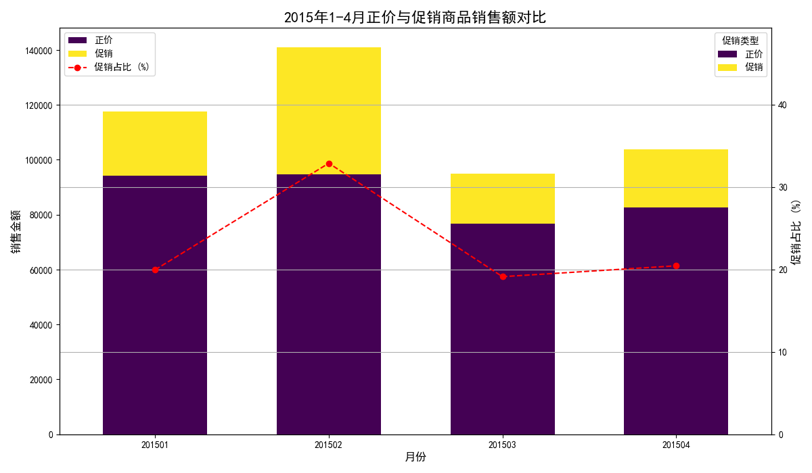
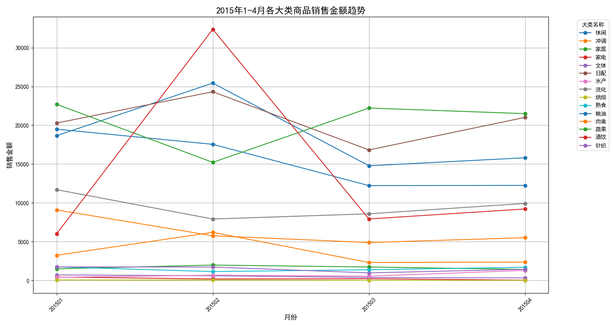
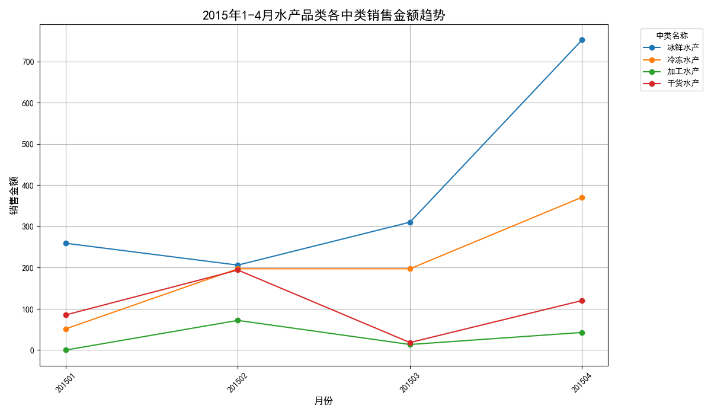

# 1-4月销售数据分析报告与后续运营建议

本报告基于2015年1月至4月的销售数据，旨在分析各大类商品的销售趋势与顾客购买偏好的变化，并为后续5月至8月的商品与库存调整提供策略建议。

## 一、 总体销售趋势分析

从1月到4月，整体销售额呈现出以2月份为高峰的波动趋势。总销售额在2月达到顶峰，随后在3月有所回落，4月企稳。

通过对促销活动的分析发现，2月份的销售高峰与当月大力度的促销活动密切相关。2月的促销商品销售额占比高达**32.9%**，远高于其他月份的平均水平（约20%）。这表明，**促销活动，特别是在春节等重要节假日期间的集中促销，是拉动整体销售额的有效手段。**

## 二、 顾客购买偏好变化洞察

在过去四个月中，顾客的消费偏好发生了显著的结构性变化，从传统的满足基本生活需求向提升生活品质的改善型消费过渡。

**1. 核心增长点：水产与酒饮**

*   **水产品类**：销售额增长最为迅猛，4月相比1月增长了**225%**。这反映了顾客对健康、高品质蛋白质的需求日益增强。
*   **酒饮品类**：实现了**53%**的稳健增长，显示出享受型和社交型消费的抬头。

**2. 稳定基本盘：日配与熟食**

*   **日配品类**：作为高频刚需消费品，销售额保持平稳，构成了销售的基本盘。
*   **熟食品类**：销售额略有下降（-2.7%），但总体保持稳定。

**3. 显著下滑点：家电、文体与传统粮油肉禽**

*   **家电、文体品类**：经历了“断崖式”下滑，特别是家电品类销售额暴跌**93%**，亟需关注。
*   **粮油、肉禽品类**：作为传统必需品，销售额分别下降了**37%**和**39%**，表明顾客的购买力可能正在向其他品类转移。

## 三、 明星品类（水产）深度剖析

为了探究增长来源，我们对表现最亮眼的水产品类进行了深入分析。

在水产品类内部，**鱼**和**虾**是驱动增长的绝对主力，其销售额在2、3、4月持续走高。而其它水产、蟹、贝类的销售则相对平稳或较低。这表明顾客对水产的消费集中在常规的核心品项上。

## 四、 5月-8月商品种类与库存调整建议

基于以上分析，针对即将到来的夏季（5-8月），我们提出以下商品与库存调整策略：

**1. 乘势而上，加大对增长品类的投入**

*   **重点加码“水产”**：
    *   **扩大库存与SKU**：大幅增加鱼类和虾类的库存，特别是迎合夏季消费场景的品类（如适合烧烤的鱼、虾）。
    *   **引入新品**：试探性引进高端或预制水产品，如进口三文鱼、小龙虾调味包等，满足消费升级趋势。
*   **发力“酒饮”**：
    *   **侧重季节性商品**：结合夏季旺季，重点增加啤酒、果酒、苏打酒等清爽型饮料的库存。
    *   **策划主题营销**：推出“啤酒节”、“夏日微醺”等主题促销，捆绑熟食、水产进行关联销售。

**2. 稳固基本盘，优化高频品类**

*   **保障“日配”供应**：确保牛奶、酸奶、冷藏食品等每日必需品的新鲜度和库存充足，维持顾客到店频率。
*   **激活“熟食”消费**：开发夏季新品，如凉菜、沙拉等，并与酒饮品类联动促销。

**3. 战略性收缩，调整衰退品类**

*   **诊断“家电、文体”**：立即复盘家电、文体品类销售额暴跌的原因。若非季节性因素，应果断**缩减库存、淘汰滞销品**，释放库存资源给增长品类。
*   **优化“粮油、肉禽”结构**：虽然整体下滑，但仍是必需品。应进行品类优化，**减少滞销单品的库存**，并根据消费者健康、便捷的需求，引入小包装、半成品、有机等概念的新产品。

**总结：** 市场正在发生变化，消费者越来越青睐能提升生活品质的商品。我们应顺应这一趋势，果断地将资源向**水产、酒饮**等增长型品类倾斜，同时通过优化和收缩策略调整现有品类，以在未来几个月实现销售额和利润的最大化。
