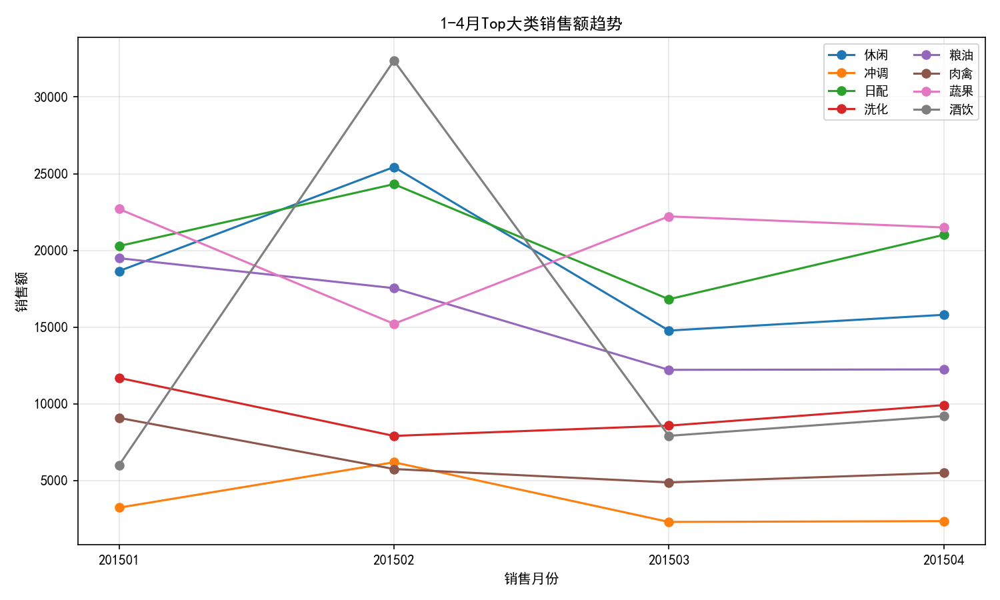
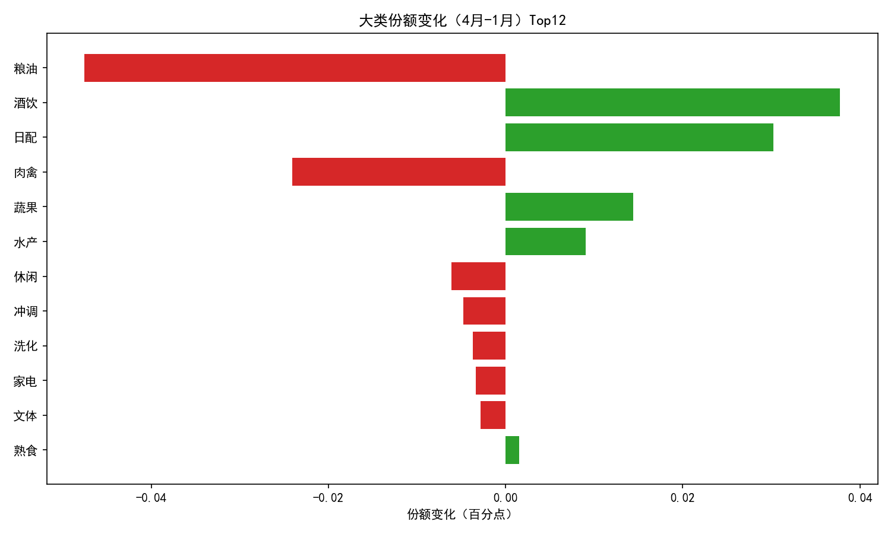
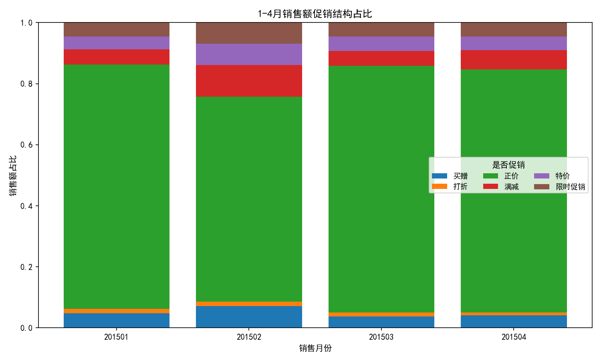
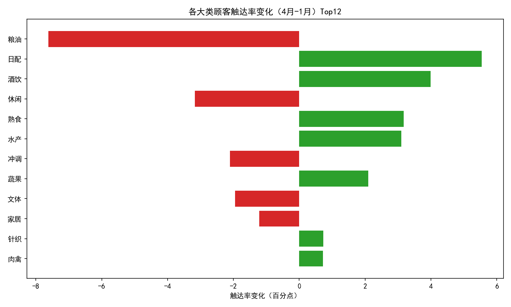

# 1-4月各大类销售金额增长趋势与顾客偏好变化分析（含5-8月策略建议）

> 数据来源：/workspace/dacomp-002.sqlite（表：工作表1）；时间范围：2015年1-4月；不进行数据清洗，仅分析。

## 可视化说明与代码
本分析使用Python绘制图片，所有图片保存在当前工作目录下并在文中引用。
为确保中文与负号正常显示，绘图脚本中包含如下配置：
```python
plt.rcParams['font.sans-serif'] = ['SimHei']
plt.rcParams['axes.unicode_minus'] = False
```

生成的图片文件：
- 1-4月Top大类销售趋势：figure1_大类销售趋势.png
- 1-4月促销结构占比：figure2_促销结构.png
- 大类份额变化（4月-1月）Top12：figure3_大类份额变化.png
- 各大类顾客触达率变化（4月-1月）Top12：figure4_顾客触达率变化.png

## 一、总体趋势概览
- 月度销售额：
  - 1月：117,708.72
  - 2月：141,065.00（环比+19.8%）
  - 3月：94,888.77（回落）
  - 4月：103,727.90（小幅回升）
- 月度销量（件）：
  - 1月：14,084
  - 2月：12,443
  - 3月：11,138
  - 4月：12,629
- 月度独立顾客数：
  - 1月：1,225
  - 2月：1,059
  - 3月：1,058
  - 4月：1,134
- 关键观察：2月在顾客数和销量下降的情况下，销售额大幅上升，显示“客单价/单客销售额”显著提升（约从1月≈96提升至2月≈133），推测春节旺季带来高客单的结构性提升（酒饮等高客单品类贡献），且2月促销结构更激进（正价占比显著降低）。

## 二、各大类销售趋势与份额变化
- Top大类的月度销售额曲线见图片：figure1_大类销售趋势.png



- 大类份额变化（4月-1月，百分点）见图片：figure3_大类份额变化.png



主要品类变化要点：
- 份额提升显著：
  - 酒饮 +3.77pp（且4月相对1月销售额+53.3%）
  - 日配 +3.03pp（4月相对1月+3.6%）
  - 蔬果 +1.44pp
  - 水产 +0.90pp（4月相对1月+225%）
- 份额下滑显著：
  - 粮油 -4.76pp（4月相对1月-37.2%）
  - 肉禽 -2.41pp（-39.4%）
  - 冲调 -0.48pp（-27.2%）
  - 家电 -0.34pp（-93.1%）
- 结构异常点：4月相比1月“烘焙”缺失（疑似断货/下架/季节性），对相关联动品（如日配、早餐组合）可能有间接影响。

解读：
- 春节旺季期间（2月）“酒饮”强势驱动客单拉升；3月回落；4月保持较高基线。生鲜短保类（蔬果、水产、日配）在3-4月稳步走强，反映季节转暖、新鲜度与即时需求提升。粮油、肉禽、冲调等家庭囤货属性品类在春节后出现显著回落。

## 三、促销结构与对销售的影响
- 各月促销结构占比见图片：figure2_促销结构.png



要点：
- 正价销售占比：1月≈80.1%、2月≈67.1%、3月≈80.9%、4月≈79.6%。2月正价占比显著下探，满减（10.4%）、特价（7.1%）、买赠（7.1%）、限时促销（6.9%）拉升明显，配合节庆动销，贡献了销售额的跃升。
- 3-4月回归以正价为主，说明促销“短期拉动、平时稳价”的策略有效。建议在关键节点保持更强的满减/特价策略，平时恢复正价以保障毛利。

## 四、顾客偏好：触达率与用户结构变化
- 各大类顾客触达率变化（4月-1月）见图片：figure4_顾客触达率变化.png



触达率变化Top（百分点）：
- 上升：日配 +5.54pp、酒饮 +3.99pp、熟食 +3.17pp、水产 +3.10pp、蔬果 +2.09pp、针织 +0.73pp。
- 下降：粮油 -7.62pp、休闲 -3.17pp、冲调 -2.11pp、文体 -1.95pp、家居 -1.22pp、家电 -0.61pp。

解读：
- 用户偏好向“即买即用/高频短保/鲜食便利”的品类（如日配、熟食、蔬果、水产）迁移，且旺季酒饮渗透加深。
- 囤货型与耐用品（粮油、家电、文体）触达率下降，节后需求回落明显。

补充诊断：
- SKU变化与销售增长的相关性（4月vs1月）约0.307，呈温和正相关。说明在增长品类中适度拓展SKU能带来一定增量，但非决定性因素，结构与运营同样关键。

## 五、预测性判断（5-8月）
结合趋势与常见季节性：
- 酒饮：夏季通常是啤酒/饮料旺季，预计5-8月保持高景气，尤其6-8月可能环比提升。
- 生鲜短保（日配、蔬果、水产、熟食）：气温升高带动即时消费和到店频次，预计维持较好韧性；但损耗与供应波动需关注。
- 囤货/耐用品（粮油、冲调、家电、文体）：预计仍然承压，需求修复节奏慢；需通过组合促销与场景化营销激活部分需求。

## 六、规范性建议：5-8月品类与库存优化方案
1) 备货结构与SKU策略
- 扩充/上新（建议增量范围包含安全库存与动销差异）：
  - 酒饮：按基线需求+15%-25%加权备货；啤酒、气泡水、功能饮料为重点；引入差异化SKU（低糖/零糖/小包装），加强冰点陈列。
  - 日配、蔬果、水产、熟食：增配8%-15%库存，短保商品按日/半日补货；引入当季高周转SKU（如水果应季品、即食/轻食新品）。
  - 依据0.307的相关性，在增长类目下做“有限SKU扩张”：优先补充畅销规格与价格带，做AB测试保留优胜者。
- 收缩/去冗余：
  - 粮油、肉禽、冲调、文体、家电：下调10%-30%备货，逐步清理尾货与低动销SKU，使用替代或小规格满足基础需求。
  - 对“烘焙”4月缺失做复盘：若因供应中断，建议与备选供应商建立冗余；若因季节性/毛利问题，聚焦高转高毛单品重启试点（小批量AB测试）。

2) 价格与促销排期
- 关键节点（端午/暑期）：采用“满减+特价”组合，借鉴2月结构拉动，窗口期正价占比可降至70%-75%；平日维持正价>78%，做小力度限时/会员专享以保毛利。
- 促销分层：
  - 酒饮：联动跨品类（休闲零食/熟食）做联名券/组合包。
  - 生鲜短保：每日低价心智+临期特价清货，控制损耗。
  - 囤货型：以囤货包/家庭装满减为主，集中在月初、节前两周释放。

3) 库存与供应链
- 生鲜（水产、蔬果、日配）：提高补货频次（蔬果/日配建议日配/半日配，水产建议日内小批量多频次），动态安全库存（损耗目标<3%-5%）。
- 酒饮：关注冷链/冰柜容量，确保旺季陈列面与即饮温度；对长补货周期单品预留2-3周预测安全量。
- 风险品类（家电、文体、冲调、粮油）：库存周转目标>8-10周转/年，设置严格的补货触发阈值，避免占用现金流。

4) 门店与陈列
- 强化即饮/即食动线：入口与黄金货架给酒饮、日配、熟食与当季水果，做场景化陈列（午间、下班、周末野餐）。
- 交叉销售：酒饮+休闲、日配+烘焙（若重启）、熟食+蔬果（沙拉/配菜）。

5) 运营指标与试点机制
- 监控KPI：
  - 类目销售额与份额、动销率、损耗率（生鲜）、客单价、顾客触达率、促销投资回报（ROI）。
- 试点与复盘：
  - 在3-5家门店先行“SKU有限扩张+促销组合”AB测试，2-3周复盘，保留ROI>1.5的方案。

## 七、结论
- 1-4月呈现“2月旺季结构性拉升、3月回落、4月企稳”的节奏；增长集中在酒饮与生鲜短保，粮油/肉禽/冲调/耐用品回落明显。
- 顾客偏好从囤货型向即时性/鲜食类迁移，触达率在日配、酒饮、水产、熟食显著上升；配合节庆促销，结构与运营共同驱动业绩。
- 5-8月建议围绕“旺季酒饮+生鲜短保”的核心做备货与SKU优化，并用精准促销与高频补货管控损耗；对承压品类实施降库存与组合促销激活需求。

---

附：图表一览
- 1-4月Top大类销售趋势：


- 1-4月促销结构占比：


- 大类份额变化（4月-1月）Top12：


- 各大类顾客触达率变化（4月-1月）Top12：

