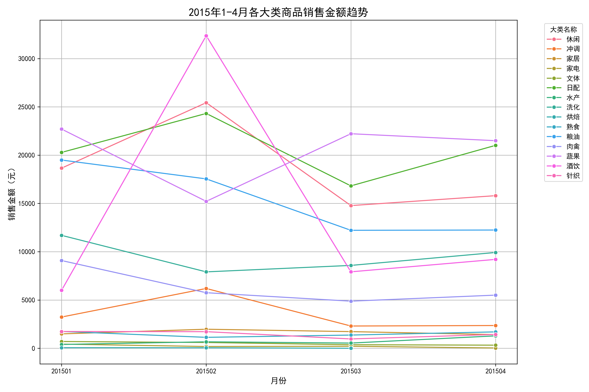
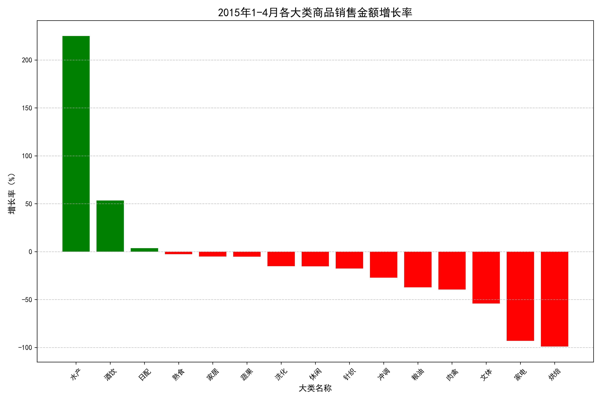
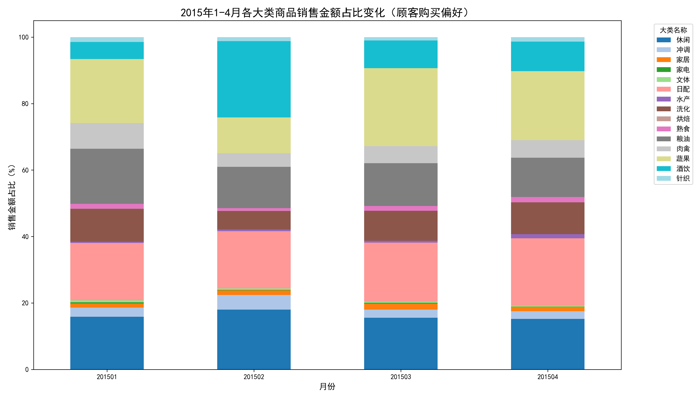
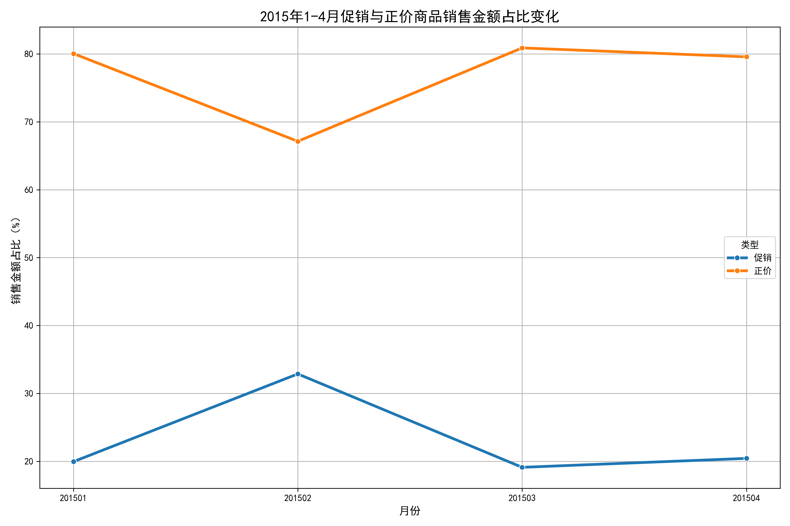
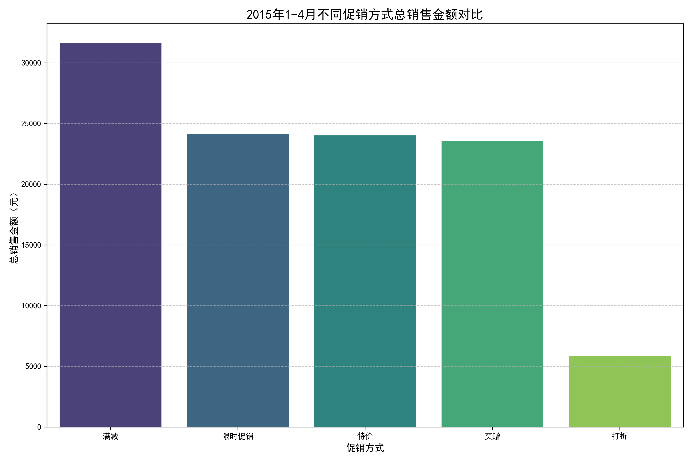

# 2015年1-4月商品销售趋势分析与5-8月调整建议报告

## 一、分析背景

本报告基于2015年1月至4月的销售数据，深入分析各大类商品的销售金额与数量增长趋势，顾客购买偏好变化，以及促销效果，为5月至8月的商品种类调整和库存管理提供数据支撑和策略建议。

## 二、销售金额趋势分析

### 2.1 各大类商品销售金额趋势

从图1可以看出，2015年1-4月期间，销售金额排名靠前的大类商品包括：蔬果、日配、粮油、休闲食品和洗化用品。其中，蔬果和日配类商品销售金额始终保持较高水平，是销售的主力类别。

**关键发现：**
- 蔬果类商品销售金额在3月有所回升，4月略有下降，整体保持稳定
- 日配类商品销售金额在2月达到峰值后，3月下降明显，4月有所恢复
- 粮油类商品销售金额呈现逐月下降趋势
- 休闲食品类商品销售金额在2月达到峰值后，3-4月有所回落

### 2.2 各大类商品销售金额增长率分析

从图2的增长率分析可以看出，1-4月期间，各大类商品销售金额增长情况差异显著：

**增长表现突出的类别：**
- **水产类**：增长率高达224.96%，表现最为亮眼
- **酒饮类**：增长率为53.34%，表现优异
- **日配类**：增长率为3.60%，基本持平

**下降明显的类别：**
- **烘焙类**：下降98.99%，几乎归零
- **家电类**：下降93.11%，需求锐减
- **文体类**：下降54.09%，需求萎缩
- **肉禽类**：下降39.42%，需求减少
- **粮油类**：下降37.18%，需求下降

## 三、顾客购买偏好变化分析

### 3.1 购买偏好变化趋势

从图3的顾客购买偏好变化图可以看出，各大类商品销售金额占比在1-4月期间发生了明显变化：

**主要变化趋势：**
- **酒饮类商品**占比显著提升，从1月的3.4%提升至2月的18.5%，成为2月销售的主力
- **休闲食品**占比在2月达到峰值18%，随后有所回落
- **蔬果类**商品占比相对稳定，保持在20%左右
- **日配类**商品占比在2月有所提升，3月回落
- **粮油类**商品占比逐月下降

## 四、促销效果分析

### 4.1 促销与正价商品占比变化

从图4可以看出，促销商品销售金额占比在2月达到峰值32.87%，其他月份维持在20%左右：

**关键发现：**
- 2月是促销活动的黄金期，促销商品占比显著提升
- 3月促销效果回落，促销商品占比下降
- 4月促销占比略有回升，但未达到2月水平

### 4.2 不同促销方式效果对比

从图5的不同促销方式销售金额对比可以看出，各种促销方式的效果存在显著差异：

**促销方式效果排名：**
1. **满减促销**：总销售金额31,636.54元，效果最佳
2. **限时促销**：总销售金额24,141.96元，效果良好
3. **特价促销**：总销售金额24,016.33元，效果稳定
4. **买赠促销**：总销售金额23,522.50元，效果一般
5. **打折促销**：总销售金额5,849.89元，效果最差

## 五、销售数量趋势分析

### 5.1 各大类商品销售数量增长率

从图6的销售数量增长率分析可以看出，各大类商品的销售数量变化趋势与销售金额基本一致：

**数量增长突出的类别：**
- **水产类**：数量增长率高达533.33%，需求爆发式增长
- **酒饮类**：数量增长率为47.89%，需求稳步增长
- **日配类**：数量增长率为2.78%，基本持平

**数量下降明显的类别：**
- **烘焙类**：数量下降100%，完全停止销售
- **家电类**：数量下降74.07%，需求锐减
- **文体类**：数量下降50.51%，需求萎缩
- **针织类**：数量下降50%，需求减少
- **肉禽类**：数量下降33.98%，需求下降

## 六、5-8月商品种类与库存调整建议

基于以上数据分析，为5-8月的商品经营提出以下具体建议：

### 6.1 商品种类调整建议

**重点扩大经营的类别：**
1. **水产类商品**
   - 建议：大幅增加水产类商品种类和库存
   - 理由：销售金额增长224.96%，数量增长533.33%，需求爆发式增长
   - 策略：引入更多海鲜品种，增加鲜活水产比例

2. **酒饮类商品**
   - 建议：适度增加酒饮类商品种类
   - 理由：销售金额增长53.34%，数量增长47.89%，表现优异
   - 策略：增加夏季畅销饮品，啤酒、饮料等

**维持稳定经营的类别：**
3. **日配类商品**
   - 建议：保持现有商品种类和库存水平
   - 理由：销售金额和数量基本持平，表现稳定
   - 策略：重点关注保质期管理，确保商品新鲜度

4. **蔬果类商品**
   - 建议：保持现有经营规模，优化品种结构
   - 理由：销售金额占比稳定，是销售主力
   - 策略：增加夏季时令蔬果，减少非应季品种

**适度缩减的类别：**
5. **粮油类商品**
   - 建议：适度减少库存，优化品种结构
   - 理由：销售金额下降37.18%，需求减少
   - 策略：减少大包装商品，增加小包装便利商品

6. **肉禽类商品**
   - 建议：适度减少库存，关注销售动态
   - 理由：销售金额下降39.42%，数量下降33.98%
   - 策略：增加夏季清淡肉类，减少油腻品种

**重点关注的类别：**
7. **休闲食品类**
   - 建议：保持现有规模，关注销售趋势
   - 理由：2月表现突出，但3-4月回落，季节性明显
   - 策略：增加夏季清爽零食，减少厚重口味商品

### 6.2 库存调整建议

**库存增加建议：**
- **水产类**：库存增加200%以上，满足爆发式增长需求
- **酒饮类**：库存增加50%，特别是夏季饮品
- **蔬果类**：库存增加20%，重点关注应季品种

**库存维持建议：**
- **日配类**：保持现有库存水平，加强周转管理
- **休闲食品**：保持现有库存，关注季节性变化

**库存减少建议：**
- **家电类**：库存减少70%，仅保留基本款
- **烘焙类**：库存减少90%，几乎可以不备货
- **文体类**：库存减少50%，减少非必需品
- **针织类**：库存减少40%，夏季需求较低
- **粮油类**：库存减少30%，优化品种结构
- **肉禽类**：库存减少25%，关注销售动态

### 6.3 促销策略建议

**重点促销类别：**
1. **水产类**：采用满减和限时促销方式，进一步提升销量
2. **酒饮类**：结合夏季特点，采用特价和买赠促销
3. **蔬果类**：采用限时促销，加快周转速度

**促销方式优化：**
- **满减促销**：效果最佳，应作为主力促销方式
- **限时促销**：效果良好，适合用于清理库存
- **特价促销**：效果稳定，适合日常促销
- **买赠促销**：效果一般，适合特定商品
- **打折促销**：效果最差，应减少使用频率

**促销时机建议：**
- 5-6月：适度促销，占比控制在20-25%
- 7-8月：加大促销力度，占比可提升至30-35%

## 七、风险提示

1. **季节性风险**：部分商品类别表现出明显的季节性特征，需要密切关注季节变化对销售的影响
2. **库存风险**：水产类商品库存增加的同时，需要加强保鲜管理，避免损耗
3. **竞争风险**：酒饮类商品需求增长，可能吸引更多竞争者，需要提前制定应对策略
4. **趋势变化**：需要持续监控销售数据，及时调整经营策略

## 八、总结

2015年1-4月的销售数据显示，顾客购买偏好发生了显著变化，水产和酒饮类商品表现突出，而传统的主力商品如粮油、肉禽等出现下滑。5-8月应重点增加水产和酒饮类商品的种类和库存，适度减少表现不佳的商品类别库存，同时优化促销策略，以满减和限时促销为主，提升整体销售业绩。

通过科学的商品种类调整和库存优化，有望在5-8月实现更好的销售业绩，满足顾客需求变化，提升市场竞争力。
