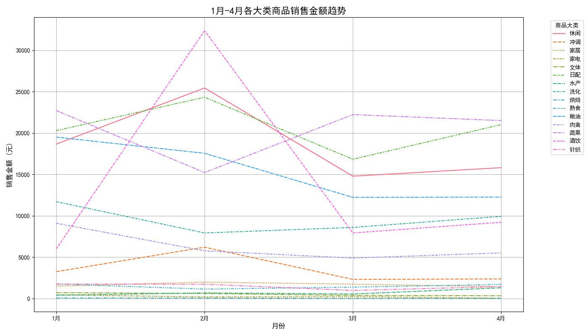

# 1-4月商品销售分析及5-8月策略建议报告

本报告旨在分析今年1月至4月各大类商品的销售趋势和顾客购买偏好的变化，并基于此为后续5月至8月的商品品类与库存调整提供 actionable 策略建议。

## 一、核心洞察

- **消费趋势向“生鲜化”和“即时化”转变**: 数据显示，顾客的消费重点正从传统的粮油、肉禽等基础食材，向日配、蔬果、水产等生-鲜品类以及酒水饮料转移。
- **季节性消费特征明显**: 酒饮品类在2月份（春节期间）出现爆发式增长，显示出强烈的节日消费驱动特性。
- **部分品类呈下降趋势**: 粮油、肉禽等传统民生商品的销售占比持续下滑，可能与市场竞争加剧或消费者购买渠道变化有关。

## 二、数据分析详情

### 1. 销售金额趋势分析

我们对1月至4月各大类商品的月度销售总额进行了趋势分析，如下图所示：

从上图可以看出：
- **日配与蔬果类**：这两类商品销售额整体保持高位，并且“日配”品类在4月份有显著增长，表明生鲜商品的需求持续旺盛。
- **酒饮类**：在2月份达到销售顶峰后回落，但其销售额在3、4月仍然稳定在较高水平，说明该品类具有持续的消费基础。
- **粮油与肉禽类**：这两类商品的销售额呈现出较为明显的下滑趋势，特别是粮油品类。

### 2. 顾客购买偏好变化

通过计算各品类销售额在总销售额中的占比变化，我们可以更清晰地看到顾客偏好的转移。从1月到4月，各大类销售占比变化如下：

- **增长最显著的品类**:
  - **酒饮**: 销售占比提升了 **3.77%**。
  - **日配**: 销售占比提升了 **3.03%**。
  - **蔬果**: 销售占比提升了 **1.44%**。
  - **水产**: 销售占比提升了 **0.90%**。

- **下降最显著的品类**:
  - **粮油**: 销售占比下降了 **4.76%**。
  - **肉禽**: 销售占比下降了 **2.41%**。
  - **休闲**: 销售占比下降了 **0.61%**。

这一数据明确指出了消费者的兴趣点正从传统的、计划性的家庭烹饪（粮油、肉禽）转向更为新鲜、即时的消费品（日配、蔬果、酒饮）。

## 三、5月-8月商品与库存策略建议

基于以上分析，我们为接下来的夏季（5月至8月）提出以下策略建议：

### 1. **加大生鲜品类投入，优化供应链**
- **增加库存与品类多样性**: 显著增加**日配、蔬果、水产**三大类的库存深度和广度。随着天气转热，消费者对沙拉、水果、冰镇海鲜等即食、易烹饪的生鲜产品需求会进一步上升。
- **确保商品新鲜度**: 加强与供应商的合作，缩短物流时间，提高冷链运输标准，确保商品的新鲜度和品质，这是吸引和留住顾客的关键。

### 2. **优化传统品类库存，减少资金占用**
- **精准削减库存**: 对销售额持续下滑的**粮油**和**肉禽**品类进行库存结构优化。利用销售数据分析到子品类，淘汰动销率低的单品，减少整体库存量，释放仓储空间和流动资金。
- **捆绑促销**: 可尝试将粮油产品与增长中的生鲜品类进行捆绑销售，以“健康-餐”组合套餐的形式提升其销量。

### 3. **策划季节性主题营销，引爆夏季消费**
- **聚焦酒水饮料**: 5月至8月是饮料和啤酒的销售旺季。应立即规划**酒饮**品类的夏季主题营销活动，如“清凉一夏”、“世界杯观赛伴侣”等，并配合满减、买赠等促销手段。
- **推广休闲零食**: 虽然休闲品类占比略有下降，但夏季是冰品、膨化食品等零食的热销期。可以引入新口味、网红产品，并将其陈列在关联商品（如酒饮）附近，带动关联销售。

### 4. **数据驱动，持续监控**
- 建立销售数据周度监控机制，密切跟踪各品类销售动态，特别是策略调整后的效果。
- 市场环境和消费者偏好是不断变化的，应保持灵活性，及时根据新的数据洞察调整库存和营销策略，以最大化销售额和利润。
