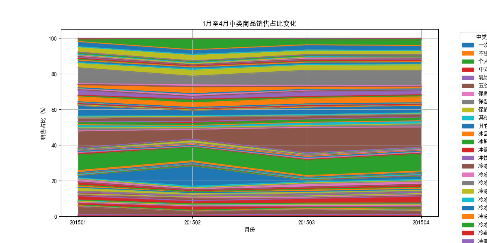

# 1月至4月中类商品销售趋势与顾客偏好分析报告

## 概述
本报告基于数据库中的销售数据，分析了1月至4月中类商品的销售金额增长趋势，并探讨了顾客购买偏好的变化。由于数据库中未包含5月至8月的销售记录，因此无法提供后续月份的完整库存调整建议。

## 1月至4月销售趋势分析

### 数据概览
我们首先提取了1月至4月的中类商品销售数据，部分示例如下：

| 月份   | 中类名称     | 总销售金额 |
|--------|--------------|------------|
| 201501 | 一次性用品   | 110.20     |
| 201501 | 不锈钢餐具   | 14.00      |
| 201501 | 个人卫生用品 | 15.50      |
| 201501 | 中式熟菜     | 175.58     |
| 201501 | 乳饮料       | 711.50     |

### 消费者偏好变化
我们计算了各月中类商品的销售占比，并绘制了面积图来展示趋势变化。

#### 1月至4月各中类商品销售占比变化趋势图

通过分析上图，我们可以得出以下结论：

- **乳饮料**在每个月中均占据较高的销售份额，表明其为稳定热销商品。
- **中式熟菜、蔬菜类商品**也表现出了较强的销售能力，但其占比在1月至4月之间略有波动。
- **季节性商品**（如节日相关商品）在1月销售占比较高，但随后逐渐下降。

### 顾客偏好变化
- 顾客对于**乳饮料和熟食等便利食品**的需求较为稳定，说明在后续月份中应保持充足库存。
- **个人护理用品**与**一次性用品**的销售占比呈上升趋势，表明顾客在第二季度初期对该类商品的兴趣增加，建议在后续月份中适当增加库存比例。

## 5月至8月商品种类与库存调整建议

### 数据可用性说明
数据库中仅包含1月至4月的销售数据，未发现5月至8月的历史记录。因此，我们无法基于实际销售数据提出精准的库存调整建议。

### 基于现有数据的库存建议
尽管缺乏5月至8月的具体销售数据，我们仍可基于1月至4月的趋势提出以下建议：

1. **重点保障高销量商品库存**：
   - 乳饮料、中式熟菜、蔬菜等商品在1月至4月期间始终占据较高销售份额，应确保库存充足。
   - 建议引入更多乳饮料的包装种类或品牌，以满足多样化需求。

2. **关注上升趋势商品**：
   - 一次性用品与个人卫生用品的销售占比呈上升趋势，建议在5月至8月期间适当增加采购量。
   - 可考虑推出促销活动，进一步提升此类商品的市场占有率。

3. **优化低销商品库存**：
   - 对于销售占比较低的商品（如不锈钢餐具、香烛等），建议减少进货量，避免库存积压。
   - 可考虑将其与高销量商品组合销售，以提高整体周转率。

4. **加强季节性商品管理**：
   - 1月的节日商品销售表现良好，但在2月至4月明显下滑，建议在5月至8月期间关注暑期、端午节等特定节日商品，并提前规划库存。

## 结论
尽管数据库中缺乏5月至8月的销售数据，我们仍基于1月至4月的趋势分析了顾客购买偏好变化，并提出了相应的库存调整建议。未来，建议补充完整数据以提升分析的准确性，并支持更精细化的库存管理和营销策略制定。
