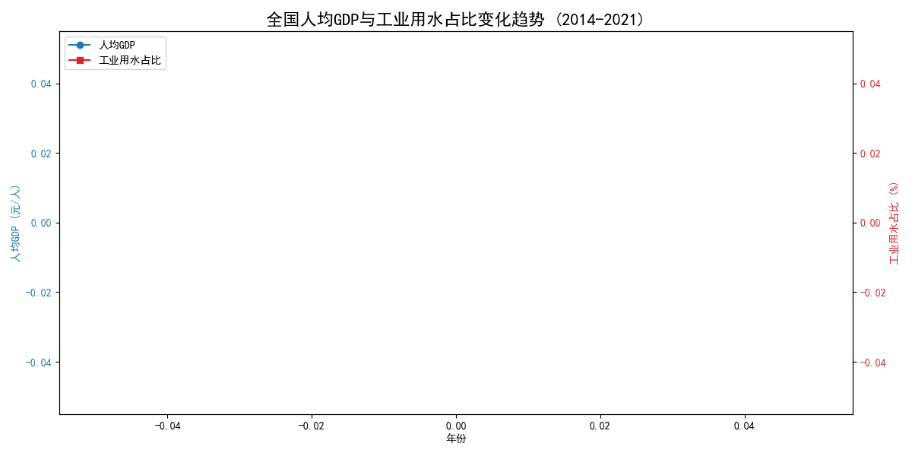
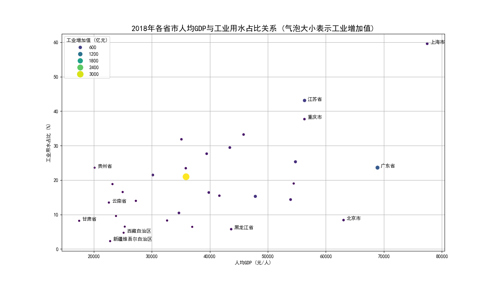

# 中国经济发展与工业用水关系分析报告

## 1. 引言

本报告旨在探究中国经济发展水平与工业用水情况之间的关系。我们通过分析全国及各省市的人均GDP（作为经济发展水平的代理指标）和工业用水占比（工业用水量占总用水量的百分比），试图回答以下两个核心问题：
1.  从中国整体来看，工业用水占比与经济发展水平之间呈现何种关系？
2.  这种关系在不同省市之间是否存在差异？其背后的原因可能是什么？

## 2. 全国整体趋势：经济增长与用水效率的演变

为了探究中国整体的趋势，我们分析了自2014年至2021年全国层面的人均GDP与工业用水占比的变化情况。

**核心洞察：**

从上图可以看出一条清晰的“反向”发展路径：
*   **人均GDP稳步增长**：蓝色曲线显示，从2014年到2021年，中国人均GDP持续攀升，反映了经济的快速发展。
*   **工业用水占比持续下降**：红色曲线显示，在同一时期，全国的工业用水占比呈现出明显的下降趋势，从约23%下降到17%左右。

**分析与解读：**
这种“一升一降”的趋势表明，**随着中国经济的整体发展，我国的用水结构正在持续优化，对工业用水的依赖度在降低**。这背后可能的原因包括：
1.  **产业结构升级**：经济发展推动了产业从高耗水、高污染的第二产业（重工业）向低耗水、高附加值的第三产业（服务业）和高新技术产业转型。
2.  **技术进步与效率提升**：工业生产技术的进步，以及对水资源循环利用率的提高，使得单位工业增加值所需的水耗显著降低。
3.  **环保政策趋严**：国家对水资源保护和利用效率提出了更高的要求，倒逼企业进行节水改造和技术升级。

总体而言，在国家层面，经济发展与水资源利用效率的提升呈现出协同发展的良好态势。

## 3. 省市差异分析：区域发展不平衡的体现

在分析了全国的宏观趋势后，我们进一步聚焦于地区差异，通过分析2021年各省市的数据来探究不同区域的特点。

**核心洞察：**

上图展示了2021年中国各省市（不含港澳台）的经济发展与工业用水情况。图中，横坐标代表人均GDP，纵坐标代表工业用水占比，而气泡的大小则代表该省的工业增加值。我们可以观察到明显的区域分化特征：

1.  **发达地区：高GDP，低用水占比**
    *   以**北京、上海、广东**为代表的东部沿海发达省市，普遍位于图的**右下角**。它们的人均GDP非常高，但工业用水占比却处于全国较低水平。
    *   **原因分析**：这些地区率先完成了产业结构调整，经济增长更多地依赖于金融、科技、服务业等低耗水产业。同时，其雄厚的资本和技术实力也使其工业水资源利用效率更高。

2.  **欠发达及资源型地区：低GDP，高用水占比**
    *   以**宁夏、新疆、青海**为代表的部分西部省份，大多位于图的**左上角或中上部**。它们的人均GDP相对较低，但工业用水占总用水量的比例非常高。
    *   **原因分析**：这些地区的经济结构可能仍较多地依赖于能源、化工、冶金等传统重工业，这些是典型的高耗水产业。例如，宁夏的现代煤化工业虽然贡献了工业产值，但也带来了巨大的水资源消耗。此外，这些地区往往水资源本底条件较差，水资源压力更大。

3.  **工业大省的特征**
    *   如图中气泡大小所示，**江苏、山东、广东**等省份的工业增加值巨大。尽管它们的工业规模庞大，但其工业用水占比仍控制在相对合理的范围（如江苏在25%左右），表明这些工业大省在维持工业体量的同时，也在水资源利用效率方面做出了努力。

## 4. 结论与建议

综合全国和地区层面的分析，我们可以得出以下结论：

*   **宏观层面**，中国经济发展与工业用水效率提升呈现出积极的协同关系。随着国家经济水平的提高，整体用水结构在向更可持续的方向优化。
*   **微观层面**，区域间差异显著。经济发达地区已步入“高GDP、低水耗”的良性循环，而部分经济欠发达和资源依赖型地区则面临着“低GDP、高水耗”的双重挑战，其经济发展模式对水资源的依赖度依然很高。

**基于以上分析，我们提出以下建议：**

1.  **实施差异化水资源管理策略**：对于工业用水占比较高的欠发达地区（如宁夏、新疆等），应将提升工业用水效率、优化产业结构作为核心政策目标。可通过财税激励、技术扶持等方式，引导其发展节水型产业，并对高耗水项目进行更严格的准入控制。
2.  **推广先进经验**：总结并推广北京、上海等发达地区在产业转型和水资源高效利用方面的成功经验。鼓励东部地区的节水技术和管理模式向中西部地区转移，促进区域间的均衡与可持续发展。
3.  **强化工业增加值的“含金量”**：在考核地方经济发展时，不仅要看工业增加值的“量”，更要关注其背后的水耗、能耗等“质”的指标。推动各地从追求规模扩张转向追求绿色、高效、可持续的工业发展模式。

通过这些措施，中国有望在保持经济稳定增长的同时，更好地应对水资源挑战，实现真正的绿色发展。
