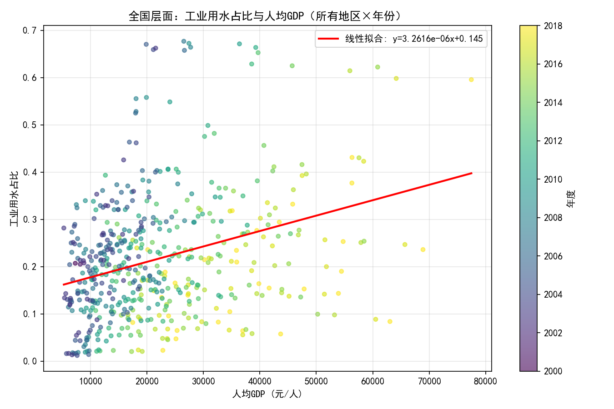
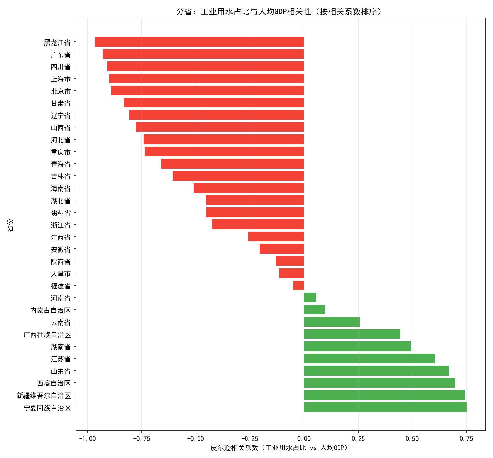

## 中国工业用水占比与经济发展水平的关系：全国与分省的对比分析

### 摘要结论
- 全国整体（所有地区×年份合并）：工业用水占比与人均GDP呈显著的“弱至中度”正相关（皮尔逊r≈0.318，斯皮尔曼r≈0.297）。全国散点图与线性拟合显示总体呈上升趋势。
- 中国国家层面（时间序列维度）：2000-2018年间，工业用水占比与人均GDP的相关为轻度负相关（皮尔逊r≈-0.147），显示随经济增长，工业用水占比总体略有下降。
- 分省时间序列：存在明显差异。10个省份（多为西部/资源型地区，如宁夏、新疆、西藏等）呈正相关；21个省市（多为东部沿海与大城市，如北京、上海、广东、四川、黑龙江）呈强负相关。
- 年度横截面（跨省同年）：几乎每个年份的跨省相关都是正的（2003-2018年皮尔逊r约0.56-0.69），即在同一时间点上，人均GDP更高的省份往往拥有更高的工业用水占比。

综合解释：横截面上，经济更发达的省份往往有更大的工业体量或更高工业比重，导致工业用水占比偏高；但在时间序列上，随着经济增长与结构升级、节水技术普及、环保政策强化，工业用水占比逐步下降。因此全国维度的总体相关是正向的，但国家和多数省份的时间序列呈负向——这体现了“横截面差异”和“时间演变”两种效应的叠加与反向。

---

### 数据与方法
- 数据来源：SQLite数据库 dacomp-003.sqlite
  - 工作表1：含“工业用水量(亿m³)、用水总量(亿m³)、地区名称、年度标识”等
  - 经济指标数据：含“人均GDP (元/人)、工业增加值 (亿元)、固定资产投资 (亿元)、城镇化率 (%)”等
- 覆盖范围：2000-2018年；31个省级行政区（不含港澳台）；合计有效样本515（全国含各省市×年份）。
- 指标定义：工业用水占比=工业用水量/用水总量。经济发展水平用人均GDP衡量。
- 关联方法：按“年度标识、地区代码、地区名称”联接两表。未进行数据清洗，仅为避免不可计算而剔除“除零/缺失”记录。

为保证中文显示和符号正常，绘图代码中包含如下设置：
```python
plt.rcParams['font.sans-serif'] = ['SimHei']
plt.rcParams['axes.unicode_minus'] = False
```

---

### 全国层面结果（所有地区×年份合并）
- 皮尔逊相关系数≈0.3176；斯皮尔曼相关系数≈0.2971（N=515）。
- 解释：在把所有地区与年份混在一起看时，工业用水占比与人均GDP总体呈正相关。这更多反映“不同地区间的结构性差异”：工业比重较高、经济体量较大或以重工业为主的地区（如部分东部制造业大省、部分资源型省份）在同一时期内会显示更高的工业用水占比。

配图（散点图+线性拟合）：


---

### 中国整体时间序列（国家层面）
- 2000-2018年，中国的工业用水占比与人均GDP呈轻度负相关（皮尔逊r≈-0.1467）。
- 解释：随着经济增长，中国在产业结构升级、节水技术进步、循环用水推广、环保与用水管控政策日益严格等因素驱动下，工业用水占比呈减势。这反映的是“随时间演变的结构升级与效率改善”。

配图（双轴时间序列）：


---

### 分省时间序列差异
- 分省相关性排序的前5名（正相关）：
  - 宁夏回族自治区（r≈0.753）、新疆维吾尔自治区（r≈0.745）、西藏自治区（r≈0.697）、山东省（r≈0.670）、江苏省（r≈0.606）。
  - 这些地区在研究期内随着人均GDP上升，工业用水占比也上升或保持较高——可能与资源开发、工业扩张、制造业体量提升有关。
- 分省相关性排序的后5名（强负相关）：
  - 北京市（r≈-0.892）、上海市（r≈-0.901）、四川省（r≈-0.909）、广东省（r≈-0.931）、黑龙江省（r≈-0.969）。
  - 这些地区随着人均GDP上升，工业用水占比显著下降——可能因为服务业比重提高、产业升级与转型、严格的节水与环保政策、用水效率显著改善。
- 总体来看：参与统计的31个省份中，正相关省份10个、负相关省份21个。说明“多数省份在时间维度上，经济发展与工业用水占比出现去耦合（负相关）”。

配图（分省相关性柱状图）：


---

### 年度横截面诊断（跨省同年）
- 在同一年度内，跨省（省与省之间）的人均GDP与工业用水占比普遍呈正相关（示例：2003年r≈0.686、2004年r≈0.670、2018年r≈0.581）。
- 解释：这说明在同一时期，经济更发达的省份往往具有更高的工业用水占比（更大的工业体量或更高的工业比重），体现了“横截面效应”。这一结论与“时间序列负相关（结构升级与节水）”并不矛盾。

---

### 诊断性洞察：为何会出现“全国总体正相关”与“时间序列负相关”的并存？
- 横截面效应：在某一年内，富省往往工业规模更大（或更高的工业比重），因此工业用水占比大；贫省工业规模较小，工业用水占比低，因此跨省相关为正。
- 时间序列效应：随着经济发展，产业结构升级（制造业向高附加值、低水耗方向转变，服务业比重提升）、技术进步（节水与循环用水）、政策约束（取水许可、用水定额、水价机制等）推动工业用水占比下降，因而多数省份在自身时间序列上呈负相关。
- 区域差异：西部/资源型省份在研究期内工业扩张与基础设施建设加快，工业用水占比可能随经济增长一并上升；而东部沿海与大城市以服务业、科技、现代制造为主，且政策和技术更成熟，工业用水占比更易下降。

---

### 预测性判断
- 若当前趋势延续：
  - 全国层面（时间序列）工业用水占比大概率继续缓慢下降或维持低位；
  - 分省层面将继续分化：资源型与工业扩张中的地区可能维持或上升工业用水占比；沿海及都市型经济体的工业用水占比或进一步下降。

---

### 规范性建议（可操作策略）
1. 因地制宜的工业用水管控：
   - 对“时间序列正相关”的省份（如宁夏、新疆、西藏等）：
     - 加速推广高耗水行业的工艺升级与设备更新（钢铁、有色、化工、煤化工等），提升循环用水比例；
     - 建立分行业的用水强度基准线与达标路线图，分阶段降耗；
     - 完善工业用水价格机制，差别化水价推动节水投资。
   - 对“时间序列负相关”的省份（如北京、上海、广东、四川、黑龙江等）：
     - 强化既有节水成效的固化与扩散，推动跨区域技术与管理经验共享；
     - 聚焦仍高耗水的细分产业与园区开展专项整治，巩固降耗成果。
2. 全国层面的结构性政策：
   - 继续推动产业结构升级，鼓励低水耗、低污染的高附加值制造与服务业发展；
   - 完善用水定额、取水许可与监管，建立工业用水占比与用水强度的监测、评估与预警机制；
   - 扩大中水回用与再生水利用，完善城市与工业园区的水循环网络。
3. 投资与技术路径：
   - 针对西部与资源型地区，加大节水技术研发与示范项目投入，支持工业水循环系统建设；
   - 推动企业披露用水强度与节水绩效，将绿色金融与节水行为挂钩。

---

### 方法与结果复核
- 有效样本数：515；参与统计省份：31；年份范围：2000-2018。
- 主要相关系数：全国皮尔逊r≈0.318；全国斯皮尔曼r≈0.297；中国时间序列r≈-0.147；多数年份跨省相关r≈0.56-0.69。
- 文件与图表：
  - 数据联接样本：joined_data.csv
  - 分省相关结果：prov_corr.csv
  - 年度横截面相关：year_cross_section_corr.csv
  - 图片：
    - 全国散点图：全国_工业用水占比_vs_人均GDP.png
    - 分省柱状图：分省_相关性柱状.png
    - 中国时间序列：中国_时间序列_人均GDP_与工业用水占比.png

---

### 结语
从全国合并数据看，工业用水占比与经济发展水平整体呈现正相关，但在国家与多数省份的时间序列上，随着经济发展，工业用水占比出现下降。两种现象并存的根源在于横截面与时间维度的效应差异。政策制定与企业实践应在结构升级与技术节水两端同时发力，并按地区差异进行精准施策，以实现“经济增长与用水压力的实质性脱钩”。
