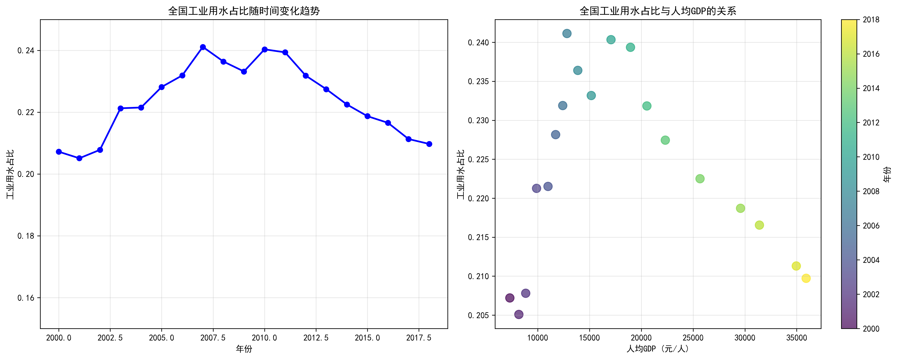
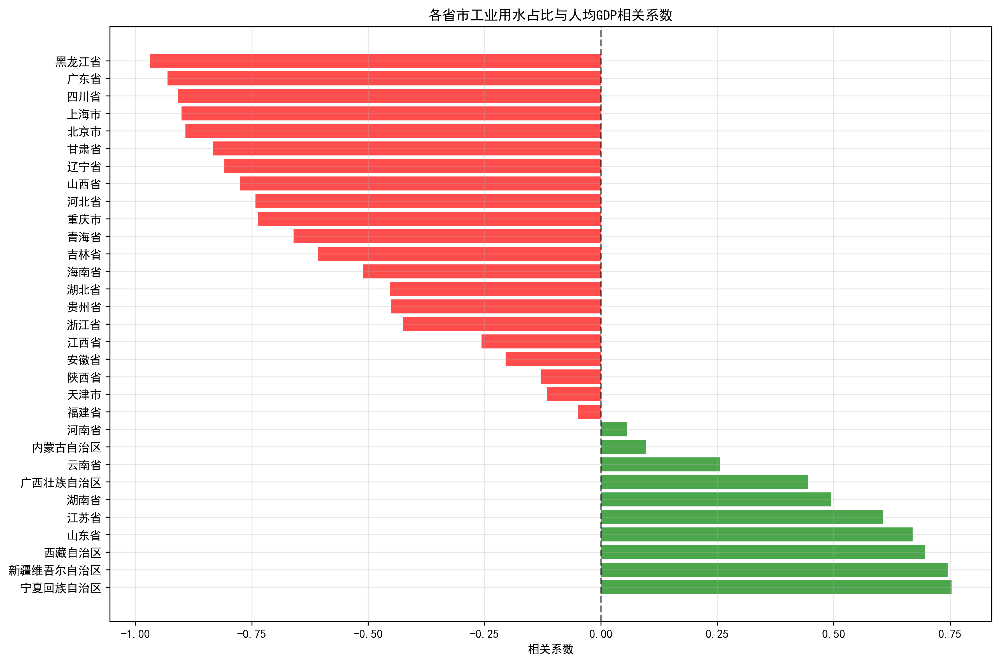
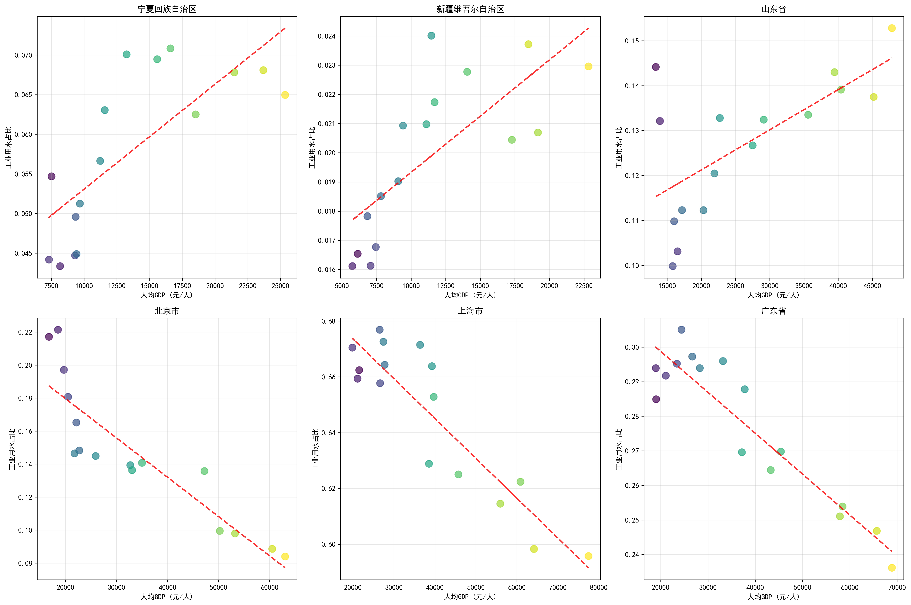
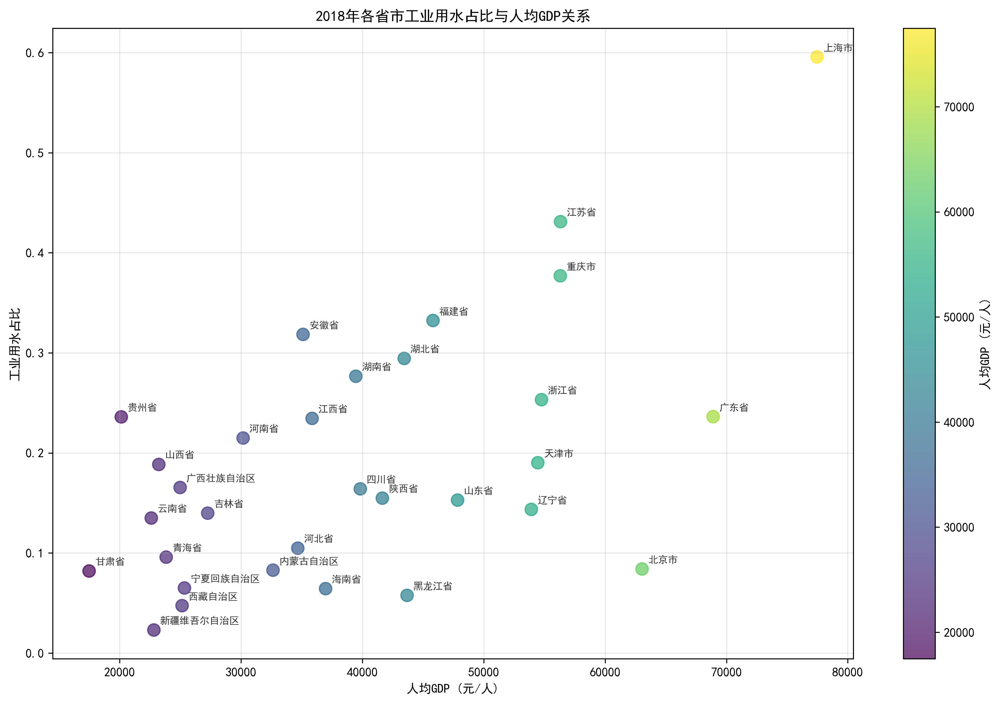

# 中国工业用水占比与经济发展水平关系分析报告

## 执行摘要

本报告基于2000-2018年中国全国及31个省市自治区的用水数据和经济指标数据，深入分析了工业用水占比与经济发展水平之间的关系。研究发现，从全国整体看，工业用水占比与经济发展水平呈弱负相关关系，但细化到不同省市，这种关系存在显著差异。

## 一、全国整体分析

### 1.1 工业用水占比时间趋势

从全国数据看，2000-2018年间中国工业用水占比呈现先上升后稳定的趋势：
- 2000-2007年：工业用水占比从20.7%持续上升至24.1%
- 2008-2018年：工业用水占比在22%-24%之间波动

### 1.2 工业用水占比与经济发展关系

全国层面分析显示，工业用水占比与人均GDP的相关系数为-0.1467，呈弱负相关关系。这表明：
- 随着经济发展，工业用水占比略有下降趋势
- 这种关系较弱，说明经济发展水平并非决定工业用水占比的主要因素

## 二、省市层面分析

### 2.1 相关系数分布特征

各省市工业用水占比与经济发展的关系存在显著差异：

**正相关地区（经济发展带动工业用水占比增加）：**
- 宁夏回族自治区（相关系数：0.753）
- 新疆维吾尔自治区（相关系数：0.745）
- 西藏自治区（相关系数：0.697）
- 山东省（相关系数：0.670）
- 江苏省（相关系数：0.606）

**负相关地区（经济发展带动工业用水占比下降）：**
- 黑龙江省（相关系数：-0.969）
- 广东省（相关系数：-0.931）
- 四川省（相关系数：-0.909）
- 上海市（相关系数：-0.901）
- 北京市（相关系数：-0.892）

### 2.2 典型省市分析

通过对典型省市的深入分析，我们发现不同发展模式：

**正相关模式代表：**
- **宁夏、新疆**：经济发展初期，工业化进程加快，工业用水占比随经济增长而上升
- **山东、江苏**：工业强省，经济发展与工业用水同步增长，体现工业主导型发展

**负相关模式代表：**
- **北京、上海**：经济发达省市，产业结构优化升级，服务业占比提高，工业用水占比下降
- **广东**：制造业大省但向高端转型，单位GDP用水效率提升

### 2.3 2018年横截面分析

2018年各省市数据显示，工业用水占比与人均GDP呈中等正相关（相关系数：0.581），这与全国时间序列的负相关形成对比，说明：

- **横向比较**：发达省市工业用水占比相对较高，体现工业基础雄厚
- **纵向发展**：随着经济发展，各省市工业用水占比变化趋势不同

## 三、主要发现与洞察

### 3.1 发展阶段差异

不同省市处于不同发展阶段，导致工业用水占比与经济发展关系各异：
- **初级阶段**：工业化初期，经济增长依赖工业扩张，工业用水占比上升
- **转型阶段**：产业结构调整，服务业比重增加，工业用水占比下降
- **成熟阶段**：高技术制造业发展，用水效率提升，占比趋于稳定

### 3.2 产业结构影响

产业结构是决定工业用水占比与经济发展关系的关键因素：
- **资源型地区**：宁夏、新疆等，资源密集型产业占比高，正相关明显
- **服务型地区**：北京、上海等，服务业占比超70%，负相关显著
- **制造型地区**：广东、江苏等，制造业转型升级，关系复杂

### 3.3 政策与技术因素

- **节水政策**：最严格水资源管理制度推动工业节水
- **技术进步**：工业用水重复利用率提升，单位产值用水量下降
- **环保要求**：环保标准提高，倒逼企业减少新鲜水取用

## 四、政策建议

### 4.1 分类施策

**对于正相关地区（宁夏、新疆等）：**
- 推进工业节水技术改造，提高用水效率
- 优化工业结构，发展节水型产业
- 加强水资源循环利用体系建设

**对于负相关地区（北京、上海等）：**
- 保持产业结构优化势头，发展高附加值低耗水产业
- 推广先进节水技术和管理经验
- 建立区域水资源调配机制

### 4.2 统筹推进

- **完善水资源价格机制**：通过价格杠杆引导工业节水
- **强化技术创新**：支持工业节水技术研发和推广
- **加强区域协调**：建立跨省流域水资源保护协作机制
- **健全考核体系**：将工业用水效率纳入地方政府考核

## 五、结论

中国工业用水占比与经济发展水平的关系呈现复杂的时空特征。全国层面弱负相关与省市层面差异显著的对比，反映了我国区域发展的不平衡性和产业结构的多层次性。未来应坚持\"节水优先\"方针，因地制宜推进工业节水，实现经济发展与水资源可持续利用的协调统一。

---

*本报告基于2000-2018年官方统计数据编制，分析结果仅供参考。*
