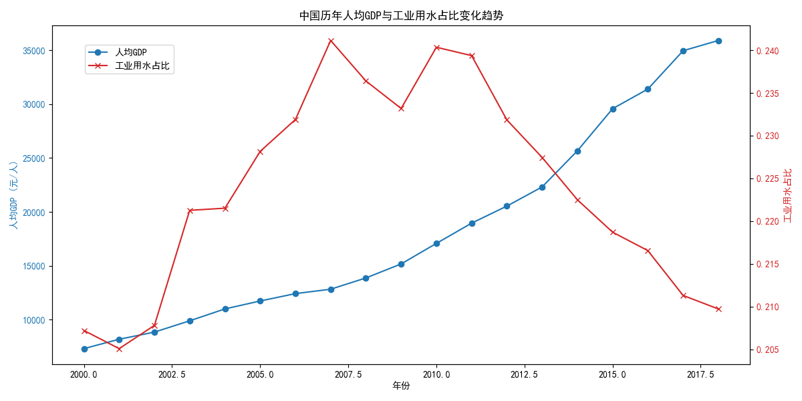
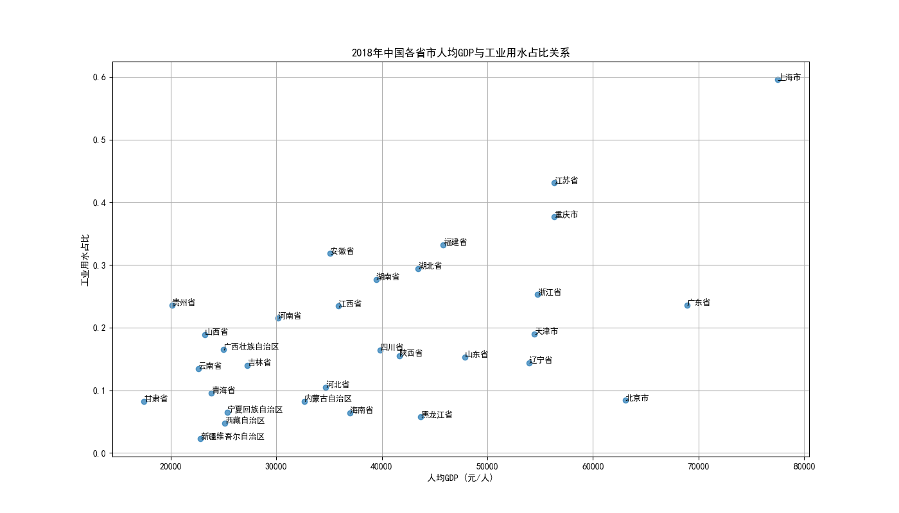

# 中国经济发展与工业用水关系分析报告

## 1. 引言

本报告旨在分析中国经济发展水平与工业用水占比之间的关系。通过对2000年至2018年的全国及各省市宏观经济数据和水资源利用数据的综合分析，我们试图回答以下两个核心问题：
1.  从全国整体来看，工业用水占比与经济发展水平（以人均GDP为代表）的长期趋势是怎样的？
2.  这种关系在不同发展水平的省市之间是否存在差异？

## 2. 全国层面：经济增长与工业用水占比的“脱钩”趋势

我们首先观察了中国自2000年以来的宏观数据。如下图所示，中国人均GDP实现了持续高速增长，而工业用水占总用水量的比例则呈现出先趋于平稳、后逐步下降的态势。

**洞察与解读：**
- **经济与用水的“脱钩”**：图表清晰地揭示了一个积极的现象——经济的快速增长并未带来工业用水占比的同步增加。尤其是在2010年之后，随着人均GDP的加速攀升，工业用水占比反而开始下降。这表明中国的经济增长正逐渐摆脱对水资源消耗的过度依赖，实现了从“强耦合”到“弱耦合”甚至“脱钩”的转变。
- **背后的驱动力**：这种趋势的形成主要得益于以下几个方面：
    - **产业结构升级**：中国经济从以高耗水的重工业为主，逐步转向服务业和高新技术产业。服务业的GDP占比不断提升，其单位产值的水耗远低于工业。
    - **技术进步与效率提升**：国家大力推广节水技术、循环用水和中水回用，显著提高了工业用水的利用效率。
    - **政策引导**：政府出台了严格的水资源管理和环境保护政策，对高耗水企业形成了有效约束。

## 3. 省市层面：经济水平越高，工业用水占比越低

为了探究这种宏观趋势在不同区域间的表现，我们对最新年份（2018年）的各省市数据进行了横向比较。散点图直观地展示了各省市人均GDP与工业用水占比的关系。

**洞察与解读：**
- **明显的负相关关系**：散点图显示，各省市的人均GDP与工业用水占比之间存在着明显的负相关关系。整体趋势线（未画出，但可凭肉眼观察）从左上向右下倾斜。
- **区域分化特征**：
    - **高GDP，低占比区（右下角）**：以北京、上海、广东、江苏为代表的东部沿海发达省市，其人均GDP位居全国前列，但工业用水占比普遍较低。这些地区经济以现代服务业和高新技术制造业为主，产业结构优化，水资源利用效率高。
    - **低GDP，高占比区（左上角）**：以宁夏、山西、辽宁等省份为代表，其人均GDP相对较低，但工业用水占比较高。这些地区通常是国家的传统重工业基地或能源矿产资源富集区，其经济结构中高耗水产业（如化工、冶金、火电）的比重较大。
- **特殊案例**：天津是一个有趣的案例，其人均GDP较高，但工业用水占比也处于中等偏上水平，这可能与其作为重要沿海工业城市的定位有关，拥有如石化、海水淡化等特殊工业门类。

## 4. 结论与建议

综合全国和省市两个层面的分析，我们可以得出以下结论：

**核心结论：** 随着经济发展水平的提升，工业用水在总用水量中的占比呈现下降趋势。这一方面是产业结构从高耗水的第二产业向低耗水的第三产业演进的自然结果，另一方面也反映了技术进步和节水政策的成效。经济发展与水资源消耗之间的“脱钩”现象已在全国层面显现，并在经济发达地区表现得尤为突出。

基于以上洞察，提出以下可行性建议：

1.  **对工业用水占比较高地区**：
    - **加速产业转型**：应加大政策引导和资金支持，推动传统高耗水产业的技术改造和升级，同时积极培育和引进附加值高、水耗低的战略性新兴产业和现代服务业。
    - **推广节水技术**：强制推行先进的节水工艺和设备，提高工业用水的重复利用率，对标国内外先进水平，设定明确的单位产品用水定额。

2.  **对经济发达地区**：
    - **分享成功经验**：系统总结在产业结构调整、水权交易、水价改革、节水技术应用等方面的成功经验，通过区域合作、对口支援等方式，向欠发达地区输出管理和技术模式。
    - **探索更高标准**：继续引领节水潮流，探索“零排放”工业园区等更高标准的水资源利用模式，为全国提供未来发展的样板。

3.  **国家宏观层面**：
    - **优化水资源配置**：在制定国家和区域发展战略时，应将水资源承载能力作为核心考量因素之一，引导产业布局与水资源分布相匹配。
    - **强化经济杠杆**：深化水价改革，使水价能更真实地反映水资源的稀缺性和环境成本，利用市场机制倒逼企业节水。
