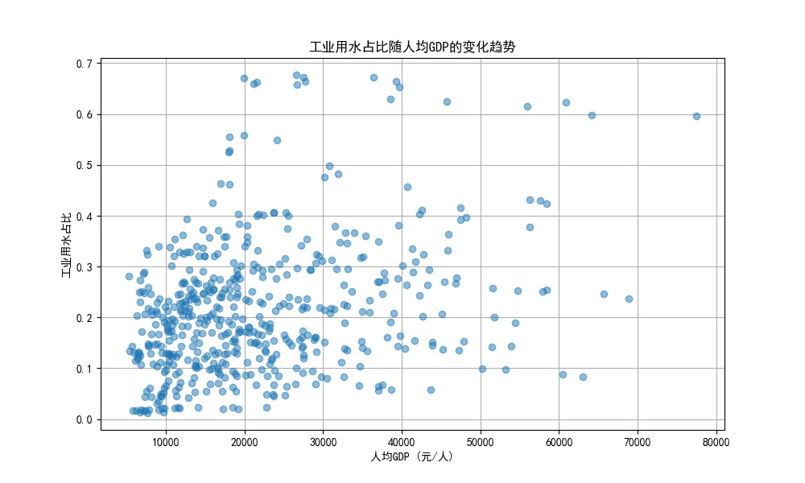
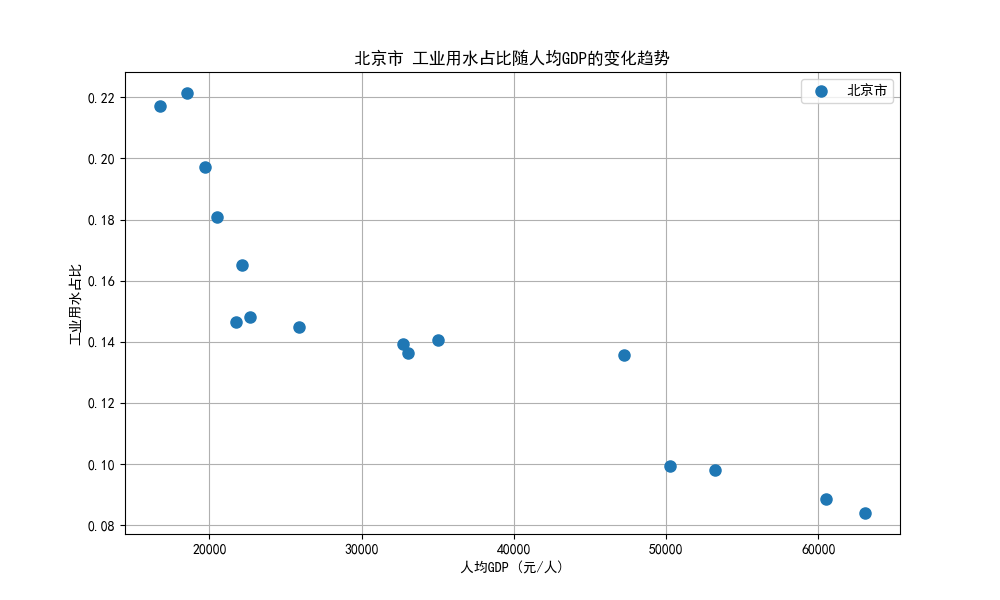
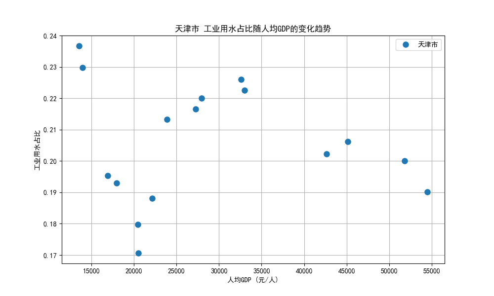
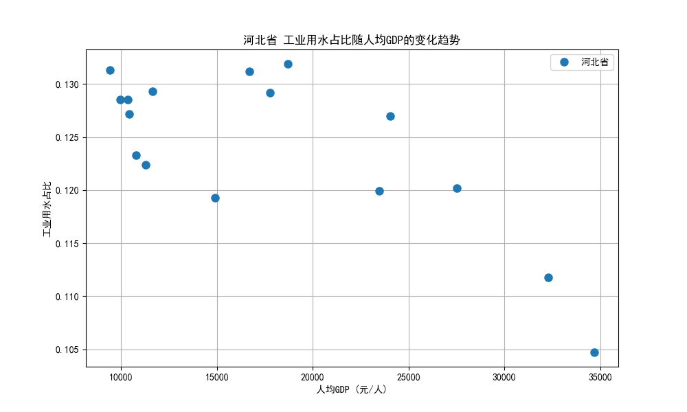

# 中国工业用水占比与经济发展水平关系分析报告

## 概述

本报告分析了中国整体工业用水占比与经济发展水平之间的关系，并深入探讨了该关系在不同省市之间的差异。

## 数据来源

分析数据来源于 `dacomp-003.sqlite` 数据库，该数据库包含以下两张表：

- **工作表1**：用水数据，包括供水总量、农业用水量、工业用水量等。
- **经济指标数据**：经济发展指标，包括人均GDP、工业增加值等。

## 分析方法

1. **整体分析**：通过 SQL 查询计算工业用水占比，并与人均GDP 进行关联。
2. **细化分析**：按不同省市分别分析工业用水占比与人均GDP 的关系。
3. **可视化分析**：绘制散点图与趋势线，展示工业用水占比与人均GDP 的关系。

## 分析结果

### 整体关系分析

以下图表展示了全国范围内工业用水占比与人均GDP 的整体关系：

从图中可以看出，随着人均GDP 的增长，工业用水占比呈现出一定的变化趋势。这表明工业用水与经济发展水平之间可能存在某种关联。

### 细化到不同省市的分析

以下图表展示了部分省市工业用水占比与人均GDP 的关系：

从这些图表中可以观察到，不同省市的工业用水占比与人均GDP 之间的关系存在一定的差异。例如，某些省市的工业用水占比随人均GDP 的增长而上升，而另一些省市则呈现出下降的趋势。

## 结论与建议

### 结论

1. **整体趋势**：中国的工业用水占比与人均GDP 之间存在一定的关系，但具体趋势需要进一步分析。
2. **区域差异**：在细化到不同省市的分析中，发现不同地区的工业用水占比与经济发展水平的关系存在明显差异。

### 建议

1. **政策建议**：各地政府应根据本地工业用水与经济发展水平的关系，制定相应的节水措施与产业政策。
2. **未来研究方向**：建议进一步研究影响工业用水的因素，例如产业结构、技术水平等，以深入了解工业用水与经济发展水平之间的关系。

---
