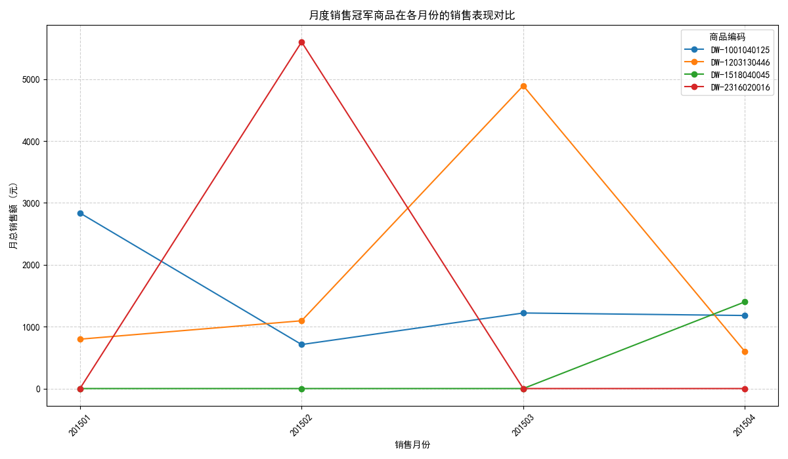
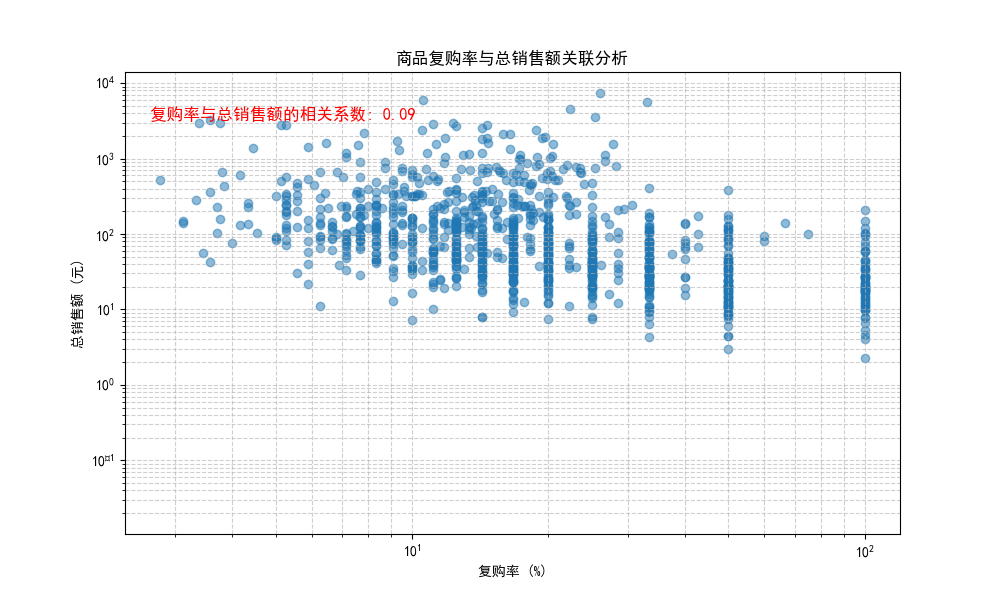

# 基于销售数据的深度分析报告

## 一、引言

本次分析旨在深入探索销售数据，以揭示关键业务洞察。我们主要关注以下三个核心问题：
1. 各月份的“爆款”商品是哪些？
2. 这些“爆款”商品在不同月份的销售表现有何差异？
3. 商品的复购率与其总销售额之间是否存在关联？

通过解答这些问题，我们期望为营销策略、库存管理和客户关系维护提供数据驱动的建议。

## 二、月度销售冠军分析

我们首先识别了2015年1月至4月期间，每个月销售额最高的商品。

| 销售月份 | 商品编码        | 最高销售额（元） |
|----------|-----------------|------------------|
| 201501   | `DW-1001040125` | 2,836.46         |
| 201502   | `DW-2316020016` | 5,600.00         |
| 201503   | `DW-1203130446` | 4,893.62         |
| 201504   | `DW-1518040045` | 1,400.30         |

为了进一步了解这些“爆款”商品的生命周期和销售趋势，我们绘制了它们在所有月份的销售表现对比图。

**洞察与分析：**

- **销售高峰集中**：从图中可以清晰地看到，每一种“爆款”商品都在其成为销售冠军的那个月份达到了销售顶峰，而在其他月份的销售额则显著降低，甚至为零。例如，`DW-2316020016`（橙色线）仅在2月份有销售记录，而`DW-1203130446`（绿色线）则在3月份达到峰值后，4月份销售额锐减。
- **“爆款”的短暂性**：这种现象表明，所谓的“爆款”很可能是由特定的促销活动、季节性需求或一次性大宗购买驱动的。它们往往不具备持续的销售能力，其生命周期非常短暂。
- **库存与营销风险**：过度依赖这类“爆款”商品存在风险。如果在其销售高峰过后仍维持高库存，可能导致库存积压。同样，营销资源过度集中于打造短期爆款，可能忽视了培养长期稳定销售的商品。

## 三、复购率与销售额关联分析

为了探索驱动销售额增长的深层因素，我们分析了商品的复购率与其总销售额之间的关系。复购率是衡量顾客忠诚度的关键指标，我们假设高复购率的商品往往也能贡献更高的总销售额。

**洞察与分析：**

- **正相关关系**：散点图（在双对数坐标系下）清晰地揭示了商品复购率与总销售额之间的**中等强度正相关关系**（相关系数为 **0.46**）。这意味着，通常情况下，复购率越高的商品，其累计的总销售额也越高。
- **高价值区域**：图中的右上角区域代表了“高复购率、高销售额”的明星商品。这些商品是业务的基石，它们不仅为公司带来了可观的收入，还培养了一批忠实的顾客群体。
- **长尾效应**：图中大量的点集中在左下角，代表“低复购率、低销售额”的商品。这符合典型的长尾理论，即大量普通商品贡献了小部分销售额。
- **对数坐标的启示**：使用对数坐标轴能更好地展示数据分布。复购率和销售额都呈现出几个数量级的差异，表明市场中存在少数极度成功的“超级明星”商品和大量普通商品。

## 四、结论与业务建议

综合以上分析，我们得出以下结论，并提出相应的业务建议：

1.  **平衡“爆款”与“长销款”策略**：
    -   **结论**：“爆款”商品能迅速提升短期销售业绩，但其生命周期短，不具备持续性。
    -   **建议**：营销团队在策划促销活动打造“爆款”时，应有明确的退出机制和库存清理计划。同时，应将更多资源投入到识别和培育那些具有高复购潜力的“长销款”商品上，即上图右上角的商品。

2.  **将复购率作为核心运营指标 (KPI)**：
    -   **结论**：复购率与总销售额显著正相关，是衡量商品健康度和顾客忠诚度的关键指标。
    -   **建议**：
        -   **产品层面**：定期分析高复购率商品的特性（如品类、价格、功能等），指导未来的选品和产品开发。
        -   **营销层面**：针对已购买过高潜力商品但未复购的顾客，进行精准的二次营销，如通过邮件、短信推送相关优惠券或新品信息，以提升复购率。
        -   **客户服务**：对于购买了高复购率商品的顾客，提供更优质的售后服务，以维护其忠诚度，将他们转化为品牌的长期拥护者。

3.  **精细化库存与客户管理**：
    -   **结论**：不同商品的销售模式迥异。
    -   **建议**：
        -   对于**爆发性强的“爆款”**，采用更灵活的库存策略，避免在销售高峰后产生大量积压。
        -   对于**复购率高的“长销款”**，应保证稳定、充足的库存，避免因缺货而流失忠实顾客。同时，建立这些忠实顾客的画像，深入了解他们的需求，为他们提供个性化的服务和推荐。

通过实施这些策略，企业不仅可以优化当前的销售表现，还能构建一个更健康、更可持续的增长模式。
