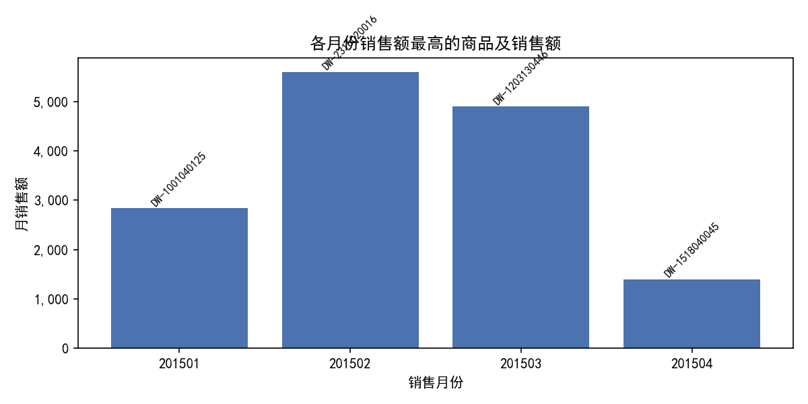
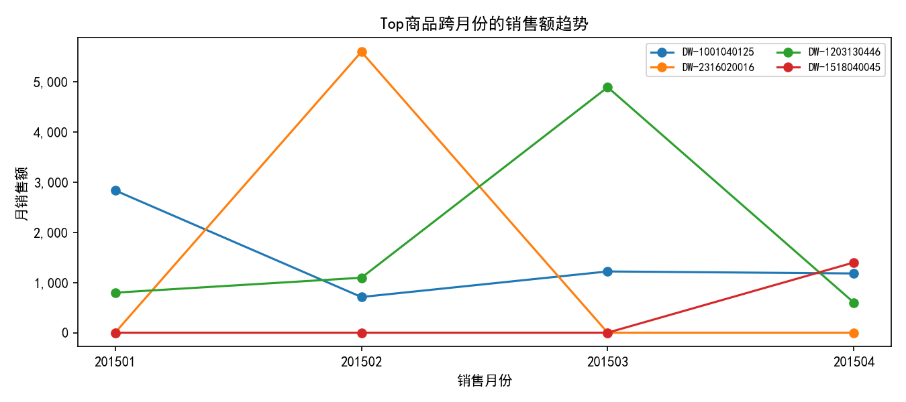
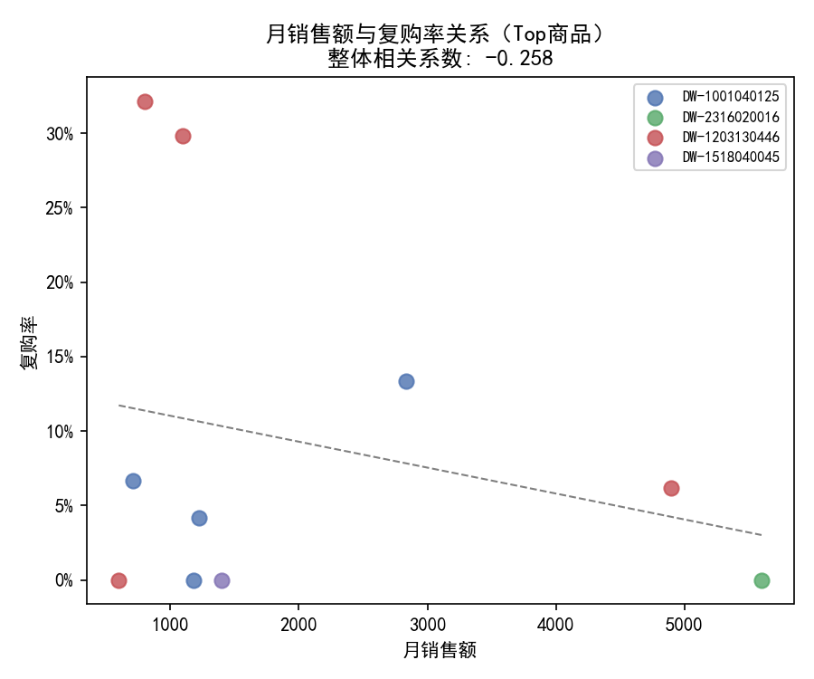

# 月度Top商品与跨月表现分析（2015-01 至 2015-04）

本文目标：
- 找出各月份中销售额最高的商品编码；
- 分析这些Top商品在不同月份的表现差异；
- 探究复购率与销售额之间的关联，给出业务建议。

数据说明：
- 来源：SQLite 表“工作表1”；字段包含：顾客编号、商品编码、销售日期/销售月份、销售金额、是否促销等。
- 时间范围：201501 至 201504。
- 样本规模：共 42,816 行记录；商品数 6,142；顾客数 2,612。

方法要点：
- 月销售额：按“销售月份×商品编码”汇总销售金额。
- 每月Top商品：按上述汇总，选取每月销售额最高的商品编码。
- 复购率定义（按SKU×月份）：在月份m购买了该SKU的顾客中，是否在m之后的任一月份再次购买同SKU的比例。注意：由于样本仅到201504，201504的复购率会存在“右删失”（后续月份不可观察）。
- 可视化：使用Python/Matplotlib绘图并保存在当前目录。关键配置如下：
```python
plt.rcParams['font.sans-serif'] = ['SimHei']
plt.rcParams['axes.unicode_minus'] = False
```

一、各月份销售额最高的商品编码
- 2015-01：DW-1001040125，月销售额=2,836.46
- 2015-02：DW-2316020016，月销售额=5,600.00
- 2015-03：DW-1203130446，月销售额=4,893.62
- 2015-04：DW-1518040045，月销售额=1,400.30

可视化（柱状图，柱顶标注商品编码）：



二、Top商品在不同月份的表现差异（跨月对比）
- DW-1001040125：四个月均有交易（活跃月数=4），2015-01 达峰值，随后在2015-02显著回落（最低月=2015-02），说明可能存在季节/一次性集中采购影响，之后有一定恢复。
- DW-2316020016：仅在2015-02出现且即为Top（活跃月数=1），强烈提示一次性大单或阶段性需求（无延续）。
- DW-1203130446：四个月均有交易（活跃月数=4），2015-03为峰值，2015-04回落明显，呈现“冲高后回落”的短周期波动。
- DW-1518040045：仅在2015-04出现（活跃月数=1），可能是尾期一次性需求或新品上线初期的小规模成交。

可视化（Top商品跨月销售额趋势，折线图）：



诊断补充：促销驱动吗？
- 将各月份Top商品在当月的销售按“是否促销”拆分，结果显示四个Top商品当月销售均为“正价”成交（促销占比=100%的“正价”），因此“成为Top”并非促销拉动，更多可能来自于自然需求、客户项目型采购或库存节奏。

三、复购率与销售额的关联
- 整体相关性（Top商品的月度样本层面）：销售额与复购率的总体相关系数为 -0.258，弱负相关。
- 分SKU视角：
  - DW-1001040125：相关系数=0.752（样本点=4），销售额越高，后续再次购买的比例越高，呈现“销售-留存同向”特征，适合做老客深耕与复购经营。
  - DW-1203130446：相关系数=-0.372（样本点=4），在该SKU上，较高销售额往往对应较低的后续复购，可能以一次性集中采购为主，或该SKU更偏“长周期复购/替换周期较长”。
  - DW-2316020016、DW-1518040045：样本仅1个月，无法计算相关系数。

可视化（销售额-复购率散点与拟合线）：



重要注意：
- 右删失影响：2015-04之后无数据，导致2015-04的复购率天然偏低（观察窗口不完整），会压低整体相关性；建议在实际业务评估时去除尾月，或延长观察窗口后再评估复购表现。
- 口径说明：复购率按“同一顾客对同一SKU在后续月份是否出现再次购买”定义，强调纵向留存而非跨品类/跨大类复购。

四、业务洞察与可行策略
1) 针对“强复购特征”SKU（如：DW-1001040125）
- 经营重点：
  - 老客维护与唤醒：通过到期提醒、阶梯价/会员价，鼓励按周期重复采购。
  - 订阅/自动补货：若该SKU具备消耗属性，考虑按月或按周期的自动补货方案，降低顾客决策成本。
  - 交叉销售：结合购买路径，推荐与之高关联的小类产品组合包，提高客单与复购频率。

2) 针对“一次性/项目型”SKU（如：DW-2316020016、DW-1518040045，另含DW-1203130446于高位月份的表现）
- 经营重点：
  - 线索放大与客群拓展：侧重获新而非深耕复购，投放在相关行业和场景的精准渠道。
  - 方案化包装：围绕项目型需求，设计套装/方案包，以提高单次成交规模与附加销售。
  - 售后与口碑：通过高质量交付与售后，提升转介绍效率，争取在不同客户之间的“横向复购”。

3) 价格与促销策略
- 诊断显示当月Top均为“正价”驱动，说明价格竞争并非必要条件：
  - 对强复购SKU，可实施“轻促销”或会员权益（包邮、快速发货、积分），避免损害毛利。
  - 对一次性SKU，优先通过“打包折扣/方案优惠”提升整体客单，而非单品降价。

4) 数据与评估建议
- 去除尾月偏差：评估复购时建议排除观察期最后一个月，或引入更长追踪期（例如T+2至T+3月）。
- 细化顾客分群：区分“项目客户”与“日常补货客户”，按群体评估复购与生命周期价值，匹配差异化触达策略。
- 监控指标架构：建议建立“SKU级月度销售-复购看板”，包含月销售额、月客户数、复购率、客单价、订单频次等，并对异常波动设置预警。

五、结论小结
- 每月Top商品编码分别为：
  - 2015-01：DW-1001040125；
  - 2015-02：DW-2316020016；
  - 2015-03：DW-1203130446；
  - 2015-04：DW-1518040045。
- 表现差异：DW-1001040125与DW-1203130446具有跨月持续交易，但峰谷差异明显；另两款SKU呈“一次性”特征。
- 促销因素：Top成交均为正价，并非促销驱动。
- 复购关联：总体弱负相关（-0.258），但SKU层面差异显著；DW-1001040125呈明显正相关、DW-1203130446略负相关。策略上应按SKU属性制定“留存优先”或“获新优先”的差异化经营方案。

附：图表文件
- top_sku_monthly_sales_bar.png
- top_skus_monthly_trend.png
- sales_vs_repurchase_scatter.png
