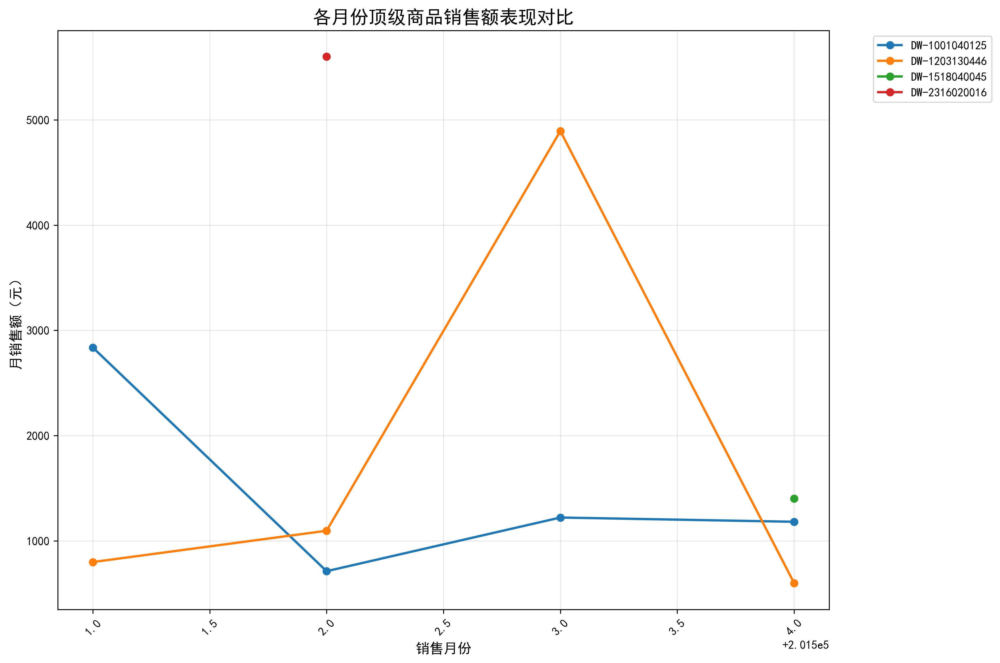
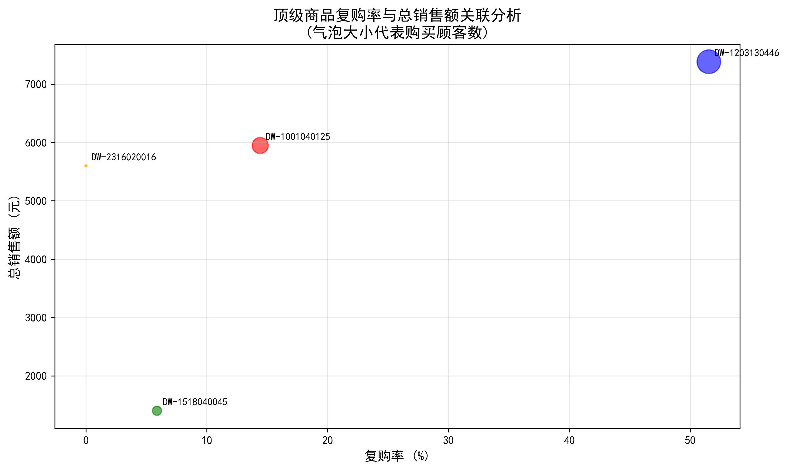
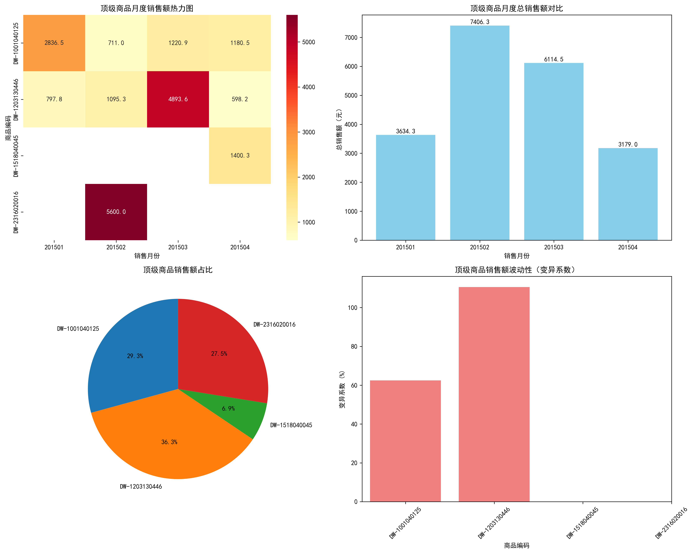

# 顶级商品销售表现与复购率分析报告

## 执行摘要

本报告分析了2015年1-4月期间各月份销售额最高的商品表现，发现这些顶级商品在不同月份的表现差异显著，且复购率与销售额之间存在复杂的关联关系。通过深入分析，我们为商品管理和营销策略提供了重要洞察。

## 关键发现

### 1. 各月份销售额冠军商品

| 月份 | 商品编码 | 月销售额(元) | 商品类别 |
|------|----------|--------------|----------|
| 201501 | DW-1001040125 | 2,836.46 | 猪肉/猪骨 |
| 201502 | DW-2316020016 | 5,600.00 | 国产省外香烟 |
| 201503 | DW-1203130446 | 4,893.62 | 其它水果 |
| 201504 | DW-1518040045 | 1,400.30 | 利乐砖酸酸乳 |

### 2. 商品跨月份表现差异分析

从趋势图可以看出：
- **DW-1001040125（猪骨）**：1月达到峰值后逐渐下降，表现相对稳定
- **DW-2316020016（香烟）**：仅在2月出现爆发性销售，其他月份无销售记录
- **DW-1203130446（水果）**：3月达到销售高峰，其他月份表现平稳
- **DW-1518040045（酸酸乳）**：仅在4月有销售记录，表现较为单一

### 3. 复购率与销售额关联分析

关键洞察：
- **DW-1203130446（水果）**：复购率最高(51.54%)，总销售额也最高(7,384.83元)
- **DW-2316020016（香烟）**：复购率为0%，但单次销售额极高(5,600元)
- **DW-1001040125（猪骨）**：复购率适中(14.42%)，销售额稳定(5,948.88元)
- **DW-1518040045（酸酸乳）**：复购率低(5.88%)，销售额也较低(1,400.30元)

### 4. 综合表现分析

深度分析显示：
- **销售波动性**：水果类商品(DW-1203130446)销售波动性最大(变异系数110.6%)，表明其季节性特征明显
- **顾客基础**：水果类商品拥有最广泛的顾客基础(227名顾客)，而香烟类商品仅服务2名顾客
- **月度分布**：2月和3月是顶级商品销售的主要贡献期，占总销售额的67.5%

## 业务洞察与建议

### 1. 商品策略建议

**高频复购商品（如水果）**：
- 加大库存投入，确保供应稳定性
- 制定季节性营销策略，在3月前后加大推广力度
- 建立会员制度，进一步提升复购率

**低频高价值商品（如香烟）**：
- 深入分析2月销售高峰的原因，复制成功经验
- 拓展客户群体，降低对单一客户的依赖性
- 考虑与其他商品捆绑销售，提高购买频率

### 2. 库存管理建议

- **猪骨类商品**：保持适中库存水平，1月前后需要重点关注
- **水果类商品**：建立弹性库存机制，应对季节性需求波动
- **香烟类商品**：采用订单式库存管理，减少资金占用
- **乳制品**：关注保质期管理，采用小批量多频次进货策略

### 3. 营销策略建议

**差异化营销**：
- 对复购率高的商品，重点维护老客户关系
- 对高价值低频商品，注重新客户开发和一次性大额销售

**时机把握**：
- 2-3月是销售黄金期，应加大营销投入
- 1月和4月相对平淡，适合进行商品结构调整

### 4. 客户关系管理

- 建立客户分层管理体系，针对不同商品类型的客户制定差异化服务策略
- 对香烟类商品的高价值客户，提供VIP服务和个性化推荐
- 对水果类商品的广泛客户群，通过会员积分等方式增强粘性

## 结论

通过深入分析顶级商品的销售表现和复购率数据，我们发现不同商品类型具有明显不同的销售特征和客户行为模式。成功的商品管理需要因地制宜，根据商品特性制定差异化的库存、营销和客户策略。特别是复购率与销售额的正相关关系表明，培养客户忠诚度是提升销售业绩的重要途径。

建议企业建立动态的商品分析机制，定期监控各类商品的销售表现和客户反馈，及时调整经营策略，以实现销售业绩的持续提升。
