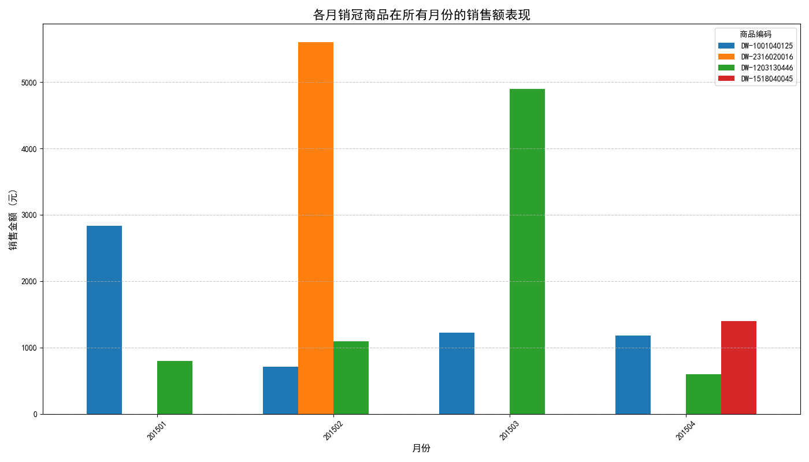

# 关于月度销冠商品的销售表现与复购分析报告

## 摘要

本报告旨在深入分析2015年1月至4月期间，每月销售额最高的商品的表现，并探究其销售额与顾客复购率之间的内在联系。通过本次分析，我们发现月度销售冠军宝座更迭频繁，其亮眼销售业绩多为短期表现，而非持续性的高热度。进一步分析表明，**高复购率是实现持续高销售额的关键驱动力**。因此，本报告建议采取双轨策略：**一方面，重点维系高复购率商品的核心用户群体；另一方面，策略性地运用短期热销商品，以其作为拉动短期收入和吸引新客流的有效工具。**

---

### 一、 各月份销售冠军商品识别

我们首先识别了2015年1月至4月中，每个自然月销售额最高的商品及其对应的销售额。

| 销售月份 | 商品编码        | 当月销售额 (元) |
|----------|-----------------|-----------------|
| 201501   | DW-1001040125   | 2,836.46        |
| 201502   | DW-2316020016   | 5,600.00        |
| 201503   | DW-1203130446   | 4,893.62        |
| 201504   | DW-1518040045   | 1,400.30        |

*数据来源：SQL查询结果*

---

### 二、 月度销冠商品的表现差异分析

为了探究这些“销冠”商品的表现是否具有持续性，我们分析了它们在1月至4月期间每月的销售额，并绘制了以下图表：

**图表洞察：**
- **业绩高峰短暂**：图表清晰地显示，每一种销冠商品仅在其获得冠军的月份表现突出，而在其他月份的销售额则大幅回落甚至为零。例如，二月份的销售冠军 `DW-2316020016` 在其他三个月内没有任何销售记录。
- **缺乏持续热度**：没有任何一款商品能够持续维持高水平的销售额。这表明它们的“销冠”地位很可能是由特定的短期因素（如季节性需求、大力度促销活动或偶然的大宗购买）驱动的，而非源于持续的市场吸引力。

---

### 三、 销冠商品的复购率与销售额关联探究

为了深入理解驱动销售额的根本原因，我们对这四款商品的总销售额和顾客复购率进行了分析。复购率定义为在统计周期内购买该商品超过一次的顾客占总购买顾客数的比例。

| 商品编码        | 四个月总销售额 (元) | 总顾客数 | 复购顾客数 | **复购率 (%)** |
|-----------------|-----------------------|----------|------------|----------------|
| **DW-1203130446** | **7,384.83**          | 227      | 60         | **26.43%**     |
| DW-1001040125   | 5,948.88              | 104      | 14         | 13.46%         |
| DW-2316020016   | 5,600.00              | 2        | 0          | 0.00%          |
| DW-1518040045   | 1,400.30              | 34       | 2          | 5.88%          |

*数据来源：Python脚本分析结果*

**分析洞察：**

1.  **高复购率驱动高销售额**：三月销冠 `DW-1203130446` 不仅在四个月内的总销售额最高（7,384.83元），其复购率也以26.43%遥遥领先。这表明该商品拥有一个稳定的核心顾客群体，其高销售额是建立在顾客忠诚度的基础之上。

2.  **“虚假繁荣”的低复购率**：二月销冠 `DW-2316020016` 虽然单月销售额很高，但其复购率却为0%。深入数据发现，其5600元的销售额仅来自2位顾客，这极有可能是偶然的大宗购买行为，而非普遍的市场需求，不具备可持续性。

3.  **关联性总结**：总体来看，**更高的复购率与更健康、更可持续的销售表现呈正相关**。单纯依赖一次性购买冲高销售额的模式，潜藏着巨大的不确定性。

---

### 四、 结论与业务建议

结合以上分析，我们得出结论：仅仅关注单月的销售冠军是不够的，必须深入其背后的驱动因素。高复购率是衡量商品长期健康度的“试金石”。

基于此，我们提出以下双轨业务策略：

1.  ** nurturing Loyalty - 培育忠诚消费群体**：
    *   **对象**：针对如 `DW-1203130446` 这样高复购率的明星商品。
    *   **策略**：将营销资源向维系老顾客倾斜。通过建立会员积分制度、推送专属优惠券、进行精准的CRM关怀等方式，进一步巩固顾客忠诚度，提升他们的终身价值。

2.  **Strategic Promotions - 善用“流量型”商品**：
    *   **对象**：针对如 `DW-2316020016` 这样依靠短期因素冲高销量的商品。
    *   **策略**：深入分析其销售高峰背后的原因（例如，是否是节假日促销？），并将这些商品作为策略性工具。在特定时期，通过促销活动来吸引新顾客、提升客单价或带动关联销售，实现短期收入目标。但必须清醒认识到，这部分销售额具有机会主义性质，不能作为常规预期。

通过实施这一策略，企业可以在“**维系忠诚顾客，保证稳定基本盘**”和“**策划短期活动，创造增量收入**”之间找到最佳平衡点，实现长期健康发展。
