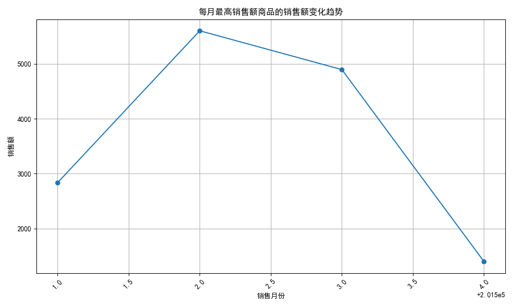
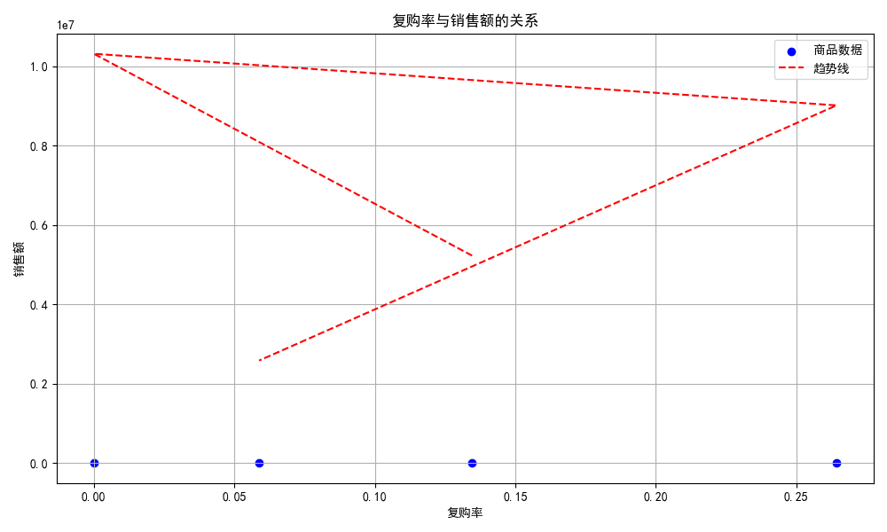

# 销售额与复购率分析报告

## 每月销售额最高的商品

我们首先分析了每个月销售额最高的商品及其对应的商品编码。分析结果显示，不同月份销售额最高的商品如下：

| 销售月份 | 商品编码         | 销售额   |
|----------|------------------|----------|
| 201501   | DW-1001040125    | 2836.46  |
| 201502   | DW-2316020016    | 5600.00  |
| 201503   | DW-1203130446    | 4893.62  |
| 201504   | DW-1518040045    | 1400.30  |

## 商品在不同月份的表现差异

通过绘制每月最高销售额商品的销售额趋势图，我们可以看出销售额在2015年2月达到峰值，随后下降。这表明某些商品在特定月份表现优异，但可能存在季节性影响或促销活动的影响。

## 复购率与销售额的关系

我们进一步分析了这些商品的复购率，并绘制了复购率与销售额的散点图。复购率计算公式为复购顾客数占总顾客数的比例。

| 商品编码         | 复购率    |
|------------------|-----------|
| DW-1001040125    | 0.134615  |
| DW-2316020016    | 0.000000  |
| DW-1203130446    | 0.264317  |
| DW-1518040045    | 0.058824  |

从图中可以看到，复购率与销售额之间的关系并不明显。销售额最高的商品 DW-2316020016 的复购率为 0，这表明其销售主要依赖于新客户。另一方面，销售额中等的商品 DW-1203130446 拥有较高的复购率，表明其具有较强的顾客忠诚度。

## 结论与建议

1. **销售额最高的商品在不同月份的表现差异较大**：企业在制定销售策略时，应关注季节性影响和促销活动，以提高销售额。

2. **复购率与销售额之间不存在明显的正相关关系**：某些商品的复购率较低，但销售额较高，表明其主要依赖新客户。相反，某些商品的复购率较高，但销售额较低，表明其客户忠诚度较强。

3. **提升复购率策略**：对于复购率较低的商品，如 DW-2316020016，企业可以通过会员计划、积分奖励或个性化推荐来增强客户忠诚度，从而提高复购率。

4. **优化高销售额商品的推广**：对于销售额较高的商品，如 DW-2316020016，企业可以进一步推广这些商品，并结合促销活动以保持其市场竞争力。

综上所述，企业在制定销售策略时，应综合考虑销售额和复购率，以实现可持续增长。
