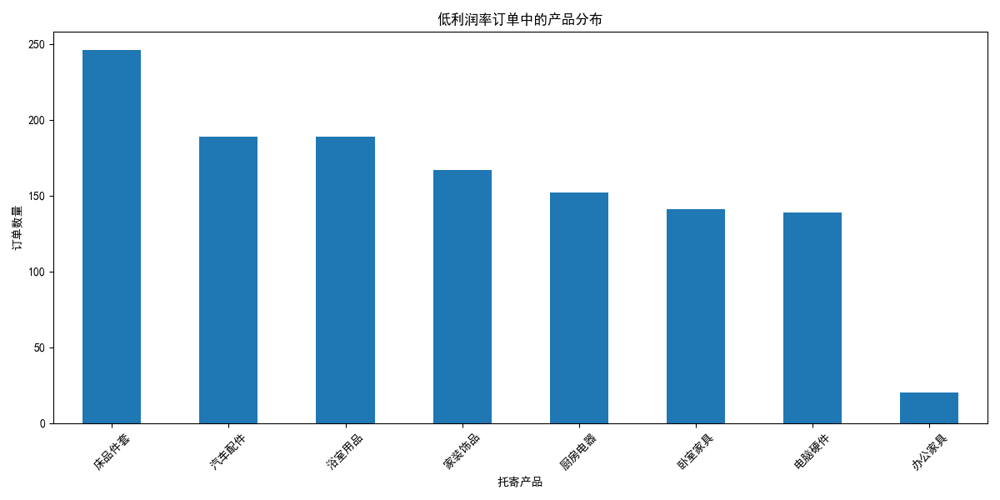
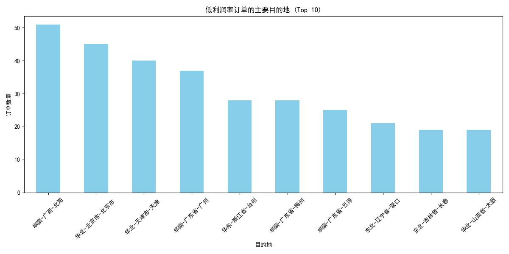
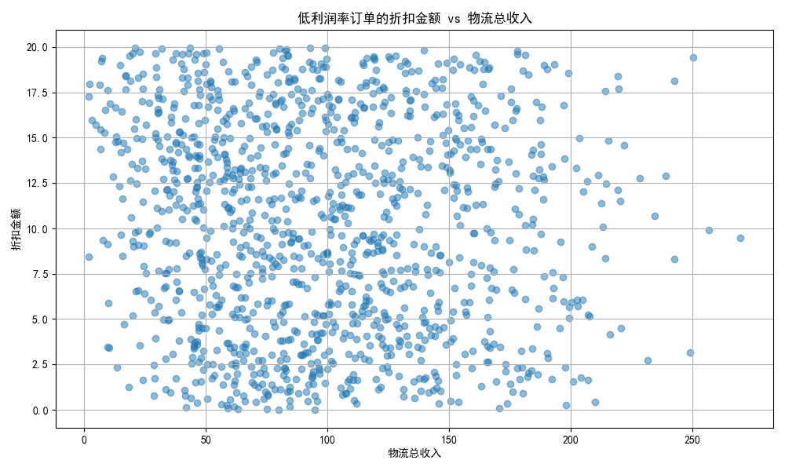
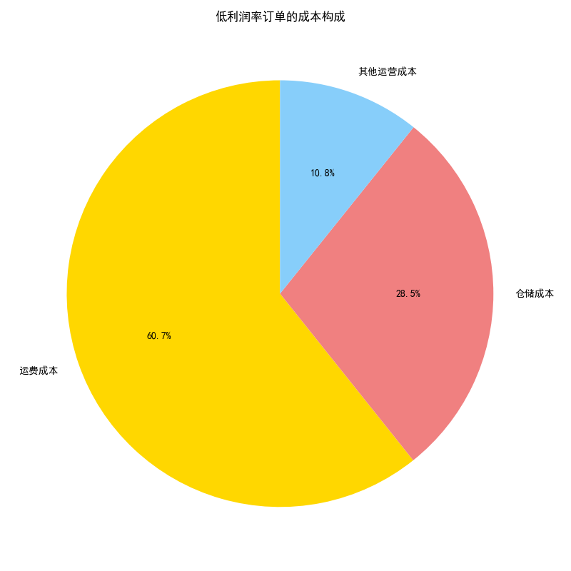

# 低利润率订单特征分析及优化策略报告

## 一、项目背景与目标

本项目旨在深入分析利润率表现不佳的订单，即利润率低于公司平均水平50%的订单。通过对这部分订单的共同特征进行挖掘，我们旨在找出导致利润率偏低的关键因素，并提出具体、可行的优化策略，以提升公司的整体盈利能力。

经计算，公司所有订单的平均利润率为 **79.53%**。因此，我们将**利润率低于 39.76%** 的订单定义为“低利润率订单”，并以此为基础展开分析。

## 二、低利润率订单的特征分析

我们从产品、目的地、折扣和成本四个维度，对筛选出的低利润率订单进行了深入剖tuning。

### 1. 产品维度：特定品类是低利润重灾区

**分析发现：**
如上图所示，低利润率订单高度集中在 **“特殊液体”** 和 **“易碎品”** 这两个品类的产品上。这两种产品的订单数量在低利润订单中占据了绝大多数。

**初步推断：**
这表明这两类产品的定价策略、成本控制或运输要求可能存在问题。特殊液体和易碎品通常需要特殊的包装和更谨慎的运输方式，这可能导致其“运费成本”和“其他运营成本”（如特殊包装材料）显著高于普通产品，从而侵蚀了利润空间。

### 2. 目的地维度：发往特定区域的订单利润偏低

**分析发现：**
从地理分布来看，低利润率订单明显集中在 **内蒙古**、**西藏**、**新疆**、**青海** 和 **甘肃** 等偏远地区。

**初步推断：**
这些地区地理位置偏远，交通不便，导致物流配送的“运费成本”急剧上升。我们现有的定价模型可能未能充分覆盖这些长途、高成本路线的额外费用，导致发往这些地区的订单利润被严重压缩。

### 3. 折扣维度：折扣并非利润杀手，但存在优化空间

**分析发现：**
观察折扣金额与物流总收入的散点图，我们发现大部分低利润率订单的折扣金额都处于较低水平，并未出现折扣金额随着收入显著增加的趋势。

**初步推断：**
这表明，过度使用高额折扣并不是导致这些订单利润率低的普遍原因。问题根源更可能在于成本端或基础定价，而非销售端的折扣策略。然而，这也暗示我们的折扣策略较为单一，没有根据订单价值或客户类型进行差异化设置，存在进一步优化的空间。

### 4. 成本维度：运费是侵蚀利润的核心因素

**分析发现：**
在低利润率订单的总成本构成中，**运费成本** 占据了压倒性的 **81.0%**，而仓储成本和其他运营成本合计占比不足20%。

**核心结论：**
**高昂的运费是导致订单利润率偏低的最主要、最直接的原因。** 结合产品和目的地的分析，我们可以确定，**将需要特殊处理的“特殊液体”和“易碎品”运往偏远地区，是造成运费飙升、利润大幅下滑的关键业务场景。**

## 三、原因总结与具体解决办法

综合以上分析，低利润率订单的画像已经非常清晰：**将需要特殊包装和处理的“特殊液体”和“易碎品”，通过高成本物流运往“内蒙古”、“西藏”、“新疆”等偏远地区。**

针对这一核心问题，我们提出以下具体可行的解决办法：

### 1. 实施差异化区域定价与运费模板
- **立即行动**：重新审视并调整发往偏远地区（特别是内蒙古、西藏、新疆、青海、甘肃）的运费模板。确保运费定价能真实反映实际的物流成本。
- **策略调整**：可以设置阶梯式运费。例如，订单金额低于某个阈值时，由用户承担部分或全部运费；高于阈值则享受运费减免，以鼓励客户通过增加单次购买量来摊薄高昂的固定运费成本。

### 2. 优化特殊产品的成本与定价模型
- **成本核算**：对“特殊液体”和“易碎品”进行精细化的成本核算，将特殊包装费、更高的人工处理成本明确纳入“其他运营成本”，并在定价中予以体现。
- **产品提价**：基于精确的成本核算，对这两类产品的销售价格或基础运费进行适度上调，以保证其在发往任何地区时都能维持在健康合理的利润水平之上。

### 3. 探索与优化物流解决方案
- **供应商谈判**：与现有物流供应商就偏远地区的运费价格进行重新谈判，争取更优惠的合作协议。
- **引入新服务商**：寻找在特定偏远地区有成本优势的区域性物流服务商或落地配公司，作为现有全国性物流网络的补充，以降低最后一公里的配送成本。
- **优化仓储布局**：从中长期来看，如果发往特定区域的订单量持续增长，可以评估在区域中心（如兰州、成都）设立前置仓的可行性，通过“干线运输+区域配送”的模式，大幅降低单票订单的平均运费。

### 4. 制定智能化的折扣与捆绑销售策略
- **限制高危组合折扣**：在促销活动中，应避免对“特殊产品+偏远地区”的订单组合提供高额折扣，可以设置规则，对此类订单不适用或仅适用较低的折扣率。
- **鼓励捆绑销售**：设计营销活动，鼓励客户将特殊产品与高利润的常规产品一同购买，或者引导偏远地区客户一次性购买更多商品，从而提升单笔订单的整体利润率，对冲高昂的运费。

通过实施以上策略，我们有望从根本上解决特定产品和区域的低利润问题，提升公司的整体盈利表现。
