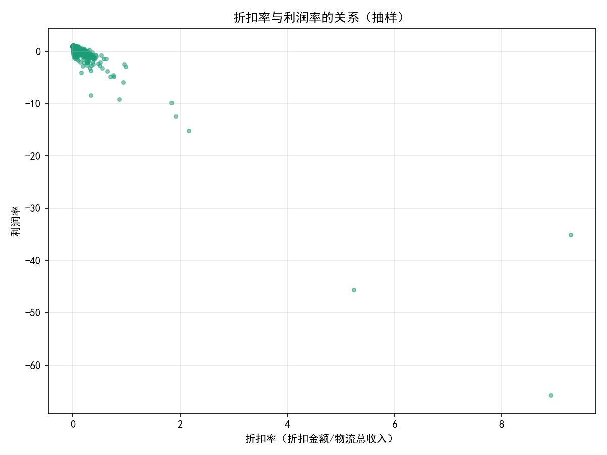
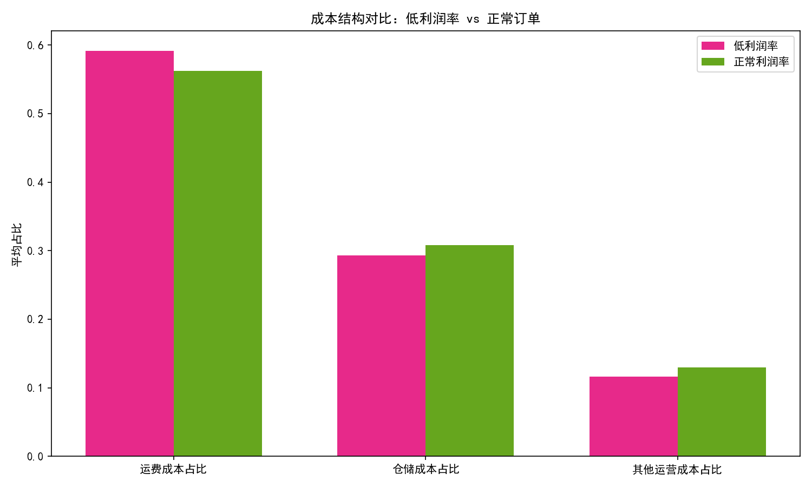
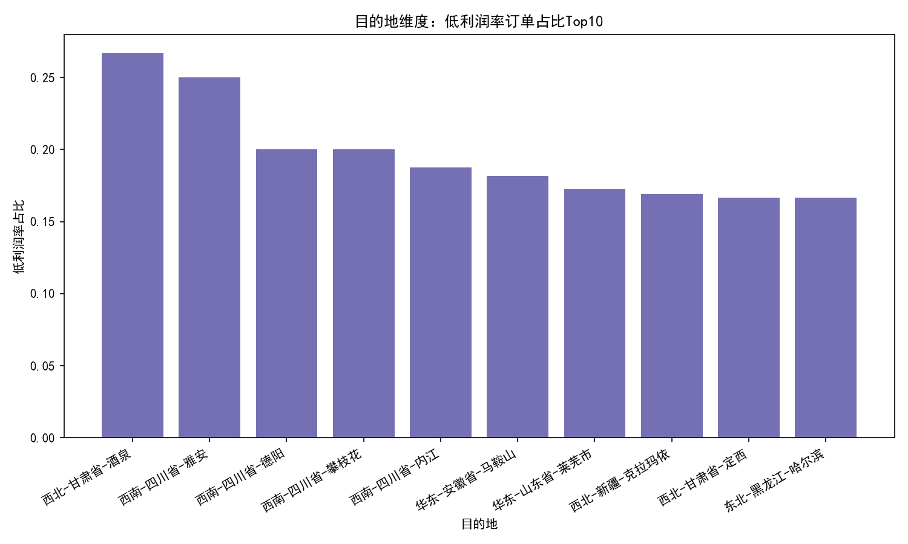
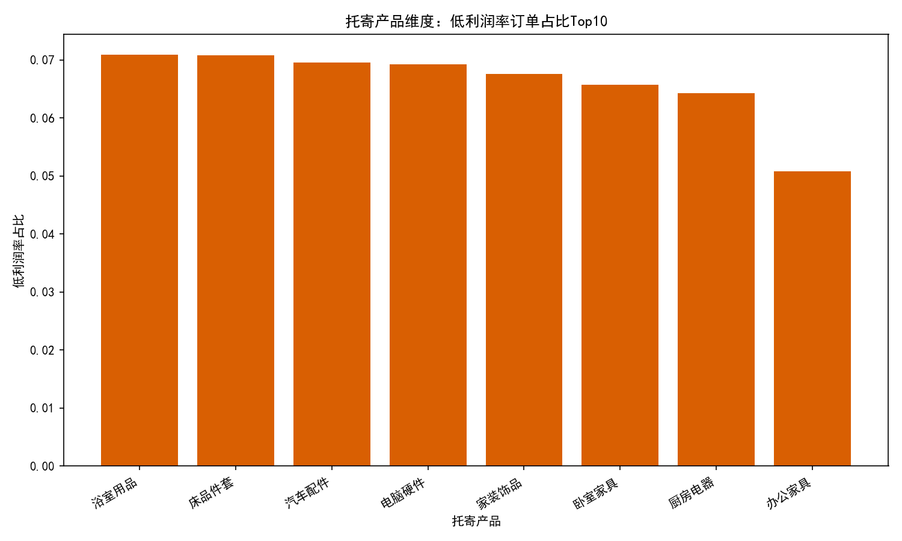

# 低利润率订单诊断与改善建议报告

以下分析基于 SQLite 数据库中的“工作表1”，遵循定义：利润率低于平均利润的50%的订单为“低利润率订单”。我们未对数据进行清洗，仅进行计算与可视化。为保证中文绘图，使用了如下代码片段：
```python
plt.rcParams['font.sans-serif'] = ['SimHei']
plt.rcParams['axes.unicode_minus'] = False
```

一、结论速览
- 平均利润率：0.7953
- 低利润率阈值（平均利润率的50%）：0.3976
- 低利润率订单数/占比：1243单，占比6.81%
- 折扣率与利润率的相关：皮尔逊相关系数 -0.912（高度负相关）
- 简易线性拟合（利润率 ≈ k*折扣率 + b）：k=-5.969，b=0.928
  - 利润率在折扣率约为15.5%时预估降至0（0 ≈ -5.969*0.155 + 0.928）

二、低利润率订单的显著特征

1. 折扣是决定性因素
- 对比均值：
  - 正常订单平均折扣率：1.32%，平均利润率：0.902
  - 低利润率订单平均折扣率：19.32%，平均利润率：-0.667
- 强负相关：折扣率与利润率的皮尔逊相关系数为 -0.912，线性拟合显示折扣每上升10个百分点，利润率大致下降约0.597。
- 诊断：折扣率的异常拉高是触发低利润率订单的首要原因。

配图：折扣率与利润率关系散点图


2. 小额订单更易触发低利润率
- 均值对比显示：低利润率订单的平均总收入仅为 98.28（远低于正常订单的 1482.17），而成本结构占比差异不大（低利润率订单运费成本占比 59.1%，正常订单为 56.2%）。
- 诊断：小额订单的固定/起步成本无法被收入覆盖，折扣叠加放大亏损风险。

配图：低利润率 vs 正常订单的成本结构对比


3. 目的地地域性“热点”与运费因素
- 低利润率占比顶部目的地（样本量较小需谨慎）：
  - 西北-甘肃省-酒泉：26.7%（N=30）
  - 西南-四川省-雅安：25.0%（N=4）
  - 西南-四川省-德阳：20.0%（N=5）
  - 西南-四川省-攀枝花：20.0%（N=5）
  - 西北-新疆-克拉玛依：16.9%（N=65）
- 诊断：偏远地区与运输半径较远的目的地低利润率占比偏高，运费成本占比较正常订单略高（+2.95个百分点），提示长途或偏远配送的运价与成本不匹配，且在小额+高折扣叠加下风险更大。

配图：目的地维度低利润率订单占比Top10


4. 产品维度差异不大但存在“边际高发”品类
- 低利润率占比靠前的托寄产品（Top10）占比在6%—7%区间，差异不算极端：
  - 浴室用品（7.09%）、床品件套（7.07%）、汽车配件（6.95%）、电脑硬件（6.92%）等
- 诊断：品类之间不是决定性驱动，但在“价格敏感度高 + 折扣高 + 小额订单”场景下，部分品类更容易被击穿利润。

配图：产品维度低利润率订单占比Top10


5. 客户细分提示人群画像，但“折扣+小额”仍是核心
- 低利润率占比相对偏高的人群片段：
  - 女性30-39岁（8.09%）、女性50-59岁（7.47%）、男性50-59岁（7.15%）、男性20-29岁（6.95%）等
- 诊断：人群差异存在，但强于人群差异的是订单层面的“折扣率”和“金额体量”。策略上以订单规则控制优先，其次再做人群差异化。

三、为什么会发生（诊断性洞察）
- 折扣规则过宽：缺乏“毛利红线”和审批门槛，导致出现折扣率>15%的交易，线性模型预估此时利润率已接近或跌破0。
- 小额订单缺乏最低计费：在存在起步/固定成本（揽收、分拣、干线、末端）时，小单很容易被成本吞噬。
- 偏远地区价不抵本：偏远地区运输半径长、空返/舱位不稳定，运费成本占比略高，若仍沿用统一定价且叠加折扣，亏损概率上升。
- 品类与人群是放大器：对价格更敏感的品类和特定人群，在营销促销下更可能触发高折扣+小额下单，放大利润下行。

四、将会发生什么（简要预测）
- 若不加干预，折扣率的波动将继续高负相关地侵蚀利润率。按拟合：折扣率每额外+5个百分点，利润率预期约-0.298。
- 在偏远地区促销活动期间，低利润率占比将阶段性走高，尤其在高折扣+小额订单占比上升时。

五、我们应该做什么（规范性建议）
1) 建立“折扣-毛利红线”与审批机制
- 设定折扣硬阈值：依据拟合，建议将通用折扣上限设为15%以内；超过10%须二级审批，超过15%默认拒绝，除非同步提升运价或增加附加费。
- 动态阈值：按品类、目的地区域、客户等级设不同折扣上限，并以“预计毛利率≥40%”为通过条件。

2) 设置“最低计费”和“小额订单附加费”
- 最低计费门槛：结合均值对比（低利润率订单平均总收入仅98），建议设定最低计费金额（如≥199）或最低票面运费。
- 小单合单/拼单：对同一收/发区域的小票提供延迟合单优惠，引导客户提高单次金额，降低起步成本摊销。
- 营销联动：对小额订单禁用大额折扣券，采用“满减/满折”引导提高客单。

3) 偏远地区的区域化定价与附加费
- 区域附加费/燃油浮动：对西北/西南等远距区域设置偏远附加费或里程分段价，确保运费成本可被覆盖。
- 路由优化：优先选择成本更优线路与时段，提升装载率，降低空返概率。

4) 成本结构优化（虽非主因但可协同）
- 运费成本占比在低利润率订单中略高（59.1% vs 56.2%），可通过提升干线装载率、优化末端路由与交付窗口来收敛差异。
- 对价值较低且体积/重量较高的品类，考虑差异化的包装/计费维度（按体积/重量计），避免低价大件“挤压”利润。

5) 客户/品类差异化策略（次优先级）
- 针对价格敏感的品类（如浴室用品、床品件套、汽车配件、电脑硬件），设更严格折扣上限或采用“满减阶梯”。
- 针对30-39岁女性、50-59岁人群在营销场景中的高折扣倾向，采用满额券替代高比例折扣券。

6) 监控与试点
- 搭建低利润率订单监管面板：实时监控“折扣>10% + 总收入<最低计费”的订单；按目的地、品类、人群打标。
- 小范围A/B测试：验证“15%折扣上限 + 最低计费199”的组合对低利润率占比的改善幅度与对转化的影响。
- 预警与回溯：出现连续3天某区域低利润率占比>两倍均值时，自动触发区域价审与促销暂停。

六、关键可视化
- 产品维度：低利润率订单占比Top10


- 目的地维度：低利润率订单占比Top10


- 折扣率与利润率的关系（抽样）


- 成本结构对比：低利润率 vs 正常订单


七、附：主要计算口径与代码要点
- 低利润率阈值：threshold = 0.5 × 平均利润率 = 0.5 × 0.7953 ≈ 0.3976
- 低利润率标记：利润率 < threshold
- 衍生指标：
  - 折扣率 = 折扣金额 / 物流总收入（仅用于分析，不做清洗）
  - 成本占比 = 各项成本 / 物流总成本（用于结构对比）
- 相关性与拟合：
  - 皮尔逊相关：df[['折扣率','利润率']].corr()
  - 线性拟合：np.polyfit(折扣率, 利润率, 1) → k=-5.969, b=0.928

八、落地优先级清单（从强到弱）
1) 设折扣上限≤15%，>10%需审批；启用毛利红线校验（预计毛利率≥40%）；
2) 推行最低计费/小额订单附加费，并与满额促销联动；
3) 偏远地区区域化定价与附加费，路由/装载优化；
4) 对“高敏品类×偏远区域×小额单”的组合重点看护；
5) 建立监控面板与A/B试点，持续评估与优化。

以上策略以“折扣治理 + 小额门槛 + 区域定价”为核心抓手，有望显著降低低利润率订单占比并稳住整体利润率。
