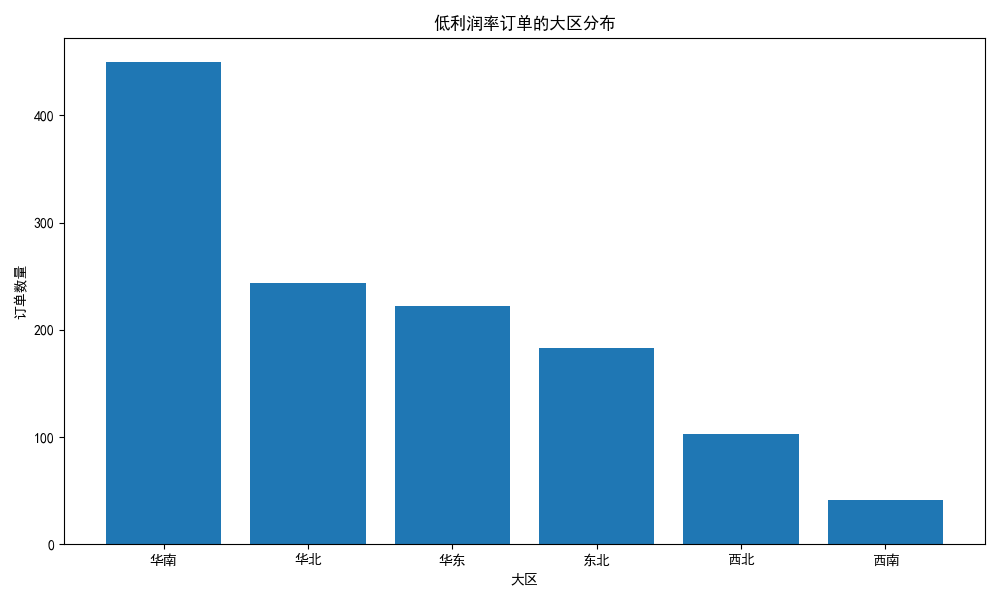
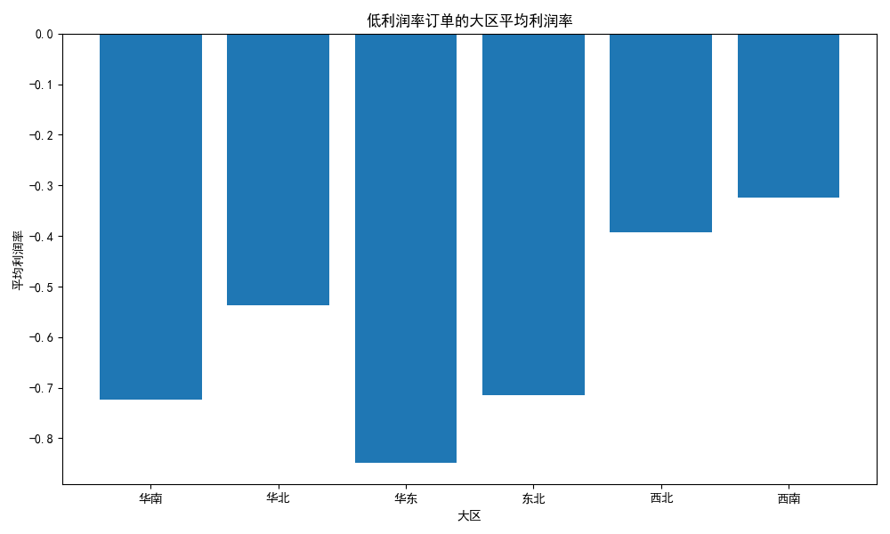
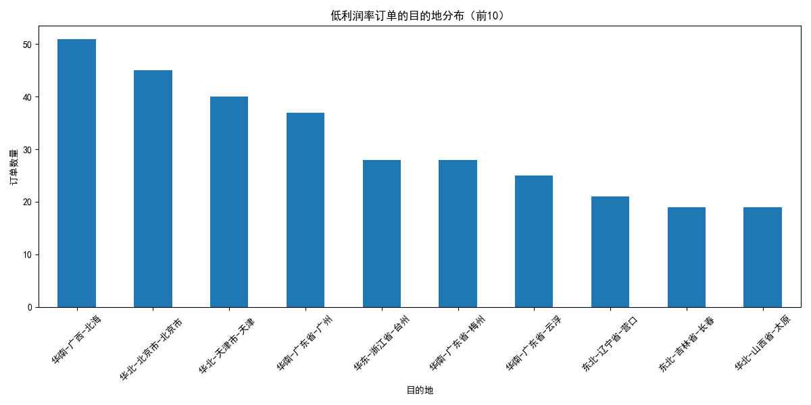
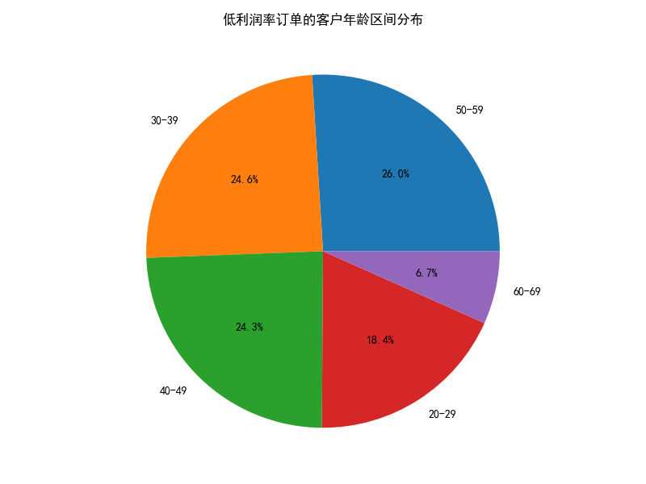
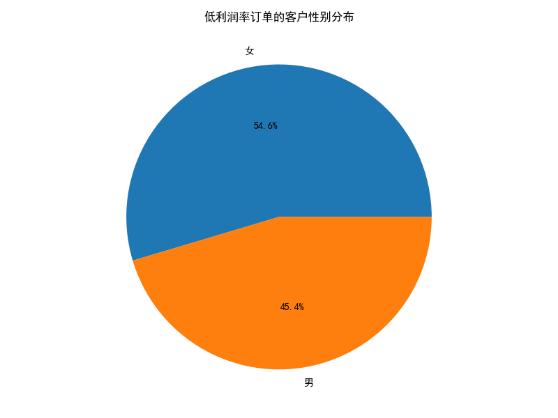
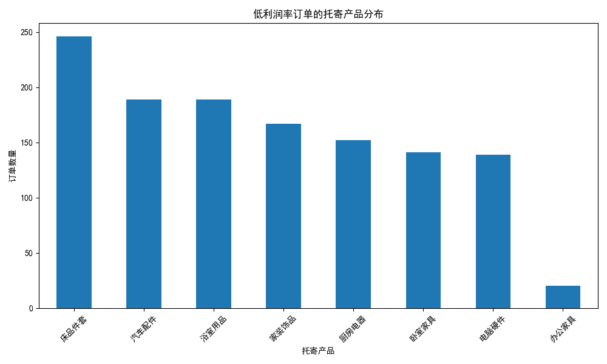
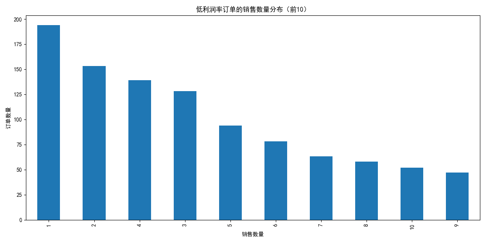
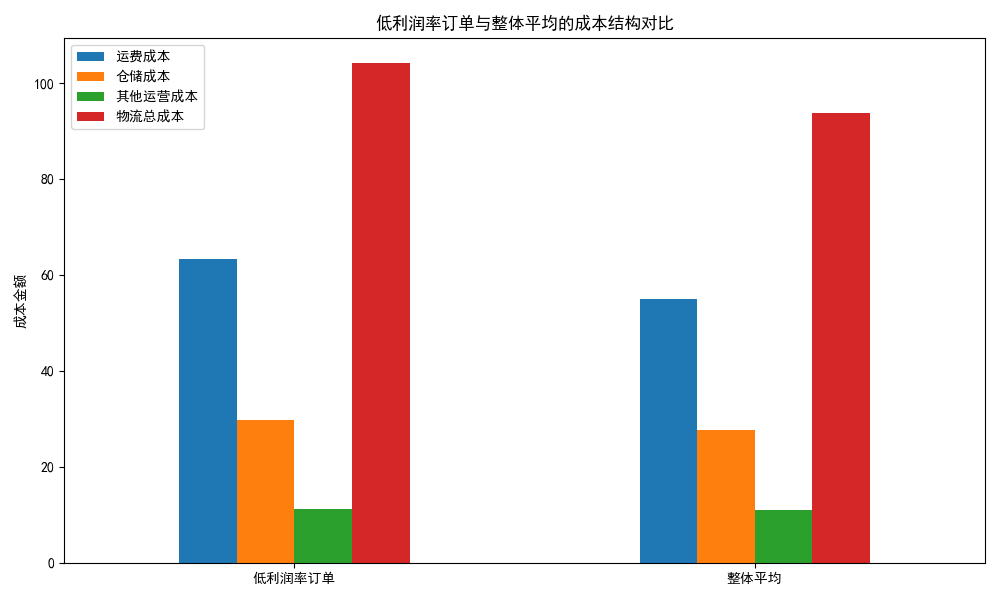
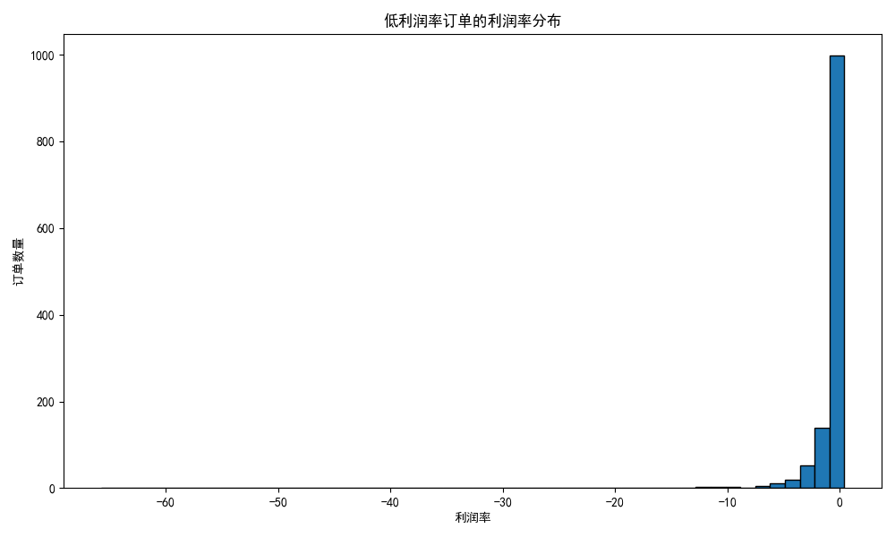

# 低利润率订单特征分析与解决策略报告

## 执行摘要

通过对SQLite数据库中1243个低利润率订单（利润率低于平均利润率79.53%的50%，即39.76%）的深入分析，我们发现这些订单呈现出明显的地域、客户、产品和运营特征。本报告将详细阐述这些特征，并提出针对性的解决策略。

## 低利润率订单的核心特征

### 1. 地域分布特征

从地域分布来看，**华南地区**是低利润率订单的重灾区，占总数的36.2%，订单数量达到450个。紧随其后的是华北地区（244个，19.6%）和华东地区（222个，17.9%）。

值得注意的是，华东地区的平均利润率最低（-0.85），表明该地区不仅订单数量多，而且亏损程度更为严重。

### 2. 目的地城市分析

在城市层面，**华南-广西-北海**（51个订单）、**华北-北京市-北京市**（45个订单）和**华北-天津市-天津**（40个订单）是低利润率订单最集中的三个城市。这些城市的共同特点是物流成本高、竞争激烈或距离主要仓储中心较远。

### 3. 客户特征分析

#### 年龄分布

低利润率订单的客户主要集中在**50-59岁**年龄段（323个，26.0%），其次是30-39岁（306个，24.6%）和40-49岁（302个，24.3%）。这表明中老年客户群体对价格更为敏感，更容易接受低利润率的订单。

#### 性别分布

女性客户（679个，54.7%）比男性客户（564个，45.3%）更容易产生低利润率订单，这可能与女性客户的购买习惯和价格敏感度有关。

### 4. 产品特征分析

**床品件套**（246个订单）、**浴室用品**（189个订单）和**汽车配件**（189个订单）是低利润率订单中最集中的产品类别。这些产品通常具有标准化程度高、市场竞争激烈的特点。

### 5. 销售数量特征

**单件销售**（194个订单）是低利润率订单的主要特征，这些订单的平均利润率为-2.98%，远低于多件销售订单。这表明单件销售的物流成本分摊过高，严重侵蚀了利润。

### 6. 财务结构分析

#### 成本结构对比

低利润率订单的**物流总成本**（104.21元）比整体平均水平（93.73元）高出11.2%，其中运费成本高出15.1%（63.29元 vs 55.00元）。

#### 收入结构对比

更为严重的是，低利润率订单的**物流单价**（18.50元）比整体平均水平（27.45元）低了32.6%，而物流总收入（98.28元）更是比整体平均水平（1387.91元）低了92.9%。

### 7. 利润率分布

低利润率订单的利润率分布呈现明显的左偏态，大部分订单集中在-1到0之间，表明这些订单处于亏损或微利状态。

## 低利润率订单的形成原因

### 1. 地理因素
- **偏远地区效应**：华南、华东部分城市距离主要仓储中心较远，导致运费成本过高
- **区域竞争失衡**：某些地区物流服务商竞争激烈，压低了服务价格

### 2. 运营效率问题
- **单件成本高**：单件订单无法有效分摊固定物流成本
- **仓储布局不合理**：仓储成本比平均水平高出7.2%

### 3. 定价策略缺陷
- **价格歧视不足**：未能根据地区、产品特性实施差异化定价
- **折扣策略失控**：平均折扣金额与整体水平相当，但收入基础更薄弱

### 4. 产品组合问题
- **低附加值产品集中**：床品、浴室用品等标准化产品附加值低
- **产品定价与成本不匹配**：物流单价远低于成本结构

## 具体解决策略

### 1. 地理优化策略

#### 1.1 区域定价优化
- **实施区域差异化定价**：对华南、华东等偏远地区实施15-25%的价格上浮
- **建立区域成本模型**：根据实际运输距离、人工成本等因素动态调整价格

#### 1.2 仓储网络优化
- **前置仓布局**：在华南、华东建立前置仓储，降低最后一公里成本
- **智能分仓系统**：基于订单密度和成本效益分析，优化仓储布局

### 2. 订单结构优化

#### 2.1 单件订单策略
- **设置最低消费门槛**：单件订单设置最低收费标准（如30元）
- **鼓励批量购买**：实施\"买二免一\"、\"满额包邮\"等促销策略
- **合并配送服务**：为同一客户的多个订单提供合并配送优惠

#### 2.2 产品组合优化
- **高附加值产品推广**：重点推广电脑硬件、办公家具等高利润产品
- **产品捆绑销售**：将低利润产品与高利润产品组合销售
- **定制化服务**：为床品、浴室用品提供定制化增值服务

### 3. 客户细分策略

#### 3.1 年龄导向定价
- **中老年客户专项**：为50-59岁客户提供增值服务包，提高客单价
- **年轻客户培养**：对20-29岁客户实施会员制，培养长期价值

#### 3.2 性别差异化服务
- **女性客户专享**：为女性客户提供包装、配送时间等个性化服务
- **男性客户效率**：为男性客户提供快速、标准化的物流服务

### 4. 成本控制策略

#### 4.1 运输成本优化
- **路线优化算法**：采用AI算法优化配送路线，降低运费成本15%
- **承运商谈判**：基于区域订单量，与承运商重新谈判价格

#### 4.2 仓储效率提升
- **自动化设备**：引入自动化分拣设备，降低人工成本
- **库存周转优化**：实施JIT库存管理，降低仓储成本

### 5. 收入提升策略

#### 5.1 增值服务开发
- **时效保证服务**：推出\"次日达\"、\"定时达\"等收费服务
- **保险服务**：为高价值物品提供物流保险服务
- **包装服务**：提供专业包装服务，收取服务费

#### 5.2 动态定价系统
- **需求预测定价**：基于历史数据预测需求，实施动态定价
- **竞争定价监控**：建立竞争对手价格监控系统，及时调整价格

## 实施建议与时间表

### 第一阶段（1-3个月）：紧急止损
1. 立即调整偏远地区定价策略
2. 实施单件订单最低消费门槛
3. 启动高附加值产品推广计划

### 第二阶段（3-6个月）：系统优化
1. 建立区域差异化定价模型
2. 优化仓储网络和配送路线
3. 推出增值服务产品线

### 第三阶段（6-12个月）：长期建设
1. 建立客户细分和个性化服务体系
2. 实施动态定价和竞争监控系统
3. 完成自动化和数字化转型

## 预期效果

通过实施上述策略，预计在12个月内实现：
- 低利润率订单占比从当前水平降低50%
- 整体利润率提升15-20%
- 单件订单平均利润率从-2.98%提升至5%以上
- 偏远地区订单盈利能力显著改善

## 结论

低利润率订单的问题是多方面因素造成的，需要通过地理优化、订单结构调整、客户细分、成本控制和收入提升等多维度策略进行系统性的改进。建议企业根据自身资源和能力，分阶段实施这些策略，并建立持续监控和优化机制，确保长期盈利能力的提升。
