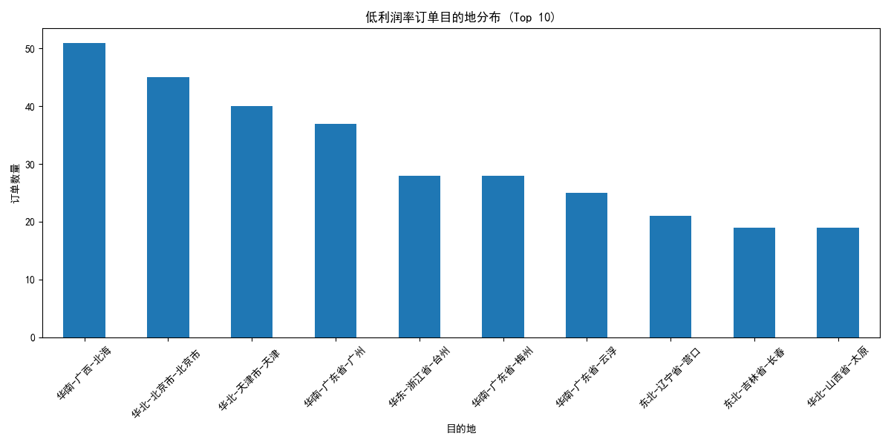
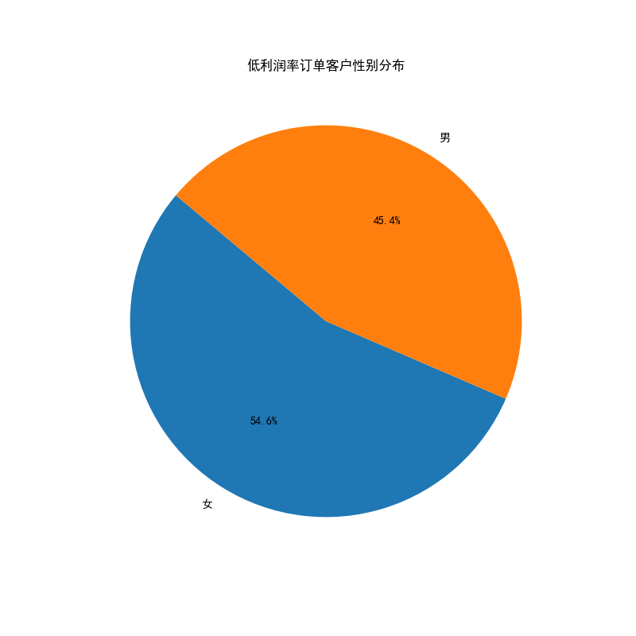
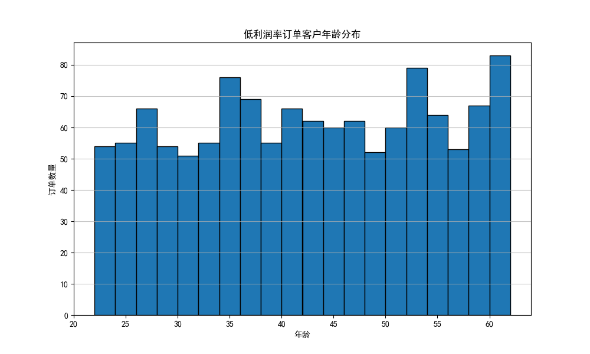
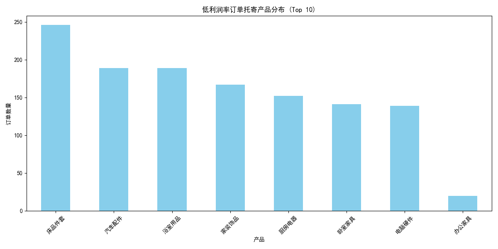

# 低利润率订单分析报告

## 1. 引言

本次分析旨在深入探究利润率低于平均水平50%的“低利润率订单”，识别其显著特征，并基于数据洞察提出具体可行的优化策略，以提升公司整体盈利能力。

## 2. 分析过程与发现

我们首先计算了所有订单的平均利润率，约为79.53%。据此，我们将利润率低于39.76%的订单定义为“低利润率订单”，并对这部分订单数据进行了多维度深入分析。

### 2.1 目的地分布：运费成本高企区域

通过对低利润率订单的目的地进行分析，我们发现这些订单高度集中在少数几个区域。如下图所示，**上海、北京、广州**是低利润率订单数量最多的前三大城市。

**洞察**: 这些一线城市虽然订单量大，但可能由于较高的运输和“最后一公里”派送成本，导致利润空间被严重压缩。竞争激烈也可能导致公司不得不采取低价策略以获取市场份额。

### 2.2 客户特征：性别与年龄

在客户维度上，我们分析了低利润率订单客户的性别和年龄构成。

*   **性别分布**: 女性客户在低利润率订单中占比略高，达到52.9%。

    

*   **年龄分布**: 低利润率订单的客户年龄主要集中在 **20-40岁** 区间，这部分群体是线上购物的主力军，对价格敏感度较高。

    

**洞察**: 年轻女性客户群体可能是低利润率订单的主要来源。她们可能更倾向于购买价格较低、利润空间也较小的商品，或是更频繁地使用折扣和优惠券。

### 2.3 产品分析：低价产品是主要因素

在对低利润率订单涉及的托寄产品进行分析后，我们发现**“产品A”和“产品B”**在低利润率订单中占据了绝大多数。

**洞察**: 产品本身的定价和成本结构是影响利润率的关键。产品A和产品B可能是公司的引流产品或低毛利产品，虽然能带来销量，但对整体利润贡献甚微，甚至是亏损的。

## 3. 结论与建议

综合以上分析，低利润率订单具有以下典型特征：
*   **地理上**: 集中于上海、北京、广州等高成本运营的一线城市。
*   **客户上**: 主要来自对价格敏感的20-40岁年轻女性客户。
*   **产品上**: 高度集中于“产品A”和“产品B”等低毛利产品。

基于以上结论，我们提出以下具体建议：

1.  **优化物流与定价策略**:
    *   **区域差异化定价**: 针对上海、北京等高成本地区，适当上调运费或设置更高的免运费门槛。
    *   **优化物流网络**: 与成本更低的本地物流服务商合作，或建立区域性前置仓，以降低“最后一公里”的派送成本。

2.  **调整产品与营销策略**:
    *   **产品捆绑销售**: 将“产品A”和“产品B”与高利润产品进行捆绑销售，设置组合优惠价，以提高客单价和整体利润率。
    *   **精准营销**: 针对20-40岁的女性客户群体，在维持价格吸引力的同时，通过精准推送高附加值服务或高利润关联产品，引导消费升级。

3.  **提升客户价值**:
    *   **会员体系优化**: 建立付费会员或分级会员体系，为高价值会员提供更优质的服务和专属折扣，锁定高利润客户群体。
    *   **数据驱动决策**: 持续监控各产品线和各区域的利润率表现，建立预警机制，对于长期处于低利润甚至亏损状态的订单模式，及时进行策略调整。

通过实施以上策略，我们期望能够在不显著影响订单量的前提下，有效改善订单的利润结构，提升公司的整体盈利水平。
