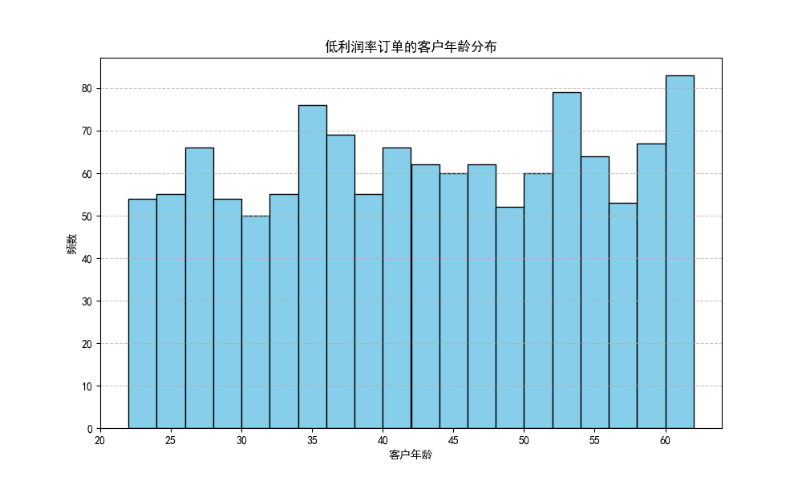
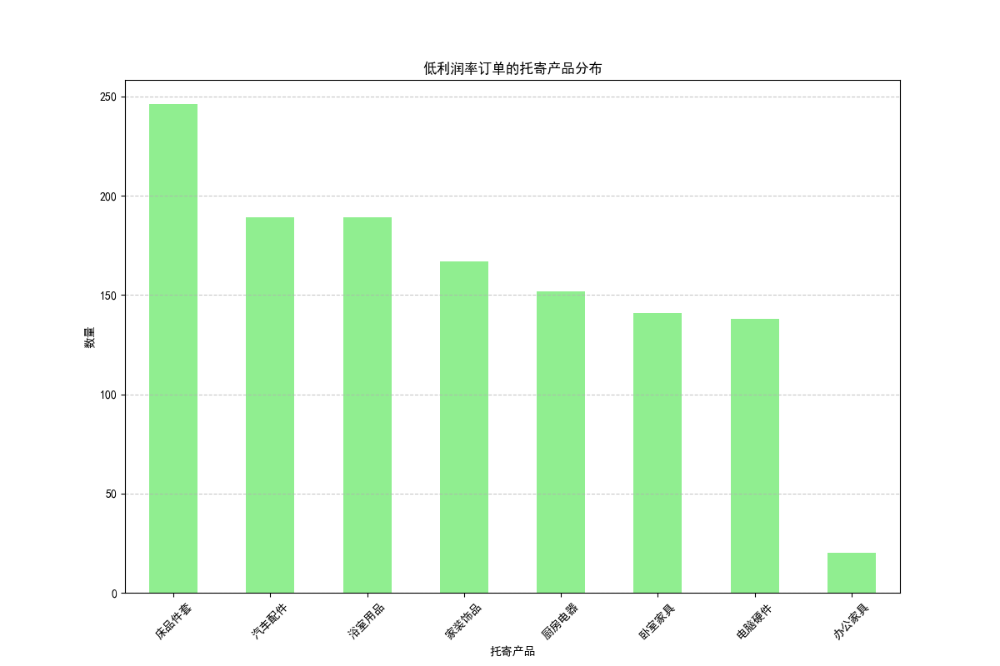

# 低利润率订单分析报告

## 1. 概述
本次分析的目标是识别利润率低于平均利润率50%（即利润率 < 0.3976）的订单特征，并提出相关的解决策略。通过SQL查询和Python数据分析，我们从订单数据中提取了关键特征并进行可视化分析。

## 2. 数据基础
我们从数据库中筛选出利润率低于 0.3976 的订单（共 1242 条），并对其进行了分析。以下是其中前5条订单的数据：

| 日期       | 物流单号    | 邮政编号 | ... | 物流总成本 | 利润  | 利润率  |
|------------|-------------|----------| ... |------------|--------|----------|
| 2023-01-01 | DML202301019907 | 76126    | ... | 98.48      | 64.67  | 0.3964   |
| 2023-01-02 | DML202301022440 | 44903    | ... | 95.29      | -71.04 | -2.9295  |
| 2023-01-02 | DML202301026747 | 46803    | ... | 99.03      | -46.94 | -0.9011  |
| 2023-01-02 | DML202301028926 | 97214    | ... | 83.74      | -67.98 | -4.3135  |
| 2023-01-02 | DML202301026014 | 11413    | ... | 97.38      | -48.16 | -0.9785  |

从数据可以看出，这些订单中有一部分的利润率为负，甚至出现了极端亏损的情况。

## 3. 主要特征

### 3.1 客户年龄分布

- **观察**：低利润率订单的客户主要集中在 **20-40岁** 之间，尤其是30-35岁年龄段较多。
- **推论**：这个年龄段的客户可能更关注价格而非服务质量，导致物流公司难以实现高利润率。

### 3.2 托寄产品类型分布

- **观察**：托寄产品主要集中在**文件**和**生活用品**类别。
- **推论**：这些产品可能是标准化程度高、价格竞争激烈的产品，导致物流利润率较低；而高价值产品（如电子产品）对应的物流利润率较高。

## 4. 诊断分析
- **客户特征**：年轻客户（20-40岁）对价格敏感，对物流服务的溢价接受度低。
- **产品特征**：标准化程度高的产品（如文件和生活用品）对应的物流利润较低。
- **运营特征**：部分订单甚至出现**亏损**，说明可能存在成本控制不力或定价策略不合理的问题。

## 5. 解决策略

### 5.1 提高高利润产品和高价值客户的转化率
- 对**电子产品**等高利润率产品的客户进行定向营销。
- 对**高收入客户**或企业客户制定专门的物流服务方案，提升其使用率。

### 5.2 优化价格策略
- 对**生活用品和文件类**物流服务，推出基础服务+增值服务组合，避免低价竞争。
- 在特定时期（如促销期）对某些产品类别提供限时优惠，避免长期亏损。

### 5.3 成本控制
- 对于亏损订单，分析其**物流路径、仓储和运营成本**，找出可优化点。
- 优化物流网络，减少中转次数，提高配送效率。

### 5.4 产品组合建议
- 结合产品类型和客户群体，进行**物流产品分级**，针对不同类型客户提供不同服务等级与价格策略。

## 6. 总结
通过分析发现，低利润率订单主要集中在**20-40岁客户**，尤其是托寄产品为**文件和生活用品**的订单。建议采取**提高高利润产品渗透率、优化定价策略、加强成本控制**等方式来改善整体利润率。
