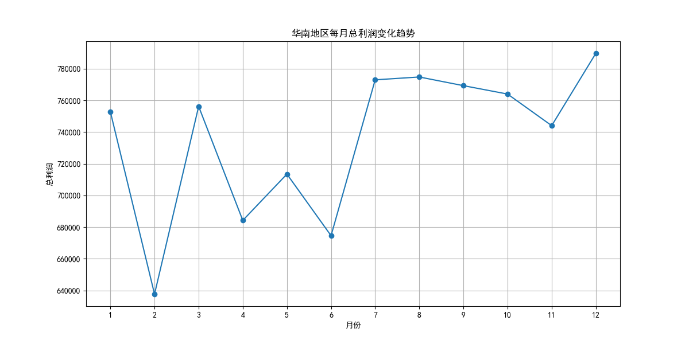
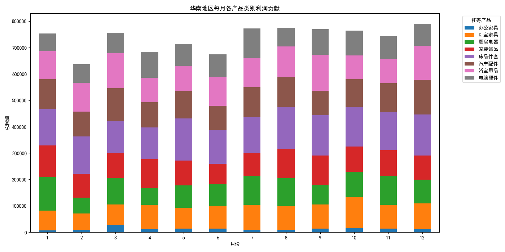
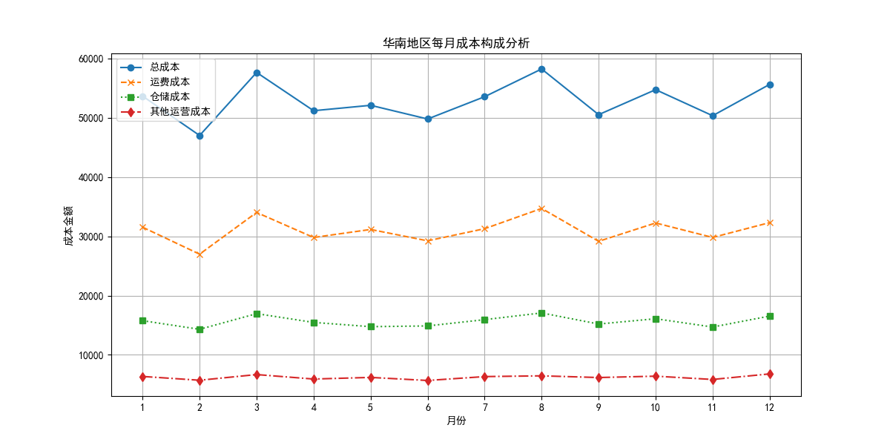

# 华南地区月度利润波动分析报告

## 1. 引言

本次分析旨在深入探究华南地区每月总利润不稳定的问题。通过对销售、产品及成本数据的多维度分析，我们旨在定位导致利润波动的根本原因，并为业务决策提供数据支持和优化建议。

## 2. 整体利润趋势分析

从下图可以看出，华南地区的月度总利润呈现出显著的波动性。其中，**2月、6月、9月和11月**是利润的明显低谷，这表明公司的盈利能力在一年中的某些特定时期会面临较大挑战。

## 3. 利润波动归因分析

为了探究利润下降的深层原因，我们从“产品贡献”和“成本构成”两个维度进行了下钻分析。

### 3.1. 产品维度：部分产品利润贡献不稳定

如下图所示，在利润下降的月份，并非所有产品线的表现都差。我们发现，**“卧室家具”** 和 **“厨房电器”** 这两个产品类别的利润贡献波动极大。

- 在利润较低的**2月**和**9月**，“卧室家具”的利润贡献明显萎缩，是导致整体利润下滑的关键因素。
- 在**6月**和**11月**，则是“厨房电器”类别的利润贡献大幅减少。

这表明，华南地区利润的不稳定性很大程度上是由少数几个核心产品类别在特定月份的业绩不佳所驱动的。

### 3.2. 成本维度：运营成本，尤其是运费成本，波动剧烈

成本的有效控制是保证利润的关键。通过对成本构成的分析，我们发现总成本在**2月、6月和9月**出现了明显的峰值，这与利润的低谷期高度吻合。

- 从成本细分来看，**运费成本**是所有成本中波动性最大的一项，其增长趋势与总成本的增长趋势高度一致。尤其是在利润大幅下滑的月份，运费成本均出现了异常的飙升。
- 仓储成本和其他运营成本相对稳定，但也在特定月份（如6月）对总成本的上涨起到了一定的推动作用。

这说明，失控的运费成本是侵蚀利润、导致业绩不稳定的另一个核心原因。

## 4. 结论与建议

综合分析，华南地区月度利润不稳定的问题并非由单一因素造成，而是**特定产品线业绩波动**和**运营成本失控**双重作用的结果。具体而言：

- **收入端**：“卧室家具”和“厨房电器”两个产品类别在特定月份的利润贡献急剧下降，对整体利润造成巨大冲击。
- **成本端**：剧烈波动的运费成本在特定月份异常飙升，严重侵蚀了来之不易的收入。

为改善华南地区盈利的稳定性，提出以下建议：

1.  **推行精细化产品运营策略**：
    - **针对“卧室家具”和“厨房电器”**：深入分析其在2月、6月、9月、11月业绩下滑的具体原因（是销量下降还是折扣过大？）。建议在这些月份前夕，制定专项营销计划（如主题促销、组合销售）以稳定销量和利润。同时，评估其供应链和库存策略，避免因缺货或压货导致利润损失。

2.  **加强物流成本管控与优化**：
    - **审核与重估物流供应商**：立即对现有物流服务商的定价和服务稳定性进行全面审查。可以考虑引入2-3家备选物流公司，通过竞价或签订长期锁价协议的方式来降低和稳定运费。
    - **优化仓储与配送网络**：分析高运费订单的目的地分布，研究通过设立前置仓或优化配送路线来降低平均物流成本的可行性。

3.  **建立月度经营分析预警机制**：
    - 建立一个常态化的月度经营分析仪表盘，实时监控华南地区各产品线的利润贡献和各项核心成本（特别是运费）的变化。当指标出现异常波动时，系统应能自动预警，以便管理团队能够迅速响应，提前干预，避免问题扩大化。
