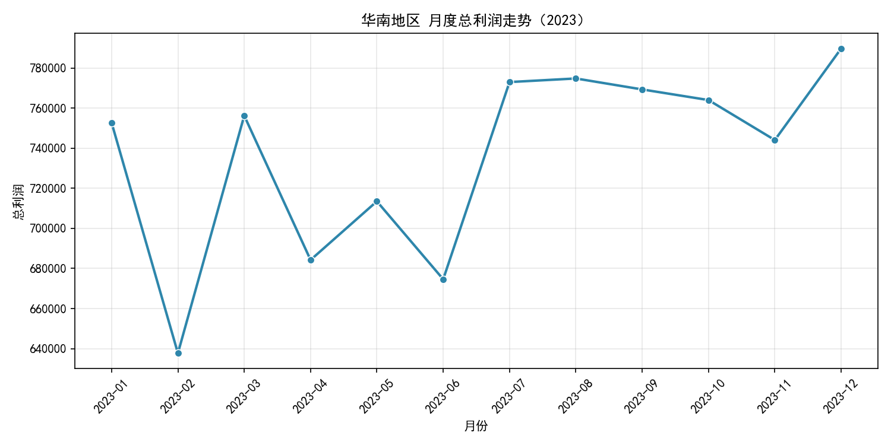
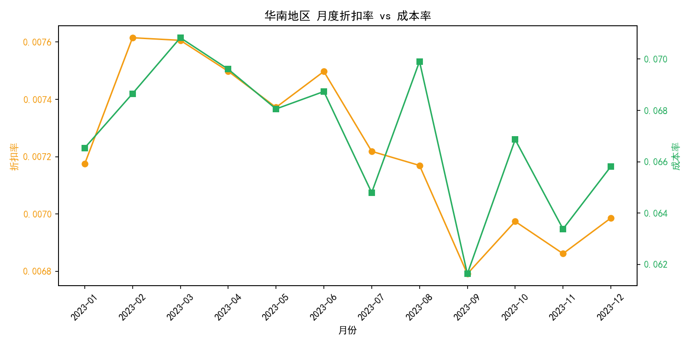
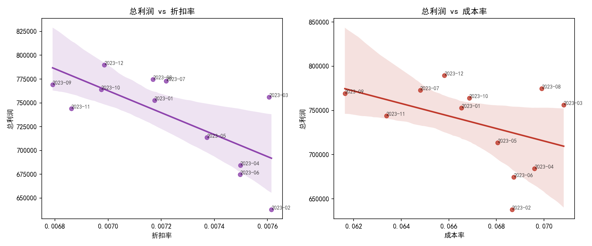
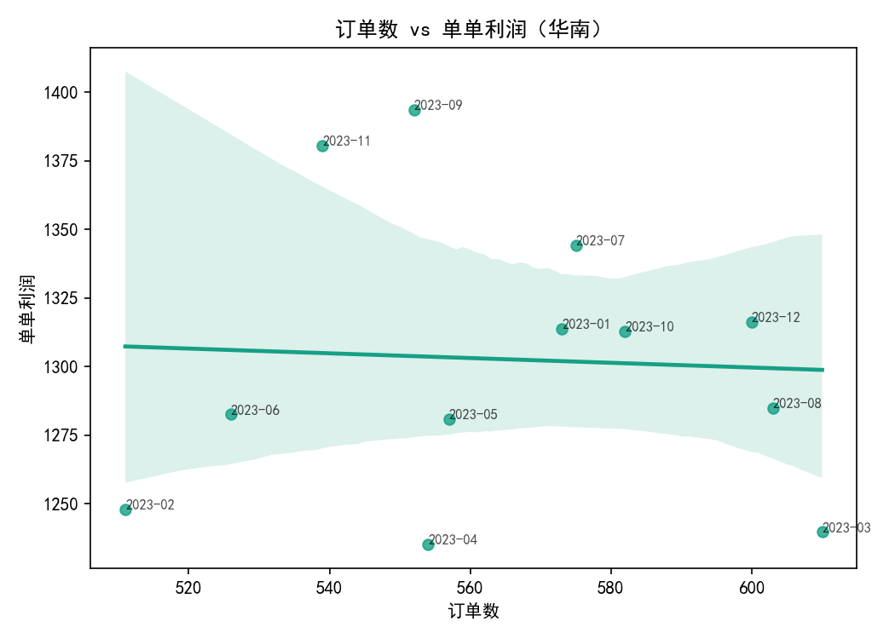
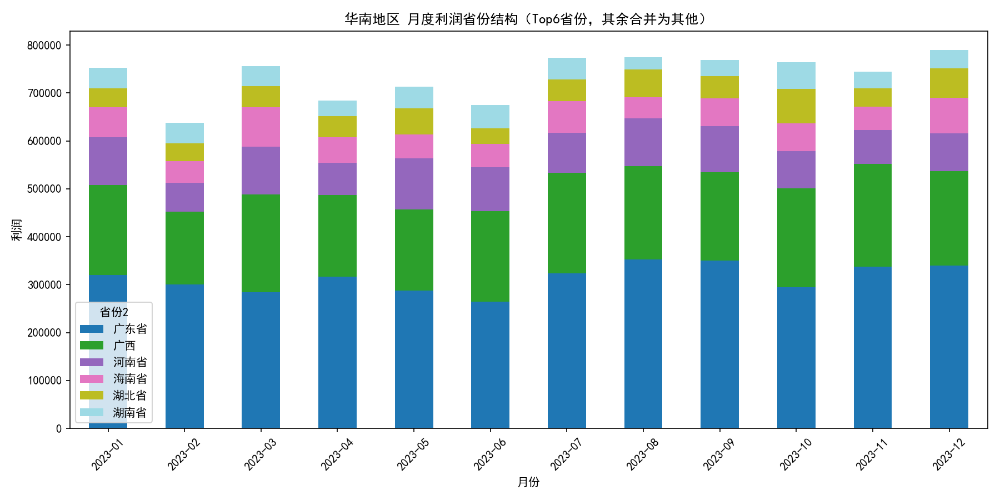
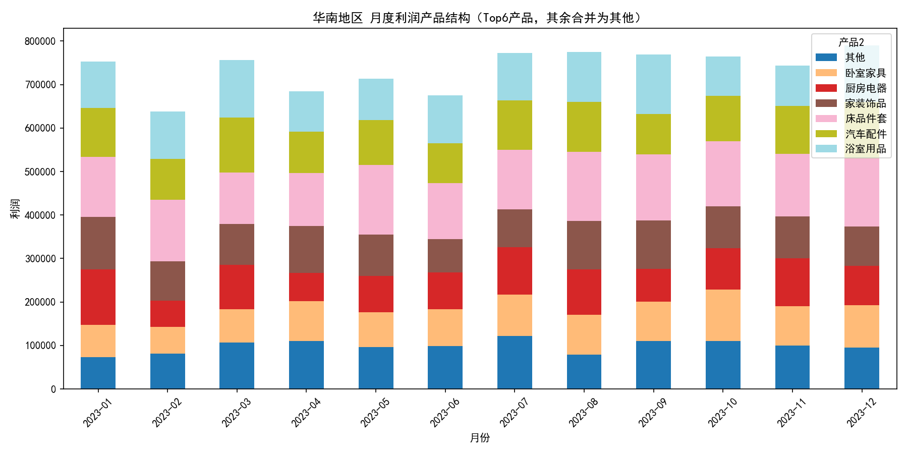
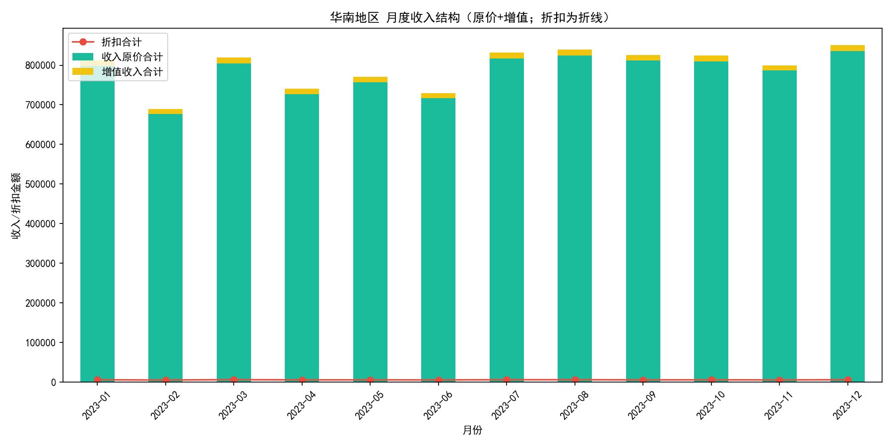
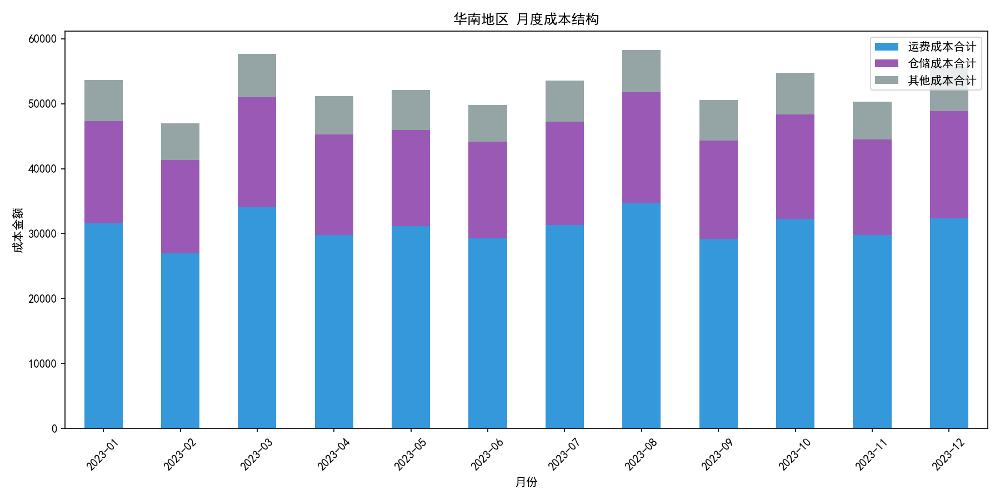
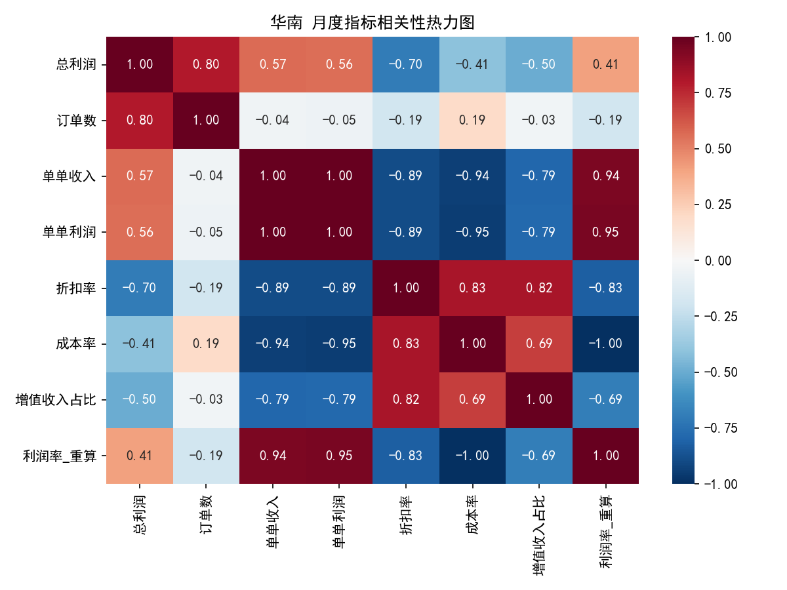

# 华南地区每月总利润不稳定的原因诊断与优化建议（2023年）

## 摘要
针对“华南地区每月总利润不稳定”的问题，我们在2023年全年的数据上进行了月度、结构（省份/产品）以及经营杠杆（订单数、折扣率、成本率、增值服务占比）等维度的分解分析。结论表明：
- 核心驱动在于“量价结构波动”，其中订单量（需求）波动与利润高度正相关，其次是折扣率与成本率的联动对单单利润形成挤压；
- 从地域看，广东省、广西、河南省、海南省贡献了主要的月度利润变化；
- 从产品看，厨房电器、浴室用品、床品件套等品类的利润波动较大，产品结构变化会放大利润波动。

可操作建议包括：稳定重点省份的需求与供给、控制折扣与成本的联动风险、对高波动品类实施价格与备货策略、搭建月度利润桥与预警机制等。

---

## 数据与方法
- 数据来源：SQLite 库 dacomp-006.sqlite 表“工作表1”，时间范围为 2023-01-01 至 2023-12-31，共18250条记录。
- 关键字段：日期、目的地、托寄产品、销售数量、物流总收入、物流总成本、利润、折扣金额、运费/仓储/其他成本、增值收入等。
- 分析方法：
  - 月度聚合：对华南地区（目的地以“华南-”开头）进行按月汇总；
  - 经营指标：利润率=总利润/总收入，折扣率=折扣合计/收入原价合计，成本率=总成本/总收入，增值收入占比=增值收入/总收入，单单利润/收入=总利润/收入÷订单数；
  - 结构拆解：省份与产品的月度利润分布及其波动（标准差）；
  - 相关性：月度层面的皮尔逊相关，用于方向性判断（12期样本，谨慎解读）。

绘图Python代码使用了如下中文配置（完整绘图脚本已在当前目录运行生成图片）：
```python
import matplotlib.pyplot as plt
plt.rcParams['font.sans-serif'] = ['SimHei']
plt.rcParams['axes.unicode_minus'] = False
# 示例：
# sns.lineplot(data=dfm, x=\"ym\", y=\"总利润\", marker=\"o\"); plt.savefig(\"华南_月度利润走势.png\")
```

---

## 1. 华南月度利润走势与基本判断
- 利润总体在约64万~79万元之间波动，存在显著月度起伏，特别是2→3月上升、3→4月回落等。

图：华南地区月度总利润走势



诊断要点：
- 从利润公式看，2023-02→2023-03的利润增加约11.85万，基本由收入增加（+12.91万）驱动，成本增长较小（+1.06万），反映“量增”带动利润显著上行；
- 结合相关性结果，月度总利润与订单数的相关性为0.801（正相关），说明订单量波动是利润波动的首要驱动。

---

## 2. 量价协同与折扣/成本的影响
- 相关性矩阵（月度层面）：
  - 总利润与订单数 r=0.801（正向），与单单收入 r=0.565、单单利润 r=0.556（正向）；
  - 总利润与折扣率 r=-0.697（负向），与成本率 r=-0.413（负向）；
  - 单单收入/单单利润与成本率、折扣率强负相关（|r|>0.89），折扣率与成本率、增值收入占比之间呈正相关（0.69~0.83）。

图1：折扣率 vs 成本率（双轴）



图2：总利润 vs 折扣率、成本率（散点回归）



图3：订单数 vs 单单利润



解释：
- 订单量是利润波动的第一驱动；
- 折扣率上升往往伴随成本率上升与增值收入占比提升，导致单单利润被“量价剪刀差”挤压；
- 华南业务的成本占比整体较低，当量波动时对利润的杠杆效应很大，这也是利润看起来“更不稳定”的结构性原因。

---

## 3. 省份结构贡献：哪些地区在“拉扯”利润？
- 按省份统计的月度利润波动（标准差，Std）Top：
  - 广东省：月度利润波动Std≈2.80万，年度利润≈377万；
  - 广西：Std≈1.85万，年度利润≈228万；
  - 河南省：Std≈1.50万，年度利润≈104万；
  - 海南省：Std≈1.19万，年度利润≈69万；
  - 湖北省、湖南省也有不小波动。

- 月度利润变化幅度最大的3个节点及省份贡献（省份层面利润变动Top5）：
  - 2023-03：广西 +5.18万、河南 +4.01万、海南 +3.73万；广东 -1.62万；
  - 2023-10：广东 -5.48万为主要下拉，部分被湖北/湖南/广西回升对冲；
  - 2023-04：河南 -3.27万、广西 -3.25万、海南 -2.93万为主要下拉，广东 +3.15万对冲有限。

图：华南地区月度利润省份结构（Top6省份，其余合并）



结论：
- 利润波动显著与“省份构成变化”相关，广东省、广西、河南省、海南省是主要的波动来源；
- 个别月份由广东领跌或广西/河南/海南集体走弱，会放大利润波动。

---

## 4. 产品结构贡献：哪些品类更“躁动”？
- 月度利润波动（Std）Top品类：
  - 厨房电器（Std≈1.98万）、浴室用品（≈1.58万）、床品件套（≈1.39万）、卧室家具（≈1.41万）、电脑硬件（≈1.33万）、汽车配件（≈1.29万）；
  - 其中床品件套、浴室用品、厨房电器等也是年度利润较高的品类，结构波动更容易放大利润不稳定。

图：华南地区月度利润产品结构（Top6产品，其余合并）



解释：
- 高利润+高波动的品类在月度配比变化时，对区域利润波动影响最大；
- 若品类促销（折扣提升）与运力/仓储等成本变化叠加，单单利润被挤压更明显。

---

## 5. 收入与成本结构的季节性特征
图1：收入结构（原价+增值收入堆叠；折扣为折线）



图2：成本结构（运费/仓储/其他）



要点：
- 增值收入占比与折扣率有联动关系（正相关≈0.82）；
- 成本率在部分月份随折扣率上升而上行，削弱利润率；
- 成本占比整体较低，使得“量的波动”对利润影响更为放大。

---

## 6. 结论归因：不稳定主要出在何处？
综上，“华南地区每月总利润不稳定”的根因主要在以下四点：
1) 需求端波动（订单量）：订单数与总利润高度正相关（r=0.801），量的波动直接放大利润起伏；
2) 省份结构波动：广东、广西、河南、海南等重点省份对月度利润变化贡献最大，单月的区域构成变动会显著影响利润；
3) 产品结构波动：厨房电器、浴室用品、床品件套等高利润高波动品类占比的月度变化，放大利润波动；
4) 折扣率与成本率联动：高折扣月往往伴随更高的成本率与更高的增值占比，单单利润被挤压，导致在量变化基础上进一步加剧利润波动。

---

## 7. 可操作的优化建议
- 稳定“量”的基座：
  - 对波动较大的重点省份（广东、广西、河南、海南）建立省份级订单漏斗与周度目标，联动营销节奏；
  - 对高波动品类（厨房电器、浴室用品、床品件套等）安排滚动补货+价格带规划，平滑供给与客单。
- 管控折扣与成本联动风险：
  - 设定折扣率的档位与ROI阈值，避免折扣与成本率同向上行；
  - 对增值服务做打包与定价校准，避免“高折扣+高增值占比”的组合侵蚀单单利润。
- 区域结构管理：
  - 针对广东等关键省份，建立运力与仓储成本的基线与浮动区间，异常波动时触发调整机制；
  - 实施“省份×品类”的配额与价格策略，降低结构突变带来的收益不确定性。
- 监控与预警：
  - 搭建月度“利润桥”（订单数→单单收入→折扣→成本→利润）与异常检测（例如：订单数、折扣率、成本率的阈值报警）；
  - 预测性管理：基于订单数与结构变量训练简单的月度预测模型（如ARIMA/GBM），提前布局运力与促销。

---

## 附：主要图表
- 华南地区月度总利润走势：
- 折扣率 vs 成本率：
- 总利润 vs 折扣率/成本率散点：
- 订单数 vs 单单利润：
- 省份结构贡献：
- 产品结构贡献：
- 相关性热力图：
- 成本结构：
- 收入结构：

以上分析未对原始数据进行清洗或更改，仅做聚合与诊断性分析。
